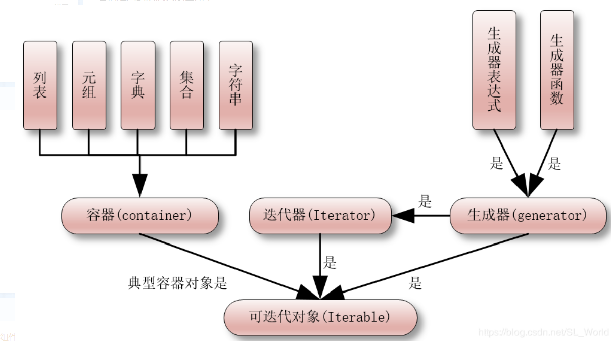

# 基础篇

1、位和字节的关系？

- 位：记作小b，“位（bit）”是电子计算机中最小的数据单位。每一位的状态都只能是0或者1.
- 字节：记作大B，8个二进制单位构成一个字节“字节（Byte）”，他是存储空间的基本单位。1字节可以存储1个英文字母或半个汉字，换句话说一个汉字占据两个字节的储存空间。
- 一字节等于八位b 1B = 8b


2、python中传参数是传值还是传地址?

> python中函数传参数是**引用传递**(注意不是值传递).对于不可变类型(数值型 、字符串、元组），因变量不能修改所以运算乎会影响到变量自身；而对于可变类型（类表、字典）来说。函数体运算可能会更改传入的参数变量。


3、大数据的文件怎么读取？

1. 利用生成器generate
2. 迭代器进程迭代遍历： for line in file


4、迭代器和生成器的区别？

- 迭代器(iterator)是一个**带状态**的对象.之所以说是带状态,是因为迭代器内部持有一个用于**记录当前迭代所在位置的状态**,以方便下次迭代的时候获取正确的元素, 迭代器并不是一次性的把所有元素都加载到内存中, 它的类都有next和iter方法返回自己本身，next（）在没有后续元素的时候，会抛出StopIterration的异常。
- 生成器（generator）是一个特殊的迭代器，它是用关键在**yield**来替换迭代器中的`__next__()`方法而拥有yield关键字的函数就是生成器函数。每次next（）被调用时，生成器会返回它上次离开的位置.
- 区别：
  - 生成器能做到迭代器所能做的事情，因而自动创建了`__iter__()`和next()方法,生成器特别简洁,而且生成器也是高效的,使用生成器表达式取代列表解释是可以同时节省内存.出了创建和保存程序状态的自动方法,当生成器终结时,还会自动抛出StopIteration异常.
  - 生成器只能遍历一次
  



5、装饰器的作用和功能？

- 装饰器本质上是Python函数，它可以让其它函数在不需要做人和代码变动的前提下增加额外的功能
- 装饰器的返回值也是一个函数对象，它经常用于有切面需求的场景，比如：插入日志，性能测试、事务处理、缓存、权限校验等场景。
- 装饰器是解决这类问题的绝佳设计，you了装饰器，我们就可以抽离出大量与函数功能本身无关的雷同代码并继续重用。

6、简单谈下GIL

- **Global Interpreter Lock（全局解释器锁）**

  - python代码的执行由Python虚拟机（有人教解释器主循环，CPython版本）来控制，Python在设计之初就考虑到要在解释器的主循环中，同时只有一个线程在运行，在任意时刻，只有一个线程在解释器中运行。对Python虚拟机的访问是由全局解释器锁（GIL）来控制的，正式这个锁来控制同一时刻只有一个线程能够运行。

  - 在多线程环境中，Python虚拟机按以下方式执行：

    1. 加锁(GIL)

    2. 切换到一个线程去运行

    3. 运行：

       a. 指定数量的字节码指令

       b. 线程主动让出控制(可以调用sleep)

    4. 把线程设置为睡眠状态

    5. 解锁(GIL)

    6. 重复上面步骤(直至整个进程全部完成)

    

    在调用外部代码(如C/C++扩展函数)的时候, GIL将会被锁定, 知道这个函数结束为止( 由于这个期间没有Python 的字节码被运行, 所以不会做线程切换). 

7、Python中的yield用法

-  yield简单的来说就是一个生成器，遮掩幻术记住他上次返回函数体中所在的位置。对生成器第二次（或N次）调用就跳转至该函数N次所在的位置

8、Python的垃圾回收机制

- python的垃圾回收机制是引用计数，在内存中声明一个变量之后是通过对这个变量的引用次数来判断这个变量在内存中是否要回收，如果因引用次数为0时这个变量的对象将在内存中被删除（回收），每调用一次，引用计数加1。
- python垃圾回收主要以引用计数. 标记-清除为辅的机制,其中标记-清除和分代回收主要是为了处理循环引用的难题。
- 当使用del删除变量指向的对象时，如果对象的引用计数不为1，那么吃是只会让这个引用计数减1当引用计数为0是，会把这个对象进行删除。

9、描述数组、列表、队列、堆栈的区别？

- 数组和列表十数据存储方式的概念，数组在连续的空间存储数据，二列表可以在非连续的空间存储数据；
- 队列和堆栈是描述数据存储的方式，队列是先进先出，而堆栈是后进先出；队列和堆栈可以用洪素珠来实现，也可使用列表来实现。

10、你知道几种排序方式？


https://www.cnblogs.com/wuxinyan/p/8615127.html

11、Python的内建数据类型有哪些？

- 整形 - int
- 布尔型 bool
- 字符串  str
- 列表 list
- 元组 tuple
- 字典 dict

12、简单的描述下`__new__`和`__init__`的区别

- `__new__`方法是在创建类的实例的时候被调用,并且必须通过super返回父类的new方法,不然`__init__`无法被调用
- `__init__`方法是初始化方法,每个实例初始化的时候都会被调用,注入一些初始值.

13、简述下with方法打开处理文件都帮我们做了些什么？

- 打开文件进行读写的时候可能会出现一些异常，导致文件无法异常关闭，如果我们使用了with，文件就会帮我们自动关闭。
- 如果我们使用的是常规的open，就会导致我们需要写很多语句try、except、finally，来对异常做处理，然后在关闭文件，如果无法关闭的文件过多就会导致系统出现iNode节点不够用的问题出现，with可以帮我们避免出现这类问题。

14、lambda使用if的2种方法。

```python
lam = lambda x: 'yes' if x == 'y' else 'no'
print(lam('y'))

lam = lambda x: ['yes', 'no'][x == 'y']
print(lam('y'))
```

15、在使用正则的时候避免转义给字符串家那个字母表示愿是字符串?

- r, 表示需要原始字符串,不转义特殊字符

16、python2和python3的却别有哪些？举几个例子？

1. print python2在使用的时候不需要加括号，python3必须要加上括号
2. input python2中使用的是raw_input函数，python3中统一使用了input
3. range python2中返回的是列表，python3中返回的是一个迭代器，节省内存
4. 编码 python2使用的是ascii编码， python3使用的是utf-8编码
5. 中文 python2中需要引入coding声明才能正常显示中文，python3中则不用

17、列出Python中可变数据类型和不可变数据类型，并描述其原理！

- 不可变数据类型：
  - 数值型、字符串型string和元组tuple
  - 不允许变量的值发生变化，如果改变了变量的值，相当于是新建了一个对象，而对于相同的值的对象， 在内存中则有且只有一个对象地址与之对应，可以通过id方法来查看。
- 可变数据类型：
  - 列表list、集合和字典dict
  - 允许变量的值发生变化，他们可以新增或是删减对象的值，但是却不会却不会区新建一个对象，变量的引用地址也不会发生变化。

18、正则表达式中(.*)和(.*?)匹配的区别在哪?

- (.*)是贪婪匹配，会把满足条件的字符串都尽可能多匹配出来
- (.*?)非贪婪匹配，会把满足的正则字符串尽可能少的匹配出来

19、简述下Django的orm

- ORM(Object Relation Mapping) 对象关系映射
- 实现了数据模型与数据库的解耦, 通过简单的配置就可以轻松更换数据库, 而不需要修改代码只面向对象编程, ORM操作本质上会根据对接的数据库引擎, 翻译成对应的sql语句, 所有使用Django开发的项目无需关心程序地城使用的是MySQL、Oracle还是其他的数据库，如果数据库迁移，只需要疯狂Django的数据库引擎即可。

20、举例说明zip()函数的用法!

- zip()函数在运算是会以一个或多个序列(可迭代对象)作为参数,返回一个元组的列表。同时将这些序列中并列的元素配对。
- zip参数可以接收任何类型的序列，同时也可以有两种以上的参数；当传入单数的长度不同时，zip能自动以最短的长度为基准进行截取，获取元组。

21、写5条常用的sql语句！

```mysql
create database if not exists test character set utf8 collate utf8_general_ci;

# 创建test用户并给与所有库的所有权限,不限制在哪里登录,密码为passwd
grant usage on *.* to 'test'@'%' identified by 'passwd';

# 给与test用户test库的所有权限,但是只能在本机登录密码为pwtest
grant all privileges on 'test'.* to 'test'@'localhost' identified by 'pwtest';

# 给test用户修改密码
update mysql.user set password = password('newpassword') where user = 'test';

flush privileges;
```

22、如何提高python的运行效率？

1. 使用生成器，应为可以节约大量的内存
2. 循环代码优化，避免过多重复的代码执行
3. 核心弄快用CPython PyPy等，提高效率
4. 使用多进程、多线程、写成
5. 使用多个if判断时，可以把最有可能发生的条件放到最前面，减少程序的判断次数

23、redis和MySQL的区别？

- redis：内存型非关系数据库，数据库保存在内存中，速度快
- mysql：关系型数据库，数据保存在磁盘中，检索的话会有一定的IO操作，访问速度相对较慢

24、遇到BUG该如何处理？

- 细节上的错误通过print()大法,能执行到print()说梦上面的代码没有问题,分段检测程序是否有问题,如果是js可以使用alert或者console.log
- 如果涉及到一些第三方框架,回去查官网文档或者一些技术博客
- 对于bug的管理与归类总结,一般测试将BUG用teambin等BUG管理公路进行记录,然后我们会一条条进行修改,修改的过程也是理解业务逻辑和提高自己编程逻辑缜密性的过程,一般都会做一些自己的总结类的笔记

25、请列出常见的状态码和意义!

| 状态码 | 说明                  | Method         | 说明                                                         |
| ------ | --------------------- | -------------- | ------------------------------------------------------------ |
| 200    | ok                    | GET            | 成功获取资源                                                 |
| 201    | CREATED               | POST/PUT/PATCH | 成功创建或修改                                               |
| 204    | NO CONTENT            | DELETE         | 成功删除资源                                                 |
| 30X    | 1永久,2临时           | ALL            | 资源重定向                                                   |
| 400    | Bad Request           | ALL            | 请求中有错误，例如<br>GET时参数有问题<br>PUT时提交的数据错误等 |
| 401    | Unauthorized          | ALL            | 权限认证未通过                                               |
| 403    | Forbidden             | ALL            | 有无权限都禁止访问该资源                                     |
| 404    | Not Found             | ALL            | 请求的资源不存在                                             |
| 500    | Internal Server Error | ALL            | 服务器端错误                                                 |
| 502    | Bad Gateway           | ALL            | 后端服务器无响应                                             |
| 503    | Service Unavailable   | ALL            | 服务器超负载或停机维护                                       |

26、分别从前端、后端、数据库阐述一下web项目的性能优化！

- 前端优化：
  1. 减少http请求，
  2. html和CSS放在页面上部，JavaScript放在页面下部，这样就不会在加载JS的时候导致页面没有可以显示的内容，增强用户体验。
  3. 尽可能的使用静态页面，最好做到动态页面也能像静态页面一样。
  4. 前端有新请求的时候，做部分更新，而不是整个页面的刷新
- 后端优化
  1. 缓存存储读写次数高的数据，比如网站首页的信息，一些热数据等；尽可能的减少和后端数据库的交互，因为数据库真的很慢。
  2. 讲动态页面弄成html页面，通过html来访问。
  3. 异步方式如果有比较耗时的操作，可以采用以异步的方法来做，如celery
  4. 代码优化，避免重复执行的代码等。
- 数据库优化：
  1. 选择适合的数据库，如果有条件，数据最好放在redis里面，增快读速度。
  2. 建立索引，外键
  3. 优化sql语句等

27、列出MySQL数据库常见的存储引擎

- InnoDB：支持实物处理，支持外键，支持崩溃修复功能并发控制。如果需要对事物的完整性要求较高（比如银行），要求实现并发控制（比如售票），或者是数据需要频繁的操作，选择InnoDB有很大的优势，应为InnoDB支持事物的提交（commit）和回滚（rollback）
- MyISAM：插入数据库快，空间和内存使用比较低。如果表主要适用于插入新纪录和读出记录，那么可以选择MyISAM能够有较高的效率。如果是要求应用的完整性，并发性较低，也可以使用。
- MEMORY：所有的数据都放在内存中，处理的速度很快，但是安全性不高。如果需要很快的读写速度，对于数据的安全性要求较低，可以选择memory。但是他对表的大小有要求，不能建立太大的表，所以这类数据库只能使用在相对较小的数据库。


28、简述下同源策略！

同源策略需要同时满足以下三点要求:

- 协议相同：
- 域名相同
- 端口相同
  - http://www.baidu.com   and https://www.baidu.com   协议不同
  - http://www.baidu.com and http://www.baidu1.com   域名不同
  - http://www.baidu.com:82  and http://www.baidu.com:81  端口不同
  - 上面的三个例子都不属于同源,只要不满足其中任意一个要求,就不符合同源策略,就会出现跨域.

29、简述下cookie和session的区别？

- session存储在服务器端，cookie在客户端（浏览器上）
- session的运行依赖session id, 而 session id是存在cookie中的,也就是说,如果浏览器竟用了cookie,同时session也会失效
- 存储session时，键与cookie中的session id 相同，值是由开发人员设置的键值对信息，进行了base64编码，过期时间有开发人员设置。
- cookie安全性比session差
- 现在很少用session，如果还是python可以用jwt 或者使用token进行校验


30、请简述下多线程和多进程！

- 进程：
  1. 操作系统进行资源分配和调度的最小单位，多个进程间相互独立。
  2. 稳定性好，如果一个进程崩溃，不影响其他的进程，但是进程消耗资源大没开启进程数量有限制。
  3. 进程有自己的独立地址空间,每启动一个进程,系统都会为它分配一个地址空间,建立数据表来为维护代码段,堆栈和数据段,非常昂贵.
- 线程：
  1. 程序执行的最小单位，线程是进程的一部分，一个进程下的多个线程可以共享该进程下的数据和资源,同时线程的开销要比进程的小很多
  2. 如果IO操作密集，则可以使用多线程运行效率较高，缺点是如果一个线程崩溃了，会导致进程的奔溃。
- 应用：
  - IO密集型的用多线程，在用户输入sleep的时候，可以切换到其他线程执行，减少等待的时间；
  - CPU密集型的话使用多进程，应为加入IO操作少，用多线程的话线程是共享一个全局解释器锁，当前运行的线程会霸占GIL，其他线程没有GIL,就不能充分利用多核CPU的优势

31、简述下乐观锁和悲观锁！

乐观锁和悲观锁都是一种思想，并不是真实存在于数据库中的一种机制

- 悲观锁：
  - 每次在拿数据的时候都会上锁，这样别人在拿到这个数据的时候无法修改，直到释放锁；
  - 传统的关系型数据库里面都用到了很多这种锁机制，比如行锁、表锁等；读锁，写锁都是放在做操作之前先上锁的。
- 乐观锁：
  - 每次去拿数据的时候都不会去上锁，但是在更新的时候会判断一下在此期间别人有没有去更新过这个数据，这样可以用版本号等机制，乐观锁适用于多读的应用类型，这样可以提高吞吐量。

32、解释下Python中的三元表达式！

```python
# [true] if expression else [false]
# 为真输出true if 条件 否则 输出 false
# 如果[expression]为真,则执行[true]部分,如果为假则执行[false]部分
a = 2
true if a > 1 else false
```

33、Python中如何实现多线程？

- 线程是轻量级的，多线程允许依次执行多个线程。总所周知，python是一种多线程语言，它有一个多线程包。
- GIL（全局解释器锁）确保依次执行单个线程。一个线程保存GIL并将其传递给下一个线程之前执行一些操作，这就产生了并行执行的错觉。但实际上，只是线程轮流在CPU上使用。当然所有的传递都会正价执行的开销，所以python多线程并行是假并行。

34、解释继承！

- 一个了类继承自另一个类，可以说是一个子类/派生类, 继承自父类/基类, 同时获取所有的成员的属性和方法。
- 继承是我们可以重用代码，并且还可以方便地创建和维护代码。Python支持一下类型的继承。
  - 单继承：一个子类继承字单个基类
  - 多重继承：一个字累继承自多个基类
  - 多级继承：一个子类继承自一个基类，而且基类继承自另一个基类
  - 分层继承：多个子类继承自同一个基类
  - 混合继承：两个或者两种以上继承类型的组合

35、什么是flask？

- flask是一个使用Python编写的轻量级Web应用框架，使用BSD授权，其WSGI工具箱采用Werkzeug，模板引擎则使用Jinja2 。出了Werkzeug和Jinja2移位几乎不一类任何外部库。因此flask被称为轻量级框架。
- flask的回话使用cookie签名来允许用户查看和修改会话内容。他会记录一个请求到另一个请求的信息。范式如果要修改的话，则必须有秘钥Flask.secret_key。

36、如何在Python中管理内存？

- Python中引用了内存池(memory pool)机制, 即Pymalloc机制(malloc:n 分配内存),用于管理对小块内存的申请和释放.
- 当穿件大量消耗小内存的对象时,频繁调用new/malloc会导致大量的内存碎片,致使效率降低.内存池的概念就是预先在内存中申请一定数量的,大小相等的内存块做备用,当有新的内存需求时,就先从内存池中分配给这个需求,不够之后再申请新的内存,这样做最显著的优势就是能够假案少内存碎片,提升效率.
- Python中的内存管理机制-----Pymalloc
  - Python中有两套实现机制---一套是针对小对象,就是大小小于256bits时,pymalloc会在内存池中申请内存空间;当发育256bits时, 则会直接执行new/malloc的行为来申请新的内存空间.
  - 释放方面,放一个对象应用几位变为0时,Python就会调用他的析构函数,在析构时也采用了内存池机制,冲内存池的内存会被归还到内存池中,以避免平凡的释放动作.

37、解释Python中的help函数和dir函数？

- help函数返回帮助文档和参数说明
- dir函数返回的事对象中所有成员（任何类型）

38、is和==的区别

- id也叫作统一性运算符，这个运算符比较判断的是对象减的唯一身份表示，也就是id是否相同。
- ==是python标准操作符中的比较操作符，用来判断两个对象的value值是否相等。

39、高阶函数map、filter、reduce的作用？

- filter(lambda x:x*x>10, [1,2,3,4,5]) #将符合条件的值过滤出来
- map（lambda x:x ，[1,2,3,4,5]) # 根据提供的幻术对指定序列做映射
- reduce(func, iterable[, initiaizer]) # 对象参数序列中匀速进行积累 # reduce在python3中不是内建函数了需要从functools中导入


40、简述下协程？

- x协程不是进程，也不是线程，他十用户空间调度完成的并发处理方式
- 进程、线程由系统调度完成，而协程是线程内完成调度；他不需要分多的线程， 自然没有多线程间切换带来的开销
- 协程是非抢占式的调度。只有一个协程主动让出控制权，另一个携程才会被调度
- 协程也不需要使用锁机制，应为在同一个线程中执行
- 再多CPU下，可以使用多进程和协程配合，技能进程并发，又能发挥协程在单线程中的优势
- Python中协程是基于生成器的

41、Python里面如何拷贝一个对象？（赋值，深浅拷贝，深浅拷贝的区别）

- 赋值（=），就是创建了对象的一个新的引用，修改其中任意一个变量都会影响到另一个。
- 浅拷贝：创建一个新的对象， 但是它包含的是队员是对象中包含项的引用（如果用应用的方式修改其中一个对象，另一个也会被改变）
- 深拷贝：创建一个新的对象， 并且递归的复制它所包含的对象（其中一个对象的改变，不会影响到另一个）

42、如何用Python来镜像查询和替换一个文本字符串？

- 可以使用sub（）方法来进行查询和替换，sub方法的格式为：sub（replace，string[,count=0])
- replacement 是被替换的字符串
- string 是需要被替换的字符串
- count 是一个可选参数，至最大被替换的数量


43、创建一个简单tcp服务的流程！

1. socket创建一个套接字
2. bind绑定ip和port
3. listen 使用套接字可以被动连接
4. accept 等待客户端的连接
5. recv/send 接受发送数据