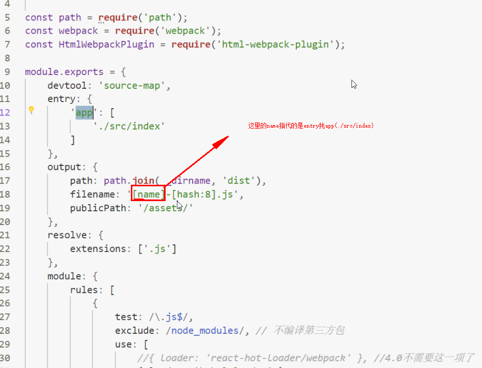
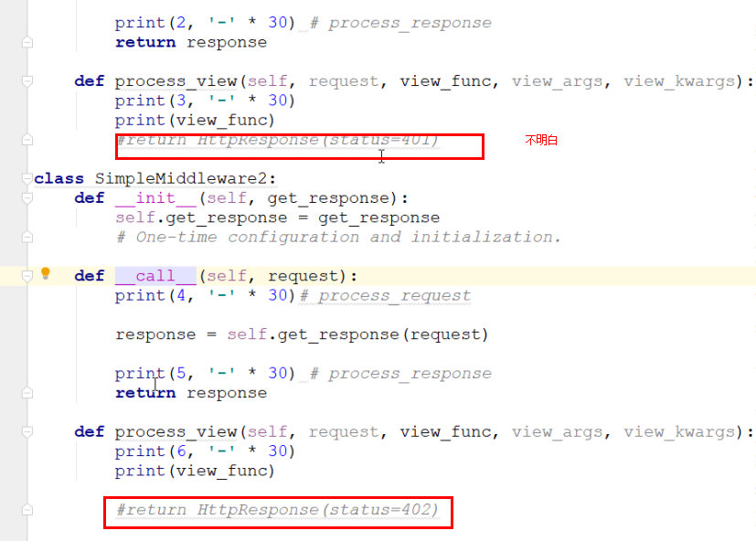

new test

`print('hello world')`

### <u>hello</u>

```python
print('this is python')
```

```python
print('this is hello')
```

```python

```
|1|2|
|:--|:---|
|1<br>2|1|

```python
import os 
print(os.path)
```



~~~python

~~~




```python
print('this is hello world')
```

