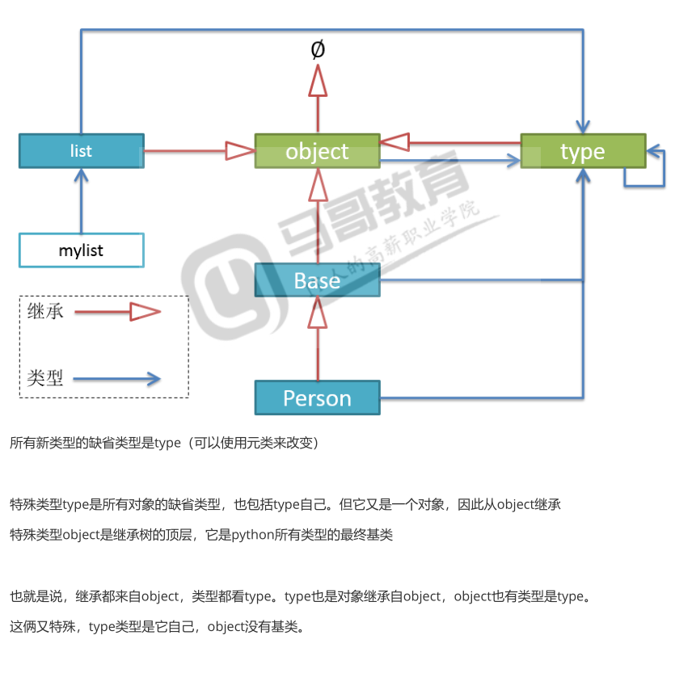

# tracemalloc  
---
标准库tracemalloc,可以同级内存的使用情况  

```py
import tracemalloc

'''
使用tracemalloc模块来跟踪内存,
我们就可以很清楚的看到了字典和元祖的内存消耗的情况比较了
'''
tracemalloc.start() #开始跟踪内存分配

d = [dict(zip('xy',(5,6))) for i in  range(1000000)] #134M
f = [tuple(zip('xy',(5,6))) for j in  range(1000000)] #107M
snapshot = tracemalloc.take_snapshot() #快照,当前内存分配
top_stats = snapshot.statistics('lineno') #快照对象的统计

for stat in top_stats:
    print(stat)
```

输出结果为:  

```py
C:/Users/abc/Desktop/learnPython/pyFile/9面向对象进阶/5.描述器/知识补充/1.tracemalloc模块.py:15: size=134 MiB, count=1999995, average=70 B
C:/Users/abc/Desktop/learnPython/pyFile/9面向对象进阶/5.描述器/知识补充/1.tracemalloc模块.py:16: size=107 MiB, count=3000002, average=37 B
C:/Users/abc/Desktop/learnPython/pyFile/9面向对象进阶/5.描述器/知识补充/1.tracemalloc模块.py:17: size=348 B, count=1, average=348 B
C:\software\python3\lib\tracemalloc.py:532: size=36 B, count=1, average=36 B
```
可以看出内存使用上字典还是比较占用空间的  

# __slots__  

---
## 问题的引出  
这是因为字典的结构导致的.  
字典为了提升查询效率,使用了用空间换时间,所以花的时间长了一些.  
一般来说一个是类,属性多一点,都存在字典中便于查询,这都不是太大的问题,但是如果数百万个实例,那么字典占用空间就有点大了.   
这个时候,能不能把属性字典`__dict__`省了?  
因此Python提供了`__slots__`方法 来省略字典,来达到节省内存的效果.  

```py

class A:
    x = 1
    # __slots__ = 'xy'.split()
    # __slots__ = ('y','z')
    __slots__ = 'y'

    def __init__(self):
        self.y = 5
        # self.z = 6

    def show(self):
        print(self.x,self.y)

a = A()
a.show()
# a.newx = 5 #AttributeError: 'A' object has no attribute 'newx' 这里不允许动态的添加属性了,,应为slots已经固定了

print('A',A.__dict__)
# print('object',a.__dict__) #AttributeError: 'A' object has no attribute '__dict__' 使用了slots方法就使字典的属性固定了,不能再有多余的属性了

print('A',a.__slots__)
```

输出结果为:  
```py
1 5
A {'__module__': '__main__', 'x': 1, '__slots__': 'y', '__init__': <function A.__init__ at 0x00B836F0>, 'show': <function A.show at 0x00B83738>, 'y': <member 'y' of 'A' objects>, '__doc__': None}
A y
```
结论:
    `__slots__`告诉解释器,实力的属性都叫什么,一般来说,既然要节约内存,最好还是使用元祖比较好.  
    一旦类提供了`__slots__`,就阻止了实力产生`__dict__`来保存实力的属性.  

---

# 继承  
---
 slots影响的只是属性实例,不能印象类实例
```py
class A:
    x = 1
    __slots__ = ('y','z') #元祖 slots影响的只是属性实例,不能印象类实例

    def __init__(self):
        self.y = 5

    def show(self):
        print(self.x,self.y)

a = A()
a.show()
print('A',A.__dict__)
print(a.__slots__)

class B(A):
    pass
print('B',B.__dict__)
print('B',B().__dict__)
```
输出结果为:  
```py
1 5
A {'__module__': '__main__', 'x': 1, '__slots__': ('y', 'z'), '__init__': <function A.__init__ at 0x014A36F0>, 'show': <function A.show at 0x014A3738>, 'y': <member 'y' of 'A' objects>, 'z': <member 'z' of 'A' objects>, '__doc__': None}
('y', 'z')
B {'__module__': '__main__', '__dict__': <attribute '__dict__' of 'B' objects>, '__weakref__': <attribute '__weakref__' of 'B' objects>, '__doc__': None}
B {}
```
结论:
    `__slots__`不影响子类实例,不会继承下去,除非子类里面自己也定义了`__slots__`. 

---
# slots的应用场景  
---
使用需要构建在数百万以上的众多对象,且内存容易比较紧张,实力的属性简单,固定且不用动态增加属性的场景.  
可以使用tracemalloc看看内存使用的差异.建议使用`stats = snapshot.staticstics('filename')查看内存的使用.  

---
# 为实现和未实现异常  
```py
print(type(NotImplemented))
print(type(NotImplementedError))
print(type(None))
```
输出结果为: 

```py
<class 'NotImplementedType'>
<class 'type'>
<class 'NoneType'>
```
NotImplemented是个值,单值,是NotImp;ementedType的实例  
NotImplementedError是类型,是异常类,返回type  

---
# 运算符重载中的反方法

---
前面学习过的运算符重载的方法,例如`__add__`和`__iadd__`  
```py

class A:
    def __init__(self,x):
        self.x = x

    def __add__(self, other):
        print(self,'add')
        return self.x+other.x
    def __iadd__(self, other):
        print(self,'iadd')
        return A(self.x+other.x)
    def __radd__(self, other):
        print(self,'radd')
        return self.x +other.x

a = A(4)
b =A(5)
print(a,b)
print(b+a)
print(a+b)

```
输出结果为:  

```py
<__main__.A object at 0x01279FF0> <__main__.A object at 0x0127EFD0>
<__main__.A object at 0x0127EFD0> add
9
<__main__.A object at 0x01279FF0> add
9

```
`__radd__`方法根本没有执行过,为什么呢?  
应为实现的都是A的实例,都是调用的`__add__`,无非就是实例a还是b调用而已.  

---
测试一下a+1
```py
class A:
    def __init__(self,x):
        self.x = x

    def __add__(self, other):
        print(self,'add')
        return self.x+other.x
    def __iadd__(self, other):
        print(self,'iadd')
        return A(self.x+other.x)
    def __radd__(self, other):
        print(self,'radd')
        return self.x +other.x

a = A(4)
a+1
```
输出结果为:  

```py
<__main__.A object at 0x016C9FF0> add
Traceback (most recent call last):
  File "C:/Users/abc/Desktop/learnPython/pyFile/9面向对象进阶/5.描述器/知识补充/5.运算符重载中的反向方法.py", line 22, in <module>
    a+1
  File "C:/Users/abc/Desktop/learnPython/pyFile/9面向对象进阶/5.描述器/知识补充/5.运算符重载中的反向方法.py", line 13, in __add__
    return self.x+other.x
AttributeError: 'int' object has no attribute 'x'

```
出现了AttributeError,应为1是int类型,没有这个属性,还是A类的`__add__`被执行了.  
测试下1+a,运行结果如下 :  

```py
Traceback (most recent call last):
<__main__.A object at 0x00F19FF0> radd
  File "C:/Users/abc/Desktop/learnPython/pyFile/9面向对象进阶/5.描述器/知识补充/5.运算符重载中的反向方法.py", line 22, in <module>
    1+a
  File "C:/Users/abc/Desktop/learnPython/pyFile/9面向对象进阶/5.描述器/知识补充/5.运算符重载中的反向方法.py", line 19, in __radd__
    return self.x +other.x
AttributeError: 'int' object has no attribute 'x'
```
这次执行了的是实例的`__radd__`方法.  
1+a等价于`1.__add__(a)`,也就是`int.__add(1,a)`,而int类型实现了`__add__`方法的,却为什么不抛出异常?而是执行了实例a的`__radd__`方法?

----
继续再看一个例子:
```py
class A:
    def __init__(self,x):
        self.x = x

    def __add__(self, other):
        print(self,'add')
        return self.x+other.x
    def __iadd__(self, other):
        print(self,'iadd')
        return A(self.x+other.x)
    def __radd__(self, other):
        print(self,'radd')
        return self.x +other.x
class B: #为实现__add__
    def __init__(self,x):
        self.x = x

a = A(4)
b = B(10)

print(a+b)
print(b+a)
```

执行结果为:  

```py
<__main__.A object at 0x01349FF0> add
14
<__main__.A object at 0x01349FF0> radd
14
```
结论:
    b+a等价于`b.__add__(a)`,但是B类却并没有实现`__add__`方法  
    1+a等价于`a.__add__(a)`,而int类型实现了`__add__`方法的,不过这个方法对于这种这种加法的返回值是NotImplemented,解释器发现了这个值,就会发其对第二操作对象的`__radd__`方法的调用.  

B类也等价于下面的实现.  
```py
class B:
    def __init__(self,x):
        self.x = x
    def __add__(self,other):
        if isinstacne(other,type(self)):
            return self.x+otherx
        else:
            return NotImplemented

```

----
解决之前的问题
```py

class A:
    def __init__(self,x):
        self.x = x

    def __repr__(self):
        return "<A {}>".format(self.x)

    def __add__(self, other):
        print('add ~~~~~~~~~~~')
        if hasattr(other,'x'):
            return self.x +other.x
        else:
            try:
                x = int(other)
            except:
                x=0
            return self.x+x
    def __iadd__(self, other):
        print('iadd ~~~~~~~~~~~')
        return A(self.x+other.x)

    def __radd__(self, other):
        print('radd ~~~~~~~~~~~')
        return self+other
a1 = A(4)
a2 = A(5)
print(a1+a2) #add int 9 a1.__add__(a2)
print(a2+a1)
# print(a2+1) #报错 调用的还是add
print(2+a1) #报错,这里调的是radd 等价于1.__radd__(a1) int.a1__radd__(1,a1)

class B:
    def __init__(self,x):
        self.x = x
    def __add__(self, other): #如果b1存在运算法重载,且它是在第一位,就按照他的运算方法来
        return NotImplemented #这里是正常输出10
    #     return 123
b1 = B(6)
print(a1+b1) #可以执行,a1.__add__(b1)
print(b1+a1) #可以执行,b1.__radd__(a1)

```
输出结果为:  

```py
add ~~~~~~~~~~~
9
add ~~~~~~~~~~~
9
radd ~~~~~~~~~~~
add ~~~~~~~~~~~
6
add ~~~~~~~~~~~
10
radd ~~~~~~~~~~~
add ~~~~~~~~~~~
10
```
'abc' +a,字符串也实现了`__add__`方法,不过默认是处理不了和其他类型的加法,就返回NotImplemented.  

--- 
# Python的对象模型 
---
在python中,任何对象都有类型,可以使用type()或者`__class__`查看.  
但是类型也是对象即类对象,他也有自己的类型.  


所有的新类型的缺省值都是type(可以使用元类来改变)  
特殊类型object是继承的顶层,它是python所有类型的最终基类.  

也就是说,继承都来自object,类型都看type,type也是对象继承自object,object也有类型是type.  
这俩又特殊,type类型是他自己,object没有积累.  