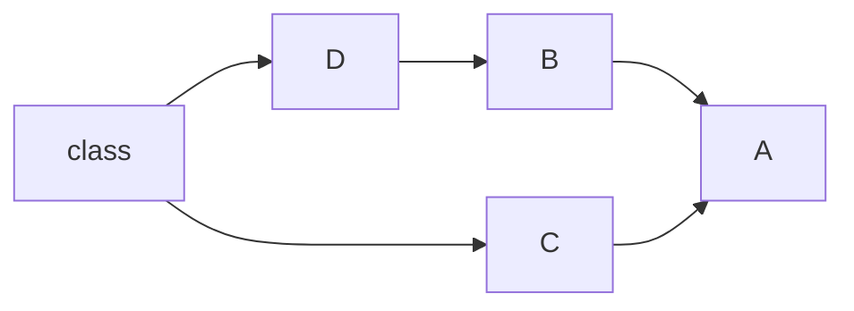
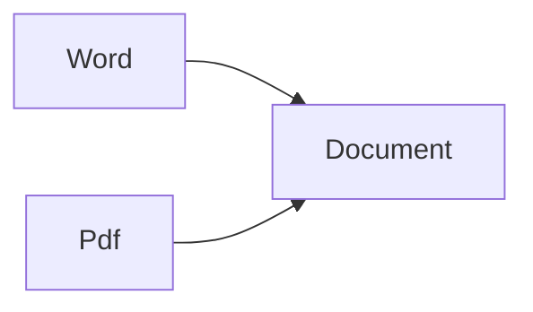
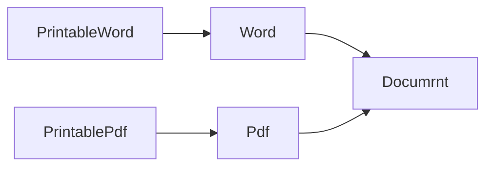
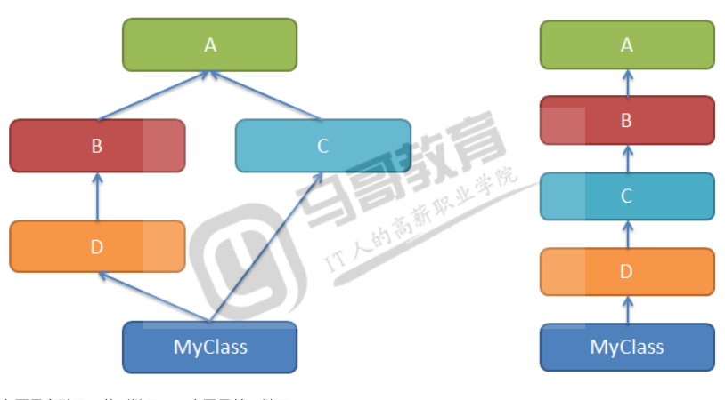

#### Python不同版本的类
------
Python2.2之前是没有共同的祖先的，之后引入object类，它是所有类的共同祖先类object。  
Python中为了兼容，分为古典类(就是类)和刑事类。  
Python3中全部都是新式类。  
新式类都是继承自object的，新式类可以使用super。  

```py
# 以下代码在python2中运行

#古典类（旧式类）
class A:pass

#新式类
class B(object):pass

print(dir(A))
print(dir(B))
print(A.__bases__)
print(B.__bases__)

#古典类
a = A()
print(a.__class__)
print(type(a)) #

#新式类
b =B()
print(b.__class__)
print(type(b))

```
*执行结果如下：*  
```py
['__doc__', '__module__']
['__class__', '__delattr__', '__dict__', '__doc__', '__format__', '__getattribute__', '__hash__', '__init__', '
__module__', '__new__', '__reduce__', '__reduce_ex__', '__repr__', '__setattr__', '__sizeof__', '__str__', '__s
ubclasshook__', '__weakref__']
()
(<type 'object'>,)
__main__.A
<type 'instance'>
<class '__main__.B'>
<class '__main__.B'>

```
#### 多继承

------
OCP原则：多用'继承'、少修改   
继承的用途：在子类上实现对基类的增强，实现多态  

# 多态  
在面向对象中，父类、子类通过继承联系在一起，如果可以通过一套方法，就可以实现不同的表现，就是多态。  
一个类继承自对各类就是继承，它具有多个类的特征。  

### 多级承的弊端  
-----
多继承很好的模拟了世界，因为实物很少是单一继承，但是舍弃简单，必然引入复杂性，带来冲突。  
如同一个孩子继承了来自父母双方的特征。那么到底眼睛像爸爸还是想妈妈呢？孩子究竟像谁多一点呢？  
多继承实现会导致编译器的设计复杂度增加，所以有些高级编程语言舍弃了类的多继承。  
C++支持多继承；Java舍弃了多继承。  
Java中，一个类可以实现多个接口，一个接口可以继承多个接口。java的接口很纯粹，只是方法的声明，继承者必须实现这些方法，就具有了这些能力，父类有什么，就能干什么。 

多继承可能会带来二义性，例如，猫和狗都继承自动物类，如果一个类继承了猫和狗类，猫和狗都有shout方法，子类究竟继承谁的shout呢？  

解决方法：
    实现多继承的语言，就要解决二义性，深度优先，或者广度优先。  


### Python多继承实现  
------
```py
class ClassName(基类列表)：
    类体
```


------


上图是多继承(菱形继承)，右图是单一继承  
多继承带来路径选择问题，究竟继承那个父类的特征呢？  
Python是有MRO(mothed resolution order方法解析顺序)解决基类搜索顺序问题。
* 历史原因，MRO有三种算法：
    - 经典算法，按照定义从左到右，深度优先策略。2.2版本之前  
    上图的MRO是MyClass>D>B>C>A  
    - 新式类算法是经典算法的升级，深度优先，重复的值保留最后一个，2,2版本  
    上图的MRO是MyClass>D>B>C>A,object
    - C3算法，在类被创建出来的时候算出一个MRO有序列表。2.3之后，Python3唯一支持的算法  
    上图中MRO是MyClass>D>B>C>A>object的列表  
    C3算法解决多继承的二义性。  

经典算法有很大的问题，如果C中有覆盖A的方法，就不会被访问到，应为有限访问A(深度优先)。  

新式类算法，依然采用了深度优先，解决了重复问题，但是同经典算法一样，没有解决继承的单调性。  

C3算法，解决了继承的单调性，他阻止了创造之前版本二义性的代码。求得的MRO本质是为了线性化，且确定了顺序。  
单调性：假设有A、B、C三个类，C的mro是[C,B,A]，那么C的子类mro中，A，B的顺序一致就是单调的。  

### 多继承的缺点
------
当类很多，继承复杂的情况下，继承路径太多，很难说清什么样的继承路径。  
Python语法是允许多继承，但是Python代码是解释执行，只是执行到的时候才发现错误。  

团队协作开发，如果引入了多继承，那代码很有可能不可控。  

不管编程语言是否支持多继承，都应当避免多继承。  

Python的面向对象，我们看到的太灵活了，太开放了，所以团队要遵守规矩。  

------

### Mixin  
------
类有下面的继承关系   



文档Document类是其他所有文档类的抽象类；  
Word、Pdf类是Document的子类。

需求，为Document子类提供打印能力
思路：
    1、在Document中提供print方法

假设已有三个类
```py
class Document:
    def __init__(self,content):
        self.content  = content

    def print(self):#抽象类方法
        raise NotImplementedError()
class Word(Document):pass
class Pdf(Document):pass
```
基类提供的方法可以不具体实现，应为他未必适合子类的打印，子类中需要覆盖写。  

基类中只做定义，不实现方法，成为**抽象类方法**。在python中，吐过擦偶用这种方式定义的抽象方法，子类可以不实现，知道子类使用方法的时候才报错。  

print(算是一种能力，--答应功能，不是所有的Document的子类都需要的，所以，从这个角度出发，上面的基类Document设计有点问题。  

    2、在需要打印的子类上增加
如果在现有子类W"ord或者Pdf上直接增加，虽然可以，却违反了OCP的原则，所以可以继承后增加打印功能。因此有下图。  



```py
class Document:
    def __init__(self,content):
        self.content  = content

class Word(Document):pass
class Pdf(Document):pass

class PrintableWord(Word):
    def print(self):#抽象类方法
        print(self.content)

print(PrintableWord.__dict__)
print(PrintableWord.mro())

pw = PrintableWord('this is test word')
pw.print()
```
*输出结果如下：*  
```py
{'__module__': '__main__', 'print': <function PrintableWord.print at 0x00289780>, '__doc__': None}
[<class '__main__.PrintableWord'>, <class '__main__.Word'>, <class '__main__.Document'>, <class 'object'>]
this is test word
```

这个看似不错，但是如果我们还需要更多其他的能是时，又该如何继承呢？
例如：
    如果该类用于网络，还应具备有序列化的能力，在类上就应该实现序列化。  
    序列化还可能分为使用pickle、json、messagepack等。  
    这个时候发下，为了增加一种能够力，就需要增加一次继承，类可能集成的太多了，so继承的方式就不是很好了。  

功能太多，A累就需要某几样功能，B类需要另几样功能，他们需要的是多个功能的自由组合，继承实现的很是繁琐。  

    3.装饰其实现  
用装饰器增强一个类，把功能给雷费附加上去，那个类需要就去装饰它。  
```py
class Document:
    def __init__(self,content):
        self.content = content

def printable(cls):
    def _print(self):
        print(self.__class__)
        print(self.content)
    cls.print = _print
    print(cls.__dict__)
    return cls

@printable #Word = printable(Word)
class Word(Document):pass

@printable
class Pdf(Document):pass

w = Word('word')
p = Pdf('pdf')
w.print()
p.print()

```
*输出结果为：*
```py
class Document:
    def __init__(self,content):
        self.content = content

def printable(cls):
    def _print(self):
        print(self.__class__)
        print(self.content)
    cls.print = _print
    print(cls.__dict__)
    return cls

@printable #Word = printable(Word)
class Word(Document):pass

@printable
class Pdf(Document):pass

w = Word('word')
p = Pdf('pdf')
w.print()
p.print()
```
* 分析：
    - 1、我们在给类增加新功能的时候不要被它的父类所影响。  
    - 2、父类只是提供一个初始化方法，给子类提供了一个self.content属性，我们新加的print功能并不是给它加的，依旧是给子类加的。
    - 3、如果还有疑惑，可以先把继承去掉，直接把初始化方法写到子类里面去，给子类新加方法就好。  
    - 4、再给类新加一个方法的时候由于要用到函数，所以就把写好的函数功能写进去就好。  

优点：   
    简单方便，在需要的地方动态增加，直接装饰函数。  
    可以味蕾灵活增加功能  

    4、Minxin(多继承，或者叫组合)

先看代码：
```py
class Document:#第三方库不允许修改
    def __init__(self,content):
        self.content = content

class Word(Document):pass #第三方库不允许修改
class Pdf(Document):pass #第三方库不允许修改

class PrintableMinxin:
    def print(self):
        print(self.content,'Mixin')

class PrintableWord(PrintableMinxin,Word):pass

pwx = PrintableWord('word test strint')
pwx.print()
print(PrintableWord.mro())
print(PrintableWord.__dict__)

#装饰器

def printable(cls):
    def _print(self):
        print(self.content)
    cls.print = _print
    print(cls.__dict__)
    return cls

@printable #Word = printable(Word)
class PrintablePdf(Document):pass
pdf = PrintablePdf('pdf test strint')
pdf.print()
print(PrintablePdf.mro())
print(PrintablePdf.__dict__)
```
*执行结果：*
```py
word test strint Mixin
[<class '__main__.PrintableWord'>, <class '__main__.PrintableMinxin'>, <class '__main__.Word'>, <class '__main__.Document'>, <class 'object'>]
{'__module__': '__main__', '__doc__': None}
{'__module__': '__main__', '__doc__': None, 'print': <function printable.<locals>._print at 0x010A9738>}
pdf test strint
[<class '__main__.PrintablePdf'>, <class '__main__.Document'>, <class 'object'>]
{'__module__': '__main__', '__doc__': None, 'print': <function printable.<locals>._print at 0x010A9738>}

```
* 分析：  
    - 1、Mixin也可以叫做组合，就是把不同但一个方法的类通过继承在一个新类中组合在一起，形成了一个多功能的新类。  
    - 2、Mixin就是其他类混合进来，同时代累了类的属性和方法。  
    - 3、这里看来Mixin类和装饰器效果一样， 也没有什么特别的。但是Mixin是类，就可以继承，但是装饰器却不可以。    
    - 4、多继承最好用单一功能的类，就好比上面的两个父类，一个做初始化，一个做输出功能，互不干涉，互不影响。  

因此在上面例子的初上我们还可以做功能上的加强。  


```py
class Document:#第三方库不允许修改
    def __init__(self,content):
        self.content = content

class Word(Document):pass #第三方库不允许修改
class Pdf(Document):pass #第三方库不允许修改

class PrintableMinxin:
    def print(self):
        print(self.content,'Mixin')

class PrintableWord(PrintableMinxin,Word):pass

pwx = PrintableWord('word test strint')
pwx.print()
print(PrintableWord.mro())
print(PrintableWord.__dict__)

class SuperPrintableMixin(PrintableMinxin):
    def print(self):
        print('~'*20) #打印增强
        super().print()
        print('*'*20) #打印增强

# PrintableMinxin 类的继承
class SuperPrintablePdf(SuperPrintableMixin,Pdf):pass

pdf = SuperPrintablePdf('pdf test strint')
pdf.print()
print(SuperPrintablePdf.mro())
print(SuperPrintablePdf.__dict__)
```
**输出结果为：**
```py
word test strint Mixin
[<class '__main__.PrintableWord'>, <class '__main__.PrintableMinxin'>, <class '__main__.Word'>, <class '__main__.Document'>, <class 'object'>]
{'__module__': '__main__', '__doc__': None}
~~~~~~~~~~~~~~~~~~~~
pdf test strint Mixin
********************
[<class '__main__.SuperPrintablePdf'>, <class '__main__.SuperPrintableMixin'>, <class '__main__.PrintableMinxin'>, <class '__main__.Pdf'>, <class '__main__.Document'>, <class 'object'>]
{'__module__': '__main__', '__doc__': None}
```
结论：
### Mixin类  
Mixin本子上就是多继承实现的。  
Mixin体现的是一宗组合的设计模式。  
在面向对象的设计中，一个复杂的类，往往需要很多功能，而这些功能来自不同的尅所提供的，这就需要很多的类组合在一起。  
从设计模式的角度来说，多组合，少继承。  

* Mixin类使用的原则  
    - Mixin类中不应该显示出现`__init__`初始化方法  
    - Mixin类通常不能独立工作，应为它是准备混入别的类中实现部分功能的。  
    - Mixin类的祖先类也应是Mixin类  
使用时，**Mixin类通常在继承列表的第一个位置**，例如，`class PrintableWord(PrintableMixin,Word):pass`  
Mixin类和装饰器  
这两种方式都是可以使用的，就看个人的爱好了。  
如果还需要继承就得使用Mixin类的方式了。  


还有就是我们在上面的类中出现了很多次的使用print方法的情况,为什么不会报错呢?  

当我们把print定义在函数的时候就会报错了呢 ?
```py
class A:
    def print(self):
        print('class A')

def print():
    print('print func')

def test():
    def print():
        print('print test func')
```
只要上面的三个例子一列出来就很清晰明了了
那是因为在类里面调用类方法print的方式是A().print(),而方法的print函数是全局变量,所以他们互不影响  

然而早第二个例子中的print的调用方式是直接调用,和全局变量的print调用方式是一样的,就把全局变量的print覆盖了,这里就形成了了递归函数,无限调用自身print所以就会报错的.

第三个例子不会报错,原因是应为他的调用方法也不是直接调用,和类的调用方法是一样的.  
 