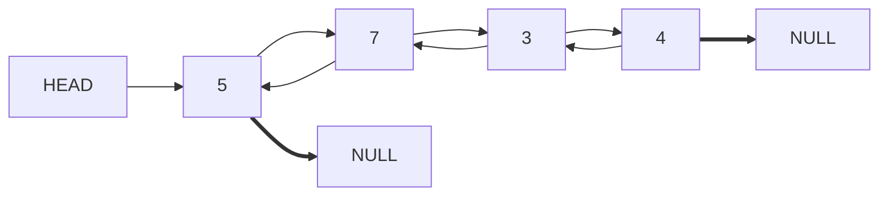

#### 练习
1.Shape基类,要求所有子类都必须提供面积的计算,子类有三角形,矩形,源.  
2.上题圆类的数据做可序列化


三角形面积---海伦公式
p = (a+b+c)/2
S = (P(p-a)(p-b)(p-c))**0.5

#### 作业

用面向对象实现Linkedlist链表  
单链表实现append,iternodes方法  
双链表实现append.pop,insert,remove,iternoder方法  
single linked list  

double linked list  



######################################################################
*************
练习题:
* 参考:
    - 1.Shape基类,要求所有自雷都必须提供面积的计算,子类有三角形,矩形,圆形
    - 2.由于我们并不清楚子类的所传参数个数是多少,子类的所求面积公式是什么,所以我们只能抽象出一个面积的方法就好了.

参考1 实现最基本的功能
```py

import pickle
class Size:
    def size(self):
        raise NotImplementedError()

class TriangleSize(Size):
    def __init__(self,a:int,b:int,c:int):
        self.a = a
        self.b = b
        self.c = c

    def size(self):
        p = (self.a+self.b+self.c)/2
        s = (p*(p-self.a)*(p-self.b)*(p-self.c))**0.5
        return s

class  RectangleSize(Size):
    def __init__(self,b,c):
        self.b = b
        self.c = c

    def size(self):
        s = self.b*self.c
        return s

class Roundness(Size):
    def __init__(self,r):
        self.r = r
    def size(self):
        s = self.r*self.r*3.14
        return  s

s = Roundness(5)
print(s.size())
s = RectangleSize(2,3)
print(s.size())
s = TriangleSize(3,4,5)
print(s.size())
```

*输出结果为:*
```py
78.5
6
6.0
```

把代码进一步的抽象还可以继续的优化为:
```py
class Shape:
    def __init__(self):
        self._area = None# if self.area else self.area

    @property
    def area(self):
        raise NotImplementedError()

class TriangleSize(Shape):
    def __init__(self,a,b,c):
        super().__init__()
        self.a = a
        self.b = b
        self.c = c
        self._p = (self.a+self.b+self.c)/2

    @property
    def area(self):
        p = self._p
        if self._area is None:
            self._area =(p*(p-self.a)*(p-self.b)*(p-self.c))**0.5
        return self._area
class  RectangleSize(Shape):
    def __init__(self,b,c):
        super().__init__()
        self.b = b
        self.c = c

    @property
    def area(self):
        if self._area is None:
            self._area =self.b*self.c
        return  self._area

class Roundness(Shape):
    def __init__(self,r):
        super().__init__()
        print(Roundness.__dict__)
        self.r = r

    @property
    def area(self):
        if self._area is None:
            self._area = self.r*self.r*3.14
        return  self._area

s = Roundness(5)
print(s.area)
s = RectangleSize(2,3)
print(s.area)
s = TriangleSize(3,4,5)
print(s.area)

```
*输出结果为:*
```py
{'__module__': '__main__', '__init__': <function Roundness.__init__ at 0x00EDF4F8>, 'area': <property object at 0x00345390>, '__doc__': None}
78.5
6
6.0

```
2.圆类的序列化
```py
class SerialzablenMixin:
    def dumps(self,t = 'json'):
        if t == 'json':
            return json.dumps(self.__dict__)
        elif t == 'msgpack':
            return msgpack.packb(self.__dict__)
        else:
            raise NotImplementedError('没有实现序列化')

class SerializableCircelMixin(SerialzablenMixin,Roundness):pass

smc = SerializableCircelMixin(4)
print(smc.area)
s = smc.dumps('msgpack')
print(s)
```
输出结果为:

```py

b'\x82\xa5_area\xcb@I\x1e\xb8Q\xeb\x85\x1f\xa1r\x04'

```
