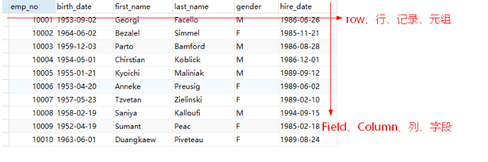
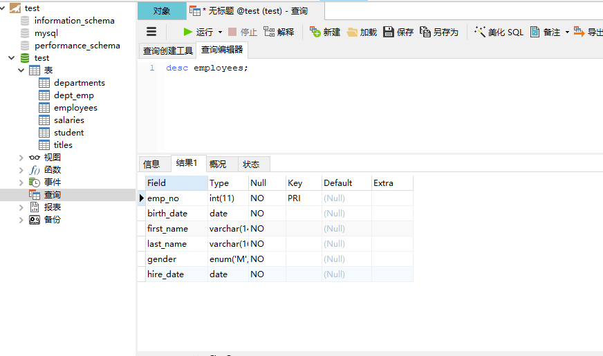
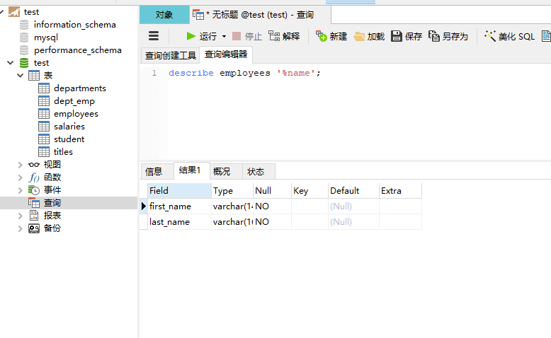

# 关系模型和sql

为了介绍关系模型,记忆Mysql为例.  

# 安装

MariaDB 安装  
```sh
[root@localhost ~]# yum list|grep mariadb
mariadb.x86_64                              1:5.5.60-1.el7_5           @base    
mariadb-libs.x86_64                         1:5.5.60-1.el7_5           @base    
mariadb-server.x86_64                       1:5.5.60-1.el7_5           @base    
mariadb-bench.x86_64                        1:5.5.60-1.el7_5           base     
mariadb-devel.i686                          1:5.5.60-1.el7_5           base     
mariadb-devel.x86_64                        1:5.5.60-1.el7_5           base     
mariadb-embedded.i686                       1:5.5.60-1.el7_5           base     
mariadb-embedded.x86_64                     1:5.5.60-1.el7_5           base     
mariadb-embedded-devel.i686                 1:5.5.60-1.el7_5           base     
mariadb-embedded-devel.x86_64               1:5.5.60-1.el7_5           base     
mariadb-libs.i686                           1:5.5.60-1.el7_5           base     
mariadb-test.x86_64                         1:5.5.60-1.el7_5           base     

# 安装mariadb 服务,会自动安装mariadb
[root@localhost ~]# yum install mariadb-server

# 启动mariadb服务
[root@localhost ~]# systemctl start mariadb.service

# 查看mariadb服务是否开启
[root@localhost ~]# ss -tanl|grep 3306
LISTEN     0      50           *:3306                     *:* 

# 设置开机启动
[root@localhost ~]# systemctl enbale mariadb.service

# 数据库登录,并修改密码
[root@localhost ~]# mysql -uroot -phxy123
Welcome to the MariaDB monitor.  Commands end with ; or \g.
Your MariaDB connection id is 2
Server version: 5.5.60-MariaDB MariaDB Server

Copyright (c) 2000, 2018, Oracle, MariaDB Corporation Ab and others.

Type 'help;' or '\h' for help. Type '\c' to clear the current input statement.

MariaDB [(none)]> show databases;
+--------------------+
| Database           |
+--------------------+
| information_schema |
| mysql              |
| performance_schema |
| test               |
+--------------------+
4 rows in set (0.00 sec)

# 创建并授权用户
MariaDB [(none)]> grant all *.* to 'hxy'@'%' identified by 'youpasswd';

# 刷新权限
MariaDB [(none)]> flush privileges;

# 导入测试脚本
[root@localhost ~]#  mysql -uroot -p < test.sql

```

## SQL语句
---
**SQL**是结构化查询语句Structured Query Language. 1987年被IOS组织标准化.  
所有主流的关系型数据库都支持SQL,NoSQL也很大一部分支持SQL.   

* SQL语句分为:  
- DDL数据定义语言,负责数据定义,数据库对象定义,create,alter与drop三种语言组成.  
- DML数据库操作语言, 负责对数据库对象的操作,CRUP增删改查(insert,delete,update,select).  
- DCL数据库控制语言, 负责数据库权限访问控制,由grant和revoke两个指令组成.  
- TCL事务控制语言,负责处理ACID事务,支持commit,rollback指令.  

> DDL 负责表的创建,修改和删除(对表字段属性的定义)  
> DML 负责表的增删改查  
> DCL 负责数据库用户权限的管理  
> TCL 负责数据库的事务处理,管理数据库事务的安全级别  

* 语言规范  
- SQL语句大小写不敏感  
    - 一般建议,SQL的关键字,函数等大写.  
- SQL语句末尾应该使用分号结束.  
- 注释  
    - 多行注释  `--注释内容`  
    - 单行注释 `/*注释内容*/`  
    - MYSQL 注释可以使用 `#`

- 使用空格或缩进来提高可读性.  
- 命名规范  
    - 必须以字母开头  
    - 可以使用数字,# , $和_  
    - 不可以使用关键字  

## DCL 
---
grant授权,revoke撤销  
```sql 
-- 授权
MariaDB [(none)]> grant all on *.* to 'haha'@'%' identified by 'passwd';
Query OK, 0 rows affected (0.00 sec)

-- 撤销授权
MariaDB [(none)]> revoke all on *.* from haha;
Query OK, 0 rows affected (0.00 sec)

```

*为通配符,指任意库或者任意表. `*.*`所有的库和表; `employees.*`表示employees库下所有的表  
%为通配符,它是SQL语句的通配符,匹配任意长度字符串.  


## DDL
#### 删除用户(慎用)
```sql
DROP USER  haha;
```

#### 创建数据库
库是数据的集合,所有数据按照数据模型组织在数据库中.  
```sql
create database if not exists test character set utf8mb4 collate utf8mb4_grneral_ci;
create database if not exists test character set utf7=8;
```

> `character set `指定字符集  
> utf8mb4是urf8的扩展,支持4字节utf8mb4需要mysql5.5.3+  
> collate(校对)指定字符集的校队规则,用来做字符创的比较的.例如a,A 谁大?  

#### 删除数据库
所有的删除操作都要慎用,宁可留着也不删除
```sql
drop database if exists tablename;
```

#### 创建表

表分为行和列,mtsql是行存数据库,数据是一行行存储的,必须固定多少列(列一旦固定了要修改的代价太大,几乎认为无法修改).  
行row, 也称记录record,元组  
列column, 也称为字段Field,属性  
字段的取值单位叫做 域Domain, 例如gender字段的取值就是M或者F两个值.  



```sql
CREATE TABLE `employees` (
  `emp_no` int(11) NOT NULL,
  `birth_date` date NOT NULL,
  `first_name` varchar(14) NOT NULL,
  `last_name` varchar(16) NOT NULL,
  `gender` enum('M','F') NOT NULL,
  `hire_date` date NOT NULL,
  PRIMARY KEY (`emp_no`)
) ENGINE=InnoDB DEFAULT CHARSET=utf8;


```
反引号标注的名称,会被认为是非关键字,使用反引号避免冲突.  

#### DESC
查看列信息  
{DESCRIBE| DESC} tab_name|[col_name| wild]
```sql
desc employees;
describe employees %name;
```



#### 联系
设计一张表,记录登录账户的注册信息,应该存储用户的姓名,登录名,密码  
```sql
drop database if exists test;
create database if not test character set utf8;
```

```sql
CREATE TABLE `reg` (
  `id` int(11) NOT NULL,
  `loginname` varchar(50) NOT NULL,
  `name` varchar(64) DEFAULT NULL,
  `PASSWORD` varchar(128) NOT NULL,
  PRIMARY KEY (`id`)
) ENGINE=InnoDB DEFAULT CHARSET=utf8mb4;

```

## 关系
在关系数据库中,关系就是二维表,有行和列组成.  
行row, 也称为记录record, 元组.   
列column,也称为字段field,属性.  
字段的取值范围叫做 域Domain.  例如gender字段的取值就是M或者F两个值  

维数: 关系的维数之关系中属性的个数.  
基数: 元组的个数.  

注意在关系中,属性的顺序并不重要. 理论上,元组顺序也不重要,但是由于元组顺序与存储相关,会影响查询的效率.  

### 候选键
关系中,唯一能标识一条元组的属性或者属性的集合,称为候选键.  

### 主键primary key 
表中一列或者多列组成唯一的key, 也就是通过这一个或者多个列能唯一标识一条记录. 即被选择的候选键.  
主键的列不能包含空值null. 主键忘完设置为整型, 长整形, 可以为自增auto_increment字段.  
表中可以没有主键,但是一般表设计中,往往都会有主键,避免重复记录.  

唯一索引和主键索引都拥有唯一性,因此它们都可以作为索引.


### 外键foreign key
严格来说,当一个关系中的某个属性或水属性集合以另一个关系(也可以是自身)的候选键匹配是,就可以称作这个属性或者属性集合是外键.  

### 索引index

可以看作是一个字典的目录,为了快速检索用的. 空间换时间,线束提高查询效率.   
可以对一列或多列字段设定索引.  

主键索引,主键会自动建立主键索引, 主键本身就是为了快速定位唯一记录的.  
唯一索引, 表中的索引列组成的索引必须唯一, 但可以为空, 非控制必须唯一.  
普通索引, 没有唯一性的要求,就是建了一个字段的字典目录而已.  

在MYSQL中, InnoDB和mysql的索引数据结构可以使用Hash或BTree,默认是BTree.  

Hash时间复杂度是O(1), 但是只能进行精确匹配,也就是Hash指的匹配, 比如范围匹配就没有办法了, hash指无序所以无法知道原有的记录顺序,Hash问题较多.  

BTree索引,以B+树为存储结构.  

虽然索引可以提高查询速度,但是却影响增删改的效率,因为需要索引更新或重构,频繁出现在where子句中的列可以考虑使用索引.要避免把性别这种字段设为索引.  


## 约束Constraint
为了保证数据的完整正确,数据模型还必须支持完整性约束.  

"必须有值"约束  
某些列的必须有值,不允许为空null  


## 域约束
限定了表中字段的取值范围  

## 实体完整性Entity Integrity
primary key约束定义了主键,就定义了**主键约束**. 主键不重复且唯一, 不能为空.  

## 引用完整性referential Integrity *** 
外键定义中,可以不是引用另一张表的主键 ,但是,往往实际只会关注引用主键.  

外键: 在B表中的列, 引用了表A中的主键, 表B中的列就是外键.  

A表称为主表, B表称为从表  

查询的时候最好使用主键,候选键,唯一键,索引,不让会浪费大量的服务器IO和网络IO.

#### 插入规则
不需要指定  
如果在B表插入一条记录,B的外键插入一个值,这个值必须是表A中存在的主键.  

#### 更新规则
定义外键约束时指定该规则  

#### 删除规则
定义外键约束时指定该规则  
数据库不能删除,最好逻辑删除 

#### 外键约束的操作  
|设定值|说明|
|:--|:----|
|cascade| 级联,从父表删除或更新会自动删除或更新字表中的匹配行|
|set null|从父表删除或更新行,会设置表中的外键列为null, 但必须保证子表列灭有指定not null,也就是说子表的字段可以为null 才行|
|restrict|如果从附表删除主键,如果子表引用了,则拒绝对浮标的删除或者更新操作|
|not action|标准sql的关键字,在mysql中与restrict. 拒绝对父表的删除或者更新操作|

# 实体-联系-E-R

数据库建立,需要收集用户需求,设计符合企业要求的数据模型. 而构建这种模型需要方法, 这种方法需要成为e-rS实体-联系模型. 也出现了一种模型语言--UML(unified modeling language) 统一建模语言.  

实体Entity: 现实世界中具有相同属性的一组对象,可以十五里存在的事务或抽象的事物.  

联系relationship: 实体之间的关系集合.  

## 实体间联系类型
假设有实体部门,实体员工  
|类型|描述|解决方案|
|:--|:----|
|一对多(1:n)|一个员工属于一个部门,一个部门有多个员工|员工建外键;连接到部门的主键|
|多对多联系(m:n)|一个员工属于多个部门,一个部门有多个员工|建立第三表|
|一对一联系(1:1)|假设有实体管理者,一个管理者管理一个部门,一个部门只有一个管理者|字段键在那张表都行|

一对一关系用较少的,往往表示表A的一条记录唯一关联表B的一条记录,反之亦然.  
它往往是为了将一张表分割并产生成了多张表,合起来是完整的信息,或为了方便查询,为了数据安全隔离一部分字段的数据等等.  
> 多对多,建新表;一对一拆个表;一对多,建外键.  
> 一对一,往往是把一张表切成两份,隐藏部分信息,或是一张表分成几份,用于复杂关系的  
> 一对多,要使用外键  
> 多对多,需要使用第三张表来建立他们之间的对应关系.  


主键候选键,可以是一行,也可以是多行
唯一键为什么不能作为候选键?
因为唯一键允许有空,主键不允许有空

索引分为主键索引,唯一键索引,普通索引. 
普通索引没有唯一性,如何能建立字典目录?
索引是为了快速定位数据,无所谓一行还是多行,但是最好用在变化范围比较大,值比较多,查询频繁的行.


索引的作用就是为了查询速度快,索引不宜过多,索引多了速度不一定快,
特别是,写多读少的库,少用索引,度多写少的库,索引最好不要超过5个.


## 视图
视图,也称为虚表,看起来像表.它是由查询语句生成的.可以通过视图进行CRUP操作.  
视图的作用.  
- 简化操作,将复杂sql语句定义为视图,可以简化查询.  
- 数据安全,视图可以只显示真是的表的部分列,或计算后的结果,从而隐藏真实表的数据.  

视图可能只是一些虚表,看到的并不是实表,起到隐藏,保护表的作用,也可以起到节省查询速度的,节约计算速度的效果.


## 数据类型  
MySQL中的数据类型  
|类型|含义|
|:--|:----|
|tinyint|1字节,带符号范围是-128到127. 无符号链接的范围是0到255 bool或boolean, 就是tinyint, 0表示假,非0表示真|
|smallint|2字节,带符号的范围是-32768到32767  无符号的范围是0到65535 |
|int|整形,4字节, 同integer 带符号的范围是-2147483648到2147483647 无符号链接范围是0到4294967295|
|bigint|长整形,8字节 带符号的范围是-9223372013854775808到9223372036854775807  无符号的范围是0到18446744073709551615|
|float|单精度浮点树精确到大约7位小数位|
|double|双精确度浮点数精确到大约15位小数位|
|date|日期,  支付的范围位'1000-01-01'到'9999-12-31'|
|datatime|支持范围是'1000-01-01 00:00:00'到'9999-12-31 23:59:59'|
|timestamp|时间戳, 范围是'1970-01-01 00:00:00'到2037年|
|char(M)|固定长度, 从右边填充空格长度达到要求. M位长度, 范围是0-255. M指的是字符个数|
|varvhar(M)|边长字符串. M表示最大列的长度. M的范围是0到65535. 但不能突破最大字节数65535|
|text|长文本. 最大长度为65535个字节|
|BLOB|大字节, 最大长度为65535字节的BLOB列|

length函数返回字节数. 二charvarchar定义的M是字符数限制.  
char可以将字符串定义为固定长度, 空间换时间, 效率略高;varchar为边长.节省了空间.  

## 关系操作
关系: 再关系数据库中,关系就是二维表  
关系操作就是对表的操作  

选择(selection): 又称为限制,是从关系中选择出满足给定条件的元祖(where).  
投影(projection): 在关系上投影就是从中选择出若干属性列组成新的关系(from).  
连接(join): 将不同的两个关系连接成一个关系(A-连接-B).  

`select 投影 from A 连接(join) B on 选择 where(选择);`

选择(Selection)

选择是单目运算，其运算对象是一个表。该运算按给定的条件，从表中选出满足条件的行形成一个新表作为运算结果。 
选择运算的记号为 σF(R)。 
其中σ是选择运算符，下标F是一个条件表达式，R是被操作的表。

投影(Projection)

投影也是单目运算，该运算从表中选出指定的属性值组成一个新表，记为：ΠA(R)。 
其中A是属性名（即列名）表，R是表名。

连接(JOIN)

把两个表中的行按着给定的条件拼接而形成的新表。 
执行顺序：自然连接–>选取–>投影


# DML ---- CRUD 增删改查
### insert语句

```sql
-- 向表中插入一行数据,自增字段,缺省字段,可以为空字段,可以不写
insert into table_name (col_name ,  ...) values (value1, ....)

-- 将select查询的结果插入到表中
insert into table_name selsct ...;

-- 如果主键冲突,唯一键冲突执行update后的设置,这条语句的意思,就是主键不在新增记录,主键在就更新部分字段.
insert into table_name (col_name ,... ) values (value1, ...) on duplicate key update clo_name1=value1, ... ;

-- 如果主键冲突,唯一键冲突,就忽略错误,返回一个警告.
insert into table_name (col_name, ... ) values (value, ...)

```

```sql
insert into reg(loginname, `name`, `password`) values ('tom', 'tom', 'tom');
insert into reg(id, loginname, `name`, `password`) values (5, 'tom', 'tom', 'tom');
insert into reg(id, loginname, `name`, `password`) values (1, 'tom', 'tom', 'tom') on duplicate key update name = 'jerry'; 
```

插入后的结果为:

```sql
MariaDB [test]> insert into reg(loginname, `name`, `password`) values ('tom', 'tom', 'tom');
Query OK, 1 row affected, 1 warning (0.01 sec)

MariaDB [test]> insert into reg(id, loginname, `name`, `password`) values (5, 'tom', 'tom', 'tom');
Query OK, 1 row affected (0.01 sec)

MariaDB [test]> insert into reg(id, loginname, `name`, `password`) values (1, 'tom', 'tom', 'tom') on duplicate key update name = 'jerry'; 
Query OK, 1 row affected (0.00 sec)

MariaDB [test]> select * from reg;
+----+-----------+------+----------+
| id | loginname | name | PASSWORD |
+----+-----------+------+----------+
|  0 | tom       | tom  | tom      |
|  1 | tom       | tom  | tom      |
|  5 | tom       | tom  | tom      |
+----+-----------+------+----------+
3 rows in set (0.01 sec)

```

### update 语句

```sql
-- ingore 意义同insert语句
update [ignore ] table_name set clo_name1 = expr1 [ , col_name2=expr2 ...] [where where_definition]

update reg set name= '张三' where id =5;

```

修改后的结果为:
```sql
MariaDB [test]> update reg set name= '张三' where id =5;
Query OK, 1 row affected (0.00 sec)
Rows matched: 1  Changed: 1  Warnings: 0

MariaDB [test]> select * from reg;
+----+-----------+--------+----------+
| id | loginname | name   | PASSWORD |
+----+-----------+--------+----------+
|  0 | tom       | tom    | tom      |
|  1 | tom       | tom    | tom      |
|  5 | tom       | 张三   | tom      |
+----+-----------+--------+----------+
3 rows in set (0.00 sec)

```

```sql
-- 注意这一句非常危险,会更新所有数据(它会把所有的name修改为ben)
update reg set name = 'ben';

-- 更新一定要加条件
update reg set name = 'ben', password = 'benpwd' where id = 1;
```

输出结果为:  

```sql
MariaDB [test]> select * from reg;
+----+-----------+------+----------+
| id | loginname | name | PASSWORD |
+----+-----------+------+----------+
|  0 | tom       | ben  | tom      |
|  1 | tom       | ben  | tom      |
|  5 | tom       | ben  | tom      |
+----+-----------+------+----------+
3 rows in set (0.00 sec)

MariaDB [test]> update reg set name = 'ben', password = 'benpwd' where id = 1;
Query OK, 1 row affected (0.00 sec)
Rows matched: 1  Changed: 1  Warnings: 0

MariaDB [test]> select * from reg;
+----+-----------+------+----------+
| id | loginname | name | PASSWORD |
+----+-----------+------+----------+
|  0 | tom       | ben  | tom      |
|  1 | tom       | ben  | benpwd   |
|  5 | tom       | ben  | tom      |
+----+-----------+------+----------+
3 rows in set (0.01 sec)

```

## delete 语句

```sql
-- 删除符号条件的记录
delete from tab_name (where where_definition)

-- 删除一定要有条件
delete from reg where id = 1;
```

输出结果为:  

```sql
MariaDB [test]> delete from reg where id = 1;
Query OK, 1 row affected (0.01 sec)

MariaDB [test]> select * from reg;
+----+-----------+------+----------+
| id | loginname | name | PASSWORD |
+----+-----------+------+----------+
|  0 | tom       | ben  | tom      |
|  5 | tom       | ben  | tom      |
+----+-----------+------+----------+
2 rows in set (0.00 sec)
```

## select 语句
```sql
elect 
    [distinct ]
    select_expr, ...
    [form table_references
    [where where_definition]
    group by {col_name | expr |position}
        [asc| desc], ...| [with rollup]
    [having where_definition]
    [order by {col_name |expr |position}
        [asc| desc], ...]
    [limit {[offset ,] row_count| row_count offset offset}]
    [for update |lock in share mode]]

```
for update 会把行进行写锁定,这是排它锁.  

查询  
查询的结果成为结果集recordest.  

```sql
-- 简单的查询
select * from employees;

-- 字符串合并
select emp_no,first_name+last_name from employees;
select emp_no,concat(first_name,' ',last_name) from employees;

-- as 定义别名,可选,写as是一个好习惯;
select emp_no as `no`, concat(first_name,' ',last_name)  name from employees emp;
```

输出结果为:

```sql
MariaDB [test]> select * from employees;
+--------+------------+------------+-------------+--------+------------+
| emp_no | birth_date | first_name | last_name   | gender | hire_date  |
+--------+------------+------------+-------------+--------+------------+
|  10001 | 1953-09-02 | Georgi     | Facello     | M      | 1986-06-26 |
|  10002 | 1964-06-02 | Bezalel    | Simmel      | F      | 1985-11-21 |
|  10003 | 1959-12-03 | Parto      | Bamford     | M      | 1986-08-28 |
|  10004 | 1954-05-01 | Chirstian  | Koblick     | M      | 1986-12-01 |
|  10005 | 1955-01-21 | Kyoichi    | Maliniak    | M      | 1989-09-12 |
|  10006 | 1953-04-20 | Anneke     | Preusig     | F      | 1989-06-02 |
|  10007 | 1957-05-23 | Tzvetan    | Zielinski   | F      | 1989-02-10 |
|  10008 | 1958-02-19 | Saniya     | Kalloufi    | M      | 1994-09-15 |
|  10009 | 1952-04-19 | Sumant     | Peac        | F      | 1985-02-18 |
|  10010 | 1963-06-01 | Duangkaew  | Piveteau    | F      | 1989-08-24 |
|  10011 | 1953-11-07 | Mary       | Sluis       | F      | 1990-01-22 |
|  10012 | 1960-10-04 | Patricio   | Bridgland   | M      | 1992-12-18 |
|  10013 | 1963-06-07 | Eberhardt  | Terkki      | M      | 1985-10-20 |
|  10014 | 1956-02-12 | Berni      | Genin       | M      | 1987-03-11 |
|  10015 | 1959-08-19 | Guoxiang   | Nooteboom   | M      | 1987-07-02 |
|  10016 | 1961-05-02 | Kazuhito   | Cappelletti | M      | 1995-01-27 |
|  10017 | 1958-07-06 | Cristinel  | Bouloucos   | F      | 1993-08-03 |
|  10018 | 1954-06-19 | Kazuhide   | Peha        | F      | 1987-04-03 |
|  10019 | 1953-01-23 | Lillian    | Haddadi     | M      | 1999-04-30 |
|  10020 | 1952-12-24 | Mayuko     | Warwick     | M      | 1991-01-26 |
+--------+------------+------------+-------------+--------+------------+
20 rows in set (0.00 sec)

MariaDB [test]> select emp_no,first_name+last_name from employees;
+--------+----------------------+
| emp_no | first_name+last_name |
+--------+----------------------+
|  10001 |                    0 |
|  10002 |                    0 |
|  10003 |                    0 |
|  10004 |                    0 |
|  10005 |                    0 |
|  10006 |                    0 |
|  10007 |                    0 |
|  10008 |                    0 |
|  10009 |                    0 |
|  10010 |                    0 |
|  10011 |                    0 |
|  10012 |                    0 |
|  10013 |                    0 |
|  10014 |                    0 |
|  10015 |                    0 |
|  10016 |                    0 |
|  10017 |                    0 |
|  10018 |                    0 |
|  10019 |                    0 |
|  10020 |                    0 |
+--------+----------------------+
20 rows in set, 40 warnings (0.00 sec)

MariaDB [test]> select emp_no,concat(first_name,' ',last_name) from employees;
+--------+----------------------------------+
| emp_no | concat(first_name,' ',last_name) |
+--------+----------------------------------+
|  10001 | Georgi Facello                   |
|  10002 | Bezalel Simmel                   |
|  10003 | Parto Bamford                    |
|  10004 | Chirstian Koblick                |
|  10005 | Kyoichi Maliniak                 |
|  10006 | Anneke Preusig                   |
|  10007 | Tzvetan Zielinski                |
|  10008 | Saniya Kalloufi                  |
|  10009 | Sumant Peac                      |
|  10010 | Duangkaew Piveteau               |
|  10011 | Mary Sluis                       |
|  10012 | Patricio Bridgland               |
|  10013 | Eberhardt Terkki                 |
|  10014 | Berni Genin                      |
|  10015 | Guoxiang Nooteboom               |
|  10016 | Kazuhito Cappelletti             |
|  10017 | Cristinel Bouloucos              |
|  10018 | Kazuhide Peha                    |
|  10019 | Lillian Haddadi                  |
|  10020 | Mayuko Warwick                   |
+--------+----------------------------------+
20 rows in set (0.00 sec)

MariaDB [test]> select emp_no as `no`, concat(first_name,' ',last_name)  name from employees emp;
+-------+----------------------+
| no    | name                 |
+-------+----------------------+
| 10001 | Georgi Facello       |
| 10002 | Bezalel Simmel       |
| 10003 | Parto Bamford        |
| 10004 | Chirstian Koblick    |
| 10005 | Kyoichi Maliniak     |
| 10006 | Anneke Preusig       |
| 10007 | Tzvetan Zielinski    |
| 10008 | Saniya Kalloufi      |
| 10009 | Sumant Peac          |
| 10010 | Duangkaew Piveteau   |
| 10011 | Mary Sluis           |
| 10012 | Patricio Bridgland   |
| 10013 | Eberhardt Terkki     |
| 10014 | Berni Genin          |
| 10015 | Guoxiang Nooteboom   |
| 10016 | Kazuhito Cappelletti |
| 10017 | Cristinel Bouloucos  |
| 10018 | Kazuhide Peha        |
| 10019 | Lillian Haddadi      |
| 10020 | Mayuko Warwick       |
+-------+----------------------+
20 rows in set (0.01 sec)

```
**总结:**  

- select 查询的时候数字可以直接相加,字符串相加要使用 函数concat  用法为concat(str1, ' ', str2) as name
- 字段或表明后面接个名字,也是做别名,但是做好还是加上as,这样提高可读性,上面的几个都是别名
    - `emp_no as \`no\`` 别名是 no  
    - `concat(first_name,' ',last_name)  name ` 别名是name  
    - `employees emp` 表别名是 emp  
表可以用别名,字段,组合都可以使用别名
在语句后面使用别名的时候,前面也要使用别名,不然就会报错,找不到表明.
### limit 子句

```sql
-- 返回5条记录
select * from employees emp limit 5;

-- 返回5条记录,偏移18条
select * from employees emp limit 5 offset 18;
select * from employees emp limit 18,5;
```

输出结果为:  
```sql
MariaDB [test]> select * from employees emp limit 5;
+--------+------------+------------+-----------+--------+------------+
| emp_no | birth_date | first_name | last_name | gender | hire_date  |
+--------+------------+------------+-----------+--------+------------+
|  10001 | 1953-09-02 | Georgi     | Facello   | M      | 1986-06-26 |
|  10002 | 1964-06-02 | Bezalel    | Simmel    | F      | 1985-11-21 |
|  10003 | 1959-12-03 | Parto      | Bamford   | M      | 1986-08-28 |
|  10004 | 1954-05-01 | Chirstian  | Koblick   | M      | 1986-12-01 |
|  10005 | 1955-01-21 | Kyoichi    | Maliniak  | M      | 1989-09-12 |
+--------+------------+------------+-----------+--------+------------+
5 rows in set (0.01 sec)

MariaDB [test]> select * from employees emp limit 5 offset 18;
+--------+------------+------------+-----------+--------+------------+
| emp_no | birth_date | first_name | last_name | gender | hire_date  |
+--------+------------+------------+-----------+--------+------------+
|  10019 | 1953-01-23 | Lillian    | Haddadi   | M      | 1999-04-30 |
|  10020 | 1952-12-24 | Mayuko     | Warwick   | M      | 1991-01-26 |
+--------+------------+------------+-----------+--------+------------+
2 rows in set (0.01 sec)

MariaDB [test]> select * from employees emp limit 18,5;
+--------+------------+------------+-----------+--------+------------+
| emp_no | birth_date | first_name | last_name | gender | hire_date  |
+--------+------------+------------+-----------+--------+------------+
|  10019 | 1953-01-23 | Lillian    | Haddadi   | M      | 1999-04-30 |
|  10020 | 1952-12-24 | Mayuko     | Warwick   | M      | 1991-01-26 |
+--------+------------+------------+-----------+--------+------------+
2 rows in set (0.00 sec)

```
limit 限制查询结果(默认是前面的5条)
limit 4 从头开始到第四条
limit 2,5 从查询到的结果的第2条开始向后5条
limit 5 offset 2 #查5条,在查询到结果的第2条之后的五条,可能会少于5条
这两个的查询结果是一样的 
limit用于数据量多大之后用来分页的.
### where子句
|运算符|描述|
|:--|:---|
|=|等于|
|<>|不等于|
|> < >= <= |大于 小于 小于等于 小于等于|
|between|在某个范围内,between a and b 等价于[a,b]|
|like| 字符串模式匹配, `%`表示任意多个字符串, `_`表示一个字符|
|in |制定针对某个列的多个可能性|
|and|与|
|or|或|

注意: 如果很多表达式需要使用and, or计算逻辑表达式值的时候,由于有结合律的问题. 建议使用小括号来避免产生错误  

```sql
-- 条件查询
select * from employees where emp_no < 10015 and last_name like 'P%';
select * from employees where emp_no between 10010 and 10015 and last_name like 'P%';
select * from employees where emp_no in (10011,10012,10019);
```

查询结果为:  
```sql
MariaDB [test]> select * from employees where emp_no < 10015 and last_name like 'P%';
+--------+------------+------------+-----------+--------+------------+
| emp_no | birth_date | first_name | last_name | gender | hire_date  |
+--------+------------+------------+-----------+--------+------------+
|  10006 | 1953-04-20 | Anneke     | Preusig   | F      | 1989-06-02 |
|  10009 | 1952-04-19 | Sumant     | Peac      | F      | 1985-02-18 |
|  10010 | 1963-06-01 | Duangkaew  | Piveteau  | F      | 1989-08-24 |
+--------+------------+------------+-----------+--------+------------+
3 rows in set (0.00 sec)

MariaDB [test]> select * from employees where emp_no between 10010 and 10015 and last_name like 'P%';
+--------+------------+------------+-----------+--------+------------+
| emp_no | birth_date | first_name | last_name | gender | hire_date  |
+--------+------------+------------+-----------+--------+------------+
|  10010 | 1963-06-01 | Duangkaew  | Piveteau  | F      | 1989-08-24 |
+--------+------------+------------+-----------+--------+------------+
1 row in set (0.00 sec)

MariaDB [test]> select * from employees where emp_no in (10011,10012,10019);
+--------+------------+------------+-----------+--------+------------+
| emp_no | birth_date | first_name | last_name | gender | hire_date  |
+--------+------------+------------+-----------+--------+------------+
|  10011 | 1953-11-07 | Mary       | Sluis     | F      | 1990-01-22 |
|  10012 | 1960-10-04 | Patricio   | Bridgland | M      | 1992-12-18 |
|  10019 | 1953-01-23 | Lillian    | Haddadi   | M      | 1999-04-30 |
+--------+------------+------------+-----------+--------+------------+
3 rows in set (0.00 sec)

```

### order by 子句
对查询结果进行排序,可以升序asc,降序desc    
默认是升序  

```sql
-- 升序
select * from employees where emp_no in (10011,10017,10019) order by emp_no ;
select * from employees where emp_no in (10011,10017,10019) order by emp_no asc;

-- 降序 
select * from employees where emp_no in (10011,10017,10019) order by emp_no desc;
```

输出结果为:

```sql
MariaDB [test]> select * from employees where emp_no in (10011,10017,10019) order by emp_no ;
+--------+------------+------------+-----------+--------+------------+
| emp_no | birth_date | first_name | last_name | gender | hire_date  |
+--------+------------+------------+-----------+--------+------------+
|  10011 | 1953-11-07 | Mary       | Sluis     | F      | 1990-01-22 |
|  10017 | 1958-07-06 | Cristinel  | Bouloucos | F      | 1993-08-03 |
|  10019 | 1953-01-23 | Lillian    | Haddadi   | M      | 1999-04-30 |
+--------+------------+------------+-----------+--------+------------+
3 rows in set (0.01 sec)

MariaDB [test]> select * from employees where emp_no in (10011,10017,10019) order by emp_no asc;
+--------+------------+------------+-----------+--------+------------+
| emp_no | birth_date | first_name | last_name | gender | hire_date  |
+--------+------------+------------+-----------+--------+------------+
|  10011 | 1953-11-07 | Mary       | Sluis     | F      | 1990-01-22 |
|  10017 | 1958-07-06 | Cristinel  | Bouloucos | F      | 1993-08-03 |
|  10019 | 1953-01-23 | Lillian    | Haddadi   | M      | 1999-04-30 |
+--------+------------+------------+-----------+--------+------------+
3 rows in set (0.00 sec)

MariaDB [test]> select * from employees where emp_no in (10011,10017,10019) order by emp_no desc;
+--------+------------+------------+-----------+--------+------------+
| emp_no | birth_date | first_name | last_name | gender | hire_date  |
+--------+------------+------------+-----------+--------+------------+
|  10019 | 1953-01-23 | Lillian    | Haddadi   | M      | 1999-04-30 |
|  10017 | 1958-07-06 | Cristinel  | Bouloucos | F      | 1993-08-03 |
|  10011 | 1953-11-07 | Mary       | Sluis     | F      | 1990-01-22 |
+--------+------------+------------+-----------+--------+------------+
3 rows in set (0.00 sec)

```

order by str1,str2  如果第一个字符串str1相等,就按str2来排序.以此类推


### distinct
不返回重复记录
```sql
select distinct dept_no from dept_emp;
select distinct emp_no from dept_emp;
select distinct dept_no, emp_no from dept_emp;
```

输出结果为:
```sql
MariaDB [test]> select distinct dept_no from dept_emp;
+---------+
| dept_no |
+---------+
| d001    |
| d003    |
| d004    |
| d005    |
| d006    |
| d007    |
| d008    |
| d009    |
+---------+
8 rows in set (0.00 sec)

MariaDB [test]> select distinct emp_no from dept_emp;
+--------+
| emp_no |
+--------+
|  10001 |
|  10002 |
|  10003 |
|  10004 |
|  10005 |
|  10006 |
|  10007 |
|  10008 |
|  10009 |
|  10010 |
|  10011 |
|  10012 |
|  10013 |
|  10014 |
|  10015 |
|  10016 |
|  10017 |
|  10018 |
|  10019 |
|  10020 |
+--------+
20 rows in set (0.00 sec)

MariaDB [test]> select distinct dept_no, emp_no from dept_emp;
+---------+--------+
| dept_no | emp_no |
+---------+--------+
| d005    |  10001 |
| d007    |  10002 |
| d004    |  10003 |
| d004    |  10004 |
| d003    |  10005 |
| d005    |  10006 |
| d008    |  10007 |
| d005    |  10008 |
| d006    |  10009 |
| d004    |  10010 |
| d006    |  10010 |
| d009    |  10011 |
| d005    |  10012 |
| d003    |  10013 |
| d005    |  10014 |
| d008    |  10015 |
| d007    |  10016 |
| d001    |  10017 |
| d004    |  10018 |
| d005    |  10018 |
| d008    |  10019 |
| d004    |  10020 |
+---------+--------+
22 rows in set (0.00 sec)

```

### 聚合函数
|函数|描述|
|:--|:---|
|count(expr)|返回记录中记录的数目,如果指定列,则返回非null值行数|
|count(distinct expr,[expr ...])|返回不重复的非null值的行数|
|avg(distinct expr)|返回平均值, 返回不同的平均值|
|min(expr), max(expr)|返回最大值,最小值|
|sum([distinct]expr)|求和,distinct返回不同值求和|
```sql
-- 聚合函数
select count(*) ,avg(emp_no), sum(emp_no), min(emp_no), max(emp_no) from employees;

-- 聚合所有
select emp_no, sum(salary), avg(salary),count(emp_no) from salaries;

-- 聚合被选择的记录
select emp_no, sum(salary), avg(salary), count(emp_no) from salaries where emp_no < 10003;
```
查询结果为:
```sql
MariaDB [test]> select count(*) ,avg(emp_no), sum(emp_no), min(emp_no), max(emp_no) from employees;
+----------+-------------+-------------+-------------+-------------+
| count(*) | avg(emp_no) | sum(emp_no) | min(emp_no) | max(emp_no) |
+----------+-------------+-------------+-------------+-------------+
|       20 |  10010.5000 |      200210 |       10001 |       10020 |
+----------+-------------+-------------+-------------+-------------+
1 row in set (0.00 sec)

MariaDB [test]> select emp_no, sum(salary), avg(salary),count(emp_no) from salaries;
+--------+-------------+-------------+---------------+
| emp_no | sum(salary) | avg(salary) | count(emp_no) |
+--------+-------------+-------------+---------------+
|  10001 |     2491668 |  62291.7000 |            40 |
+--------+-------------+-------------+---------------+
1 row in set (0.00 sec)

MariaDB [test]> select emp_no, sum(salary), avg(salary), count(emp_no) from salaries where emp_no < 10003;
+--------+-------------+-------------+---------------+
| emp_no | sum(salary) | avg(salary) | count(emp_no) |
+--------+-------------+-------------+---------------+
|  10001 |     1694739 |  73684.3043 |            23 |
+--------+-------------+-------------+---------------+
1 row in set (0.01 sec)


```

聚合 既是多行聚合为一行
聚合的时候没有分组的话,是所有的数据聚合为一行,
有分组的话,就按照分组来聚合
因此一般都只是做分组聚合,很少做全表聚合
having 使用在 group by之后的条件判断,它是对于要出书的数据做进一步的过滤的.

### group by 子句
group by 用于分组查询
如果有条件,使用having子句过滤分组,聚合过的结果.  

```sql
--分组
select emp_no from salaries group by emp_no;
select emp_no from salaries where emp_no < 10003 group by emp_no ;

-- 按照不同emp_no 分组,梅竹芬别聚合
select emp_no,sum(salary), avg(salary), count(emp_no) from salaries where emp_no <10003 group by emp_no;

-- having子句对分组结果过滤
-- where一次过滤 having二次过滤
select emp_no,sum(salary), avg(salary), count(emp_no) from salaries group by emp_no having avg(salary) > 60000;

--使用别名
select emp_no,sum(salary), avg(salary) as sal_avg, count(emp_no) from salaries group by emp_no having sal_avg > 60000;

-- 最后对分组过滤后的结果排序
select emp_no,sum(salary), avg(salary) as sal_avg, count(emp_no) from salaries group by emp_no having sal_avg > 60000 order by sal_avg;

```

查询结果为:
```sql
MariaDB [test]> select emp_no from salaries group by emp_no;
+--------+
| emp_no |
+--------+
|  10001 |
|  10002 |
|  10003 |
|  10004 |
+--------+
4 rows in set (0.00 sec)

MariaDB [test]> select emp_no from salaries where emp_no < 10003 group by emp_no ;
+--------+
| emp_no |
+--------+
|  10001 |
|  10002 |
+--------+
2 rows in set (0.00 sec)

MariaDB [test]> select emp_no,sum(salary), avg(salary), count(emp_no) from salaries where emp_no <10003 group by emp_no;
+--------+-------------+-------------+---------------+
| emp_no | sum(salary) | avg(salary) | count(emp_no) |
+--------+-------------+-------------+---------------+
|  10001 |     1281612 |  75388.9412 |            17 |
|  10002 |      413127 |  68854.5000 |             6 |
+--------+-------------+-------------+---------------+
2 rows in set (0.00 sec)

MariaDB [test]> select emp_no,sum(salary), avg(salary), count(emp_no) from salaries group by emp_no having avg(salary) > 60000;
+--------+-------------+-------------+---------------+
| emp_no | sum(salary) | avg(salary) | count(emp_no) |
+--------+-------------+-------------+---------------+
|  10001 |     1281612 |  75388.9412 |            17 |
|  10002 |      413127 |  68854.5000 |             6 |
+--------+-------------+-------------+---------------+
2 rows in set (0.00 sec)

MariaDB [test]> select emp_no,sum(salary), avg(salary) as sal_avg, count(emp_no) from salaries group by emp_no having sal_avg > 60000;
+--------+-------------+------------+---------------+
| emp_no | sum(salary) | sal_avg    | count(emp_no) |
+--------+-------------+------------+---------------+
|  10001 |     1281612 | 75388.9412 |            17 |
|  10002 |      413127 | 68854.5000 |             6 |
+--------+-------------+------------+---------------+
2 rows in set (0.00 sec)

MariaDB [test]> select emp_no,sum(salary), avg(salary) as sal_avg, count(emp_no) from salaries group by emp_no having sal_avg > 60000 order by sal_avg;
+--------+-------------+------------+---------------+
| emp_no | sum(salary) | sal_avg    | count(emp_no) |
+--------+-------------+------------+---------------+
|  10002 |      413127 | 68854.5000 |             6 |
|  10001 |     1281612 | 75388.9412 |            17 |
+--------+-------------+------------+---------------+
2 rows in set (0.00 sec)
```
分组是将数据按照指定的字段分组,最终每组只能出来一条记录,这就带来了问题, 每一组谁来做代表?其实谁做代表都不合适.  
如果只能投影分组字段,聚合数据,不会有问题. 如果投影非分组字段,显示时候不能确定是组内谁的数据.  
```sql
-- 分组
select emp_no, max(salary) from salaries; -- 10001 88958
select emp_no, min(salary) from salaries; -- 10001 40006
```

查询结果为:
```sql
MariaDB [test]> select emp_no, max(salary) from salaries; -- 10001 88958
+--------+-------------+
| emp_no | max(salary) |
+--------+-------------+
|  10001 |       88958 |
+--------+-------------+
1 row in set (0.01 sec)

MariaDB [test]> select emp_no, min(salary) from salaries; -- 10001 40006
+--------+-------------+
| emp_no | min(salary) |
+--------+-------------+
|  10001 |       40006 |
+--------+-------------+
1 row in set (0.01 sec)

```
上例很好的说明了使用了聚合函数,虽然没有显示使用group by语句,但其实就是把所有记录当做一组,每组只能出一条,那么一组也只能出一条,所有结果就一条.  
但是emp_no就是非分组字段,那么它就要开始覆盖,所以,显示为10001,当求最大值的时候,正好工资表中10001的工资最高,感觉是对的.但是,求最小工资的时候,明明最小工资是40006,由于emp_no不是分组字段,导致最后被覆盖为10001.  

正确的分组查询
```sql
select emp_no, min(salary) from salaries group by emp_no;
```
输出结果为:
```sql
MariaDB [test]> select emp_no, min(salary) from salaries group by emp_no;
+--------+-------------+
| emp_no | min(salary) |
+--------+-------------+
|  10001 |       60117 |
|  10002 |       65828 |
|  10003 |       40006 |
|  10004 |       40054 |
+--------+-------------+
4 rows in set (0.00 sec)

```
上句才是正确的语义,按照不同员工emp_no工号分组,每一个人一组,每一个人有多个工资记录,按时每组只能按照人头出一条记录.  

复杂的查询语句  
```sql
-- 单标较为复杂的语句
select 
    emp_no,
    avg(salary) as avg_salary
from
    salaries
where
    salary > 70000
group by
    emp_no
having
    avg_salary > 70001
order by
    avg_salary
limit 1;
```


查询结果为:
```sql

MariaDB [test]> select 
    ->     emp_no,
    ->     avg(salary) as avg_salary
    -> from
    ->     salaries
    -> where
    ->     salary > 70000
    -> group by
    ->     emp_no
    -> having
    ->     avg_salary > 70001
    -> order by
    ->     avg_salary
    -> limit 1;
+--------+------------+
| emp_no | avg_salary |
+--------+------------+
|  10002 | 72245.0000 |
+--------+------------+
1 row in set (0.00 sec)

```

### 子查询
查询语句可以嵌套,内部查询就是子查询(select (select))  
子查询必须在一组小括号中.  
子查询中不能使用order by.  

```sql
-- 子查询
select * from employees where emp_no in (select emp_no from employees  where emp_no > 10015) order by emp_no desc;

select emp.emp_no,emp.first_name, gender from (select * from employees where emp_no >10015) as emp where emp.emp_no <10019 order by emp_no desc;
```

查询结果为:
```sql
MariaDB [test]> select * from employees where emp_no in (select emp_no from employees  where emp_no > 10015) order by emp_no desc;
+--------+------------+------------+-------------+--------+------------+
| emp_no | birth_date | first_name | last_name   | gender | hire_date  |
+--------+------------+------------+-------------+--------+------------+
|  10020 | 1952-12-24 | Mayuko     | Warwick     | M      | 1991-01-26 |
|  10019 | 1953-01-23 | Lillian    | Haddadi     | M      | 1999-04-30 |
|  10018 | 1954-06-19 | Kazuhide   | Peha        | F      | 1987-04-03 |
|  10017 | 1958-07-06 | Cristinel  | Bouloucos   | F      | 1993-08-03 |
|  10016 | 1961-05-02 | Kazuhito   | Cappelletti | M      | 1995-01-27 |
+--------+------------+------------+-------------+--------+------------+
5 rows in set (0.00 sec)

MariaDB [test]> select emp.emp_no,emp.first_name, gender from (select * from employees where emp_no >10015) as emp where emp.emp_no <10019 order by emp_no desc;
+--------+------------+--------+
| emp_no | first_name | gender |
+--------+------------+--------+
|  10018 | Kazuhide   | F      |
|  10017 | Cristinel  | F      |
|  10016 | Kazuhito   | M      |
+--------+------------+--------+
3 rows in set (0.00 sec)

```
in 后面接元祖(,)
能用in就用in 因为in的效率很高.
在使用in的时候尽量选择在主键里面

这里的from 不一定非的是表,也可以是别的表的查询结果来作为我们的输出

### join 连接
交叉连接 cross join   
笛卡尔乘积,全部交叉,量很大,重复很多  
在mysql中年,cross join 从语法上说与inner join等同  

join会构建一张临时表  
```sql
-- 攻资40行
select * from salaries;

--员工表20行
select * from employees;

-- 使用cross 800行
select * from employees cross join salaries;

-- 隐式连接 800行
select * from employees, salaries;

```
注意: salaries和employees并没有直接的关系,做笛卡尔乘积只是为了看得清楚

#### 内连接
inner join ,省略join.  
等值连接,只选某些field相等的元祖(行), 使用on限定关系的结果.   
自然连接,特殊的等值连接, 会去掉重复的列. 用的很少.  

```sql
-- 内连接,笛卡尔乘积,800行
select * from employees join salaries;
select * from employess inner join salaries;

-- on等值连接40行
select  * from employees join salaries onemployees.emp_no = salaries.emp_no;

-- 自然连接,去掉重复列,且自行使用employees.emp_no = salaries.emp_no的条件
select * from employess natural join salaries;

```
外连接  
outer join, 可以省略为join  
分为左外连接,即左连接; 右外连接,即右连接;全外连接  

 **左右连接**  
```sql
-- 左连接
select * from employees left join salaries on employees.emp_no = salaries.emp_no;

-- 右连接
select * from employees right join salaries on employees.emp_no = salaries.emp_no;

-- 这个右连接等价于上面的左连接
select * from salaries right join employees on employees.emp_no = salaries.emp_no;

```
左外连接,右外连接  
`select * from employees right join salaries on employees.emp_no = salaries.emp_no;`  
结果是先employees后salaries的字段显示,right是看表的数据的方向,从salaries王employees看,以salaries为准,他的所有数据都显示.  

左右连接
左连从向右看,以坐标为准;右连从右向左看,以右表为准;为准的表全部显示,另一表有的全部显示,没有的部分全部为NULL;

还有自然连接natural,这个自然连接一般不用,因为是隐式的,隐藏了太多了.

多表查询.
where 和on 的区别
join 和on 配合使用,这是显示连接
where 是隐式连接,单独用

**自连接**  
表,自己和自己连接  

```sql
select manager.* from emp manager, emp worker where manager.emp_no=worker.mgr and worker.emp_no=1;
select magager.* from emp manager inner join emp worker on manager.emp_no=worker.mgr where worker.emp_no=1;
```
## 存储过程,触发器
存储过程(stored procedure), 数据库系统中,一段完成特定功能的sql语句,编写成类似函数的方式.可以传参并调用.支持流控制语句.  

触发器(Trigger), 有事件触发的特殊存储过程,例如insert数据时触发.  

这两种技术虽然是数据库高级内容,性能不错,但基本很少用了.  
不用它的最大原因是,它们一致性太差,使用时 占用不少的服务器资源,且拍错,维护都很不方便.  
最大的原因是,不太建议巴洛基放在数据库中.   

# 事务Transaction
InnoDB引擎,支持事务.  
事务,是由若干语句组成的,指的是要做一系列的操作.  

关系型数据库中支持事务,必须支持其四个特性(ACID): 
|特性|描述|
|:--|:----|
|原子性(atomicity)|一个事务是一个不可分割的工作单位, 事务中包括的所有操作要么全部完成,要么什么都不做.|
|一致性(consistency)|事务必须是使用数据库从一个一致性状态变到另一个一致性状态,一致性与原子性是密切相关的|
|隔离性(isolation)|一个事务的执行不能被其他事务干扰.即一个事务内部的操作及使用的数据对并发的其他事务是隔离的,并发执行的各个事物之间互不干扰|
|持久性(durability)|持久性也称永久性(permanence),只一个事务一旦提交,它对数据库中的改变就应该是永久性的. 接下来的其他操作或故障不应该对其有任何的影响|

> 原子性,要求事务中的所有操作,不可分割,不能做了一部分,还剩下一部分没做.  
> 一致性,多个事务并行执行的结果,应该和事务排队执行的结果一致.如果事务的并行执行和多线程读写共享资源一样不可预期,就不能保证  一致性.  
> 隔离性,就是指多个事务访问共同的数据了,,应该 互不干扰.隔离性,指的是究竟在一个事务处理期间,其他事务能不能访问的问题  
> 持久性, 比较好理解,就是事务提交后,数据不能丢失.   

MySQL隔离级别  
隔离性不好,事务的操作就会相互影响,带来不同严重程度的后果  
首先看着隔离性不好会带来哪些问题:
- 1.更新丢失lost update  
    - 事务A和B,更新同一个数据,他们都读去了初始值100,A要减10,B要加 100, A减去10后个更新为90,B加100更新为200,A的更新丢失了,就行从来没有减过10一样.  
- 2.**脏读**  
    - 事务A和B,事务B读取到了事务A未提交的数据(这个数据可能是一个中间值,也可能事务A后来回滚的事务). 事务A是否最后提交并不关心. 只要读取到了这个被修改的数据 就是脏读.  
- 3.不可重复读UNrepeatable read  
    - 事务A在事务执行中相同的查询语句,得到了不同的结果,**不能**保证一条查询语句**重复读**相同的结果就是不可重复读.  
    - 例如,事务A查询了一次后,事务B**修改了**数据,事务A有查询了一次,发现数据不一致了.  
    - 注意,脏读讲的是可读到相同数据的,但是 读取的是一个未提交的数据,而不是提交最终的结果.  
- 4.**幻读**Phantom read  
    - 事务A中 同一个查询要进行多次,事务B插入数据,导致A返回不同的结果集,如同幻觉,就是幻读 .   
    - 数据集有记录增加了,可以看措施增加了记录的不可重复读.  

mysql隔离级别  
> 1.丢失更新,两个语句都在同一时刻操作同一个数据,导致了其中一个操作的丢失.  
> 2.脏读 事务没落地没有彻底完成,就提前没读取,就是脏数据   
> 3.不可重复读, 在某一次事务提交的前后只允许读一次,否则读两次会出现两个结果,指的是数值的变化  
> 4.幻读 是不可重复读的加强.幻读指的是条目数的变化  

不可重复读指的是单行的结果
幻读,指的是多行的改变,

有了上述问题,数据库就必须要解决,提出隔离级别.  
隔离级别是由低到高,如下表:  
|隔离级别|描述|
|:--|:----|
|read uncommitted|读取到未提交的数据|
|read commited|读已经提交的数据 ,orcale的默认级别 |
|repeateble read|可以重复读,**MySQL的默认隔离级别**|
|serializable|可串行化.事务键完全隔离,事务不能 并发,只能串行执行.|

隔离级别越高, 串行化越高,数据库执行效率也就越低,隔离级别越低,并行读也就越高,性能也自然越高 .  
隔离级别越高 ,当前事务处理中的中间结果对其它事务不可见度也就越高.   

```sql
-- 设置会话 级或全局隔离级别
set [session| global] transaction isolation  level;
{read uncommitted | read committed |repeatable  read| serializable}

-- 查询 隔离级别
select @@global.tx_isolation;
select @@tx_isolation;

set session transaction isolation level read committed;
set session transaction isolation level  repeatable read;

-- 禁用自动提交
set autocommit =  0
```

serializable,串行了,解决所有问题  

repeatable read. 事务 A中同一条查询语句返回同样的结果,就是可以重复读数据了;例如语句为(select *  from user). 解决的办法有:   
-  1.对select 的数据枷锁,不允许其他事务删除,修改的操作.   
-  2.第一次select的时候,对最后一次确切提交的事务的结果 做快照.  
解决了不可重复读,担忧可能出现 幻读,因为一个事务可以增删数据.  


read committed 在事务中,每次select可以读取到别的事务刚提交成功的新的数据.应为读到的时提交后的数据额,解决了脏读的问题,但不能 解决不可重复读和幻读的问题,应为其他事务前后修改了数据或赠删了数据.  


read umcommitted, 能读取到别的事务还没有提交的数据,完全没有隔离性可言,出现了脏读,当然其他的问题都可能出现.  

**事务语法**  
start transaction 或begin开始一个事务,start transaction是标准sql的语法.  
使用**commit**提交事务后,变更为永久变更.  
**rollback**可以用在提交事务之前,回滚变更,事务中的操作就如同没有发生过一样(原子性).  
set autocommit语句可以警用或启用默认的autocommit模式,用于当前连接.  set autocommit = 0 禁用自动提交事务.如果开启自动提交,如果只哟一个修改表的语句执行后,会立即把更新存储到磁盘.  

# 数据仓库和数据库的区别  
本质上来说没有区别,都是存放数据的地方  
但是数据库关注的是持久化,数据的关系,为业务系统提供支持,事务支持;  
数据仓库存储的数据是为了分析或者发掘而设计的表结构, 可以存储海量数据;  

数据库存储在线交易数据OLTP(连击事务处理OLTP, on-line Transaction Processing); 数据仓库存储历史数据用于OLAP(联机分析On-line Analytical Processing).  

数据库支持在线业务, 需要频繁增删改查;数据仓库一般囤积历史数据支持用于分析的sql,一般不建议删改.  


# 其他概念
## 游标Cursor
操作查询的结果集的一种方法  
可以将游标当做一个指针,指向结果集中某的一行.  

