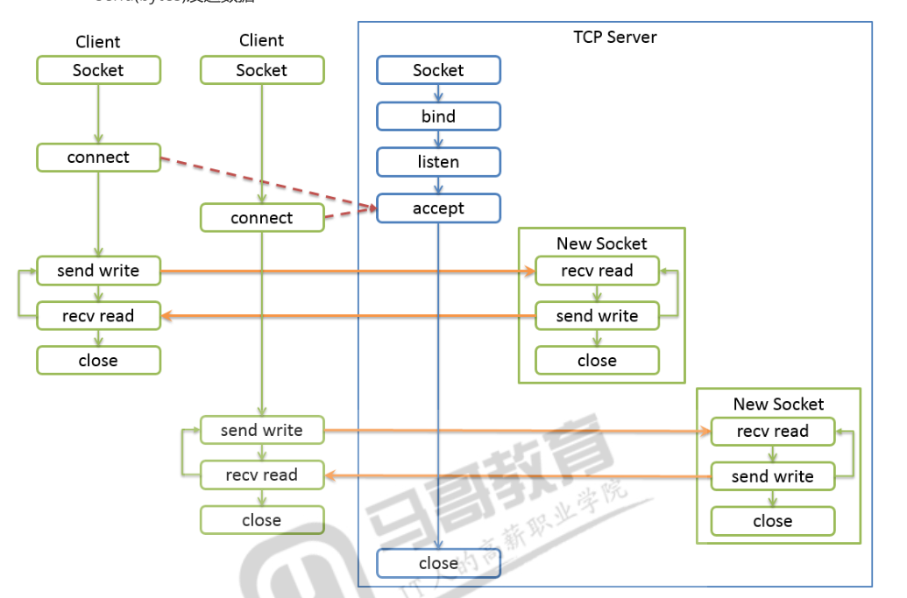

# 网络编程 
---
## Socket介绍
---
### socket套接字
---
Python中提供socket.py标准库,非常低成的接口库  
Socket是一种通用的网络编程接口,和网络层次没有一一对应的关系.  

### 协议族
---
AF 表示Address Family,用于socket()第一个参数  
|名称|含义|
|:--|:----|
|AF_INET|IPV4|
|AF_INET6|IPV6|
|AF_UNIX|Unix Domain Socket, windows没有|

### Socket类型
|名称|含义|
|:--|:----|
|SOCK_STREAM|面向连接的流程套接字.默认值TCP协议|
|SCOK_DGRAM|无连接的数据报文套接字.UDP协议|
# <font color=red> TCP编程 </font>
--- 
Socket编程,需要两端,一般来说一个服务端,一个客户端,服务端称为Server,客户端称为Client.  
这种编程模式也称为`cs编程`.  
## TCP服务端编程
--- 
### 服务器端编程步骤
---
- 创建Socket对象  
- 绑定IP地址Address和端口Port,bind()方法  
    - IPV4地址为一个二元组('IP地址字符串',Port)  
- 开始监听,将制定的IP端口上监听.Listen()方法  
- 获取用于传数据的Socket对象  
    - socket.appent() --> (socket.object,address info)  
    - accept方法阻塞等待客户端建立连接,返回一个新的Socket对象和客户端地址的二元组  
    - 地址是远程客户端的地址,IPV4中它是一个二元组(clientaddr,port)  
        - 接收数据  
            - recv(bufsize[],flags])使用缓冲区接收数据  
        - 发送数据  
            - send(bytes)发送数据  

问题  
两次绑定同一个监听端口会怎么样?  
回答:  会出现绑定端口重复

```py
import socket

s = socket.socket() # 创建socket对象
s.bind(('127.0.0.1',60000))
s.listen(5)#开始监听,等待客户端连接到来 5的意思是最多5个连接


# 接入一个到来的连接
s1, info = s.accept() # 阻塞知道和客户端成功建立连接,返回一个新的socket对象和客户端地址
print(s1,info)

# 使用缓冲区获取数据
data = s1.recv(1024) #阻塞 1024是接受数据的大小
print(info, data)
s1.send(b'welcome to network! ') # 这里发送的是二进制数据
s1.close()

# 接入另一个连接

s2, info = s.accept()
data = s2.recv(1024)
print(info,data)
s2.send(b'hello python')

s2.close()
s.close()
```

上例accept和recv是阻塞的,主线程经常被阻塞住而不能工作.怎么办?  
查看监听端口  
```sh
# windows 命令
netstat -anp tcp|findstr 60000

# linux 命令
ss -tanl|grep 60000
netstat -tanl|frep 60000
```

### 实战----写一个群聊程序
---
#### 需求分析
聊天工具CS程序,C是每一个客户端client,S是服务器端server.  

* 服务器端应该具有的功能:  
    - 1.启动服务,包括绑定地址和端口,并监听  
    - 2.建立连接,能和多个客户端建立连接  
    - 3.接收不同用户的信息  
    - 4.分发,将接收的某个用户信息转发到已连接所有客户端  
    - 5.停止服务  
    - 6.记录连接的客户端

#### 代码实现
服务端应该对应一个类  
```py
class ChatServer:
    def __init__(self,ip,port): #启动服务
        self.sock = socket.socket()
        self.addr = (ip,port)
    
    def start(self):#启动监听
        pass
    
    def accept(self): #多人连接
        pass

    def recv(self): # 接收客户端数据
        pass
    
    def stop(self): #停止服务
        pass

```
在此基础上,扩展完成  
```py
#!/usr/bin/env python
# -*- coding: utf-8 -*-
# File  : 2.多人聊天程序.py
# Author: HuXianyong
# Date  : 2019/7/7 1:30


import socket
import threading
import datetime
import logging
FROMAT = logging.basicConfig(level=logging.INFO, format='%(asctime)s %(name)s [%(message)s]')

class  ChatServer:
    def __init__(self,ip='127.0.0.1',port=60000): # 启动服务
        self.sock = socket.socket()
        self.addr = (ip,port)
        self.clients = {} # 客户端

    def start(self): # 启动监听
        self.sock.bind(self.addr) #绑定
        self.sock.listen(5) # 监听
        # accept会阻塞主线程,所以开启一个新线程
        threading.Thread(target=self.accept).start() # 阻塞

    def accept(self): # 多人连接
        while True:
            sock,client = self.sock.accept()# 阻塞
            self.clients[client] = sock #添加到客户端字典
            # 准备接收数据,热诚是阻塞的,开始新的线程
            threading.Thread(target=self.recv,args=(sock,client)).start()

    def recv(self, sock:socket.socket, client): # 接受客户端数据
        while True:
            data = sock.recv(1024) # 阻塞到数据的到来
            msg = "{:%Y%m/%d %H:%M:%S} {}:{}\n{}\n".format(datetime.datetime.now(),*client,data.decode())
            logging.info(msg)
            msg = msg.encode()
            for s in self.clients.values():
                s.send(msg)


    def stop(self): # 停止服务
        for s in self.clients.values():
            s.close()
        self.sock.close()
cs = ChatServer()
cs.start()
```

添加加锁功能 
```py
import socket
import threading
import datetime
import logging
FROMAT = logging.basicConfig(level=logging.INFO, format='%(asctime)s %(name)s [%(message)s]')

class  ChatServer:
    def __init__(self,ip='127.0.0.1',port=60000): # 启动服务
        self.sock = socket.socket()
        self.addr = (ip,port)
        self.clients = {} # 客户端
        self.event = threading.Event()

    def start(self): # 启动监听
        self.sock.bind(self.addr) #绑定
        self.sock.listen(5) # 监听
        # accept会阻塞主线程,所以开启一个新线程
        threading.Thread(target=self.accept).start() # 阻塞

    def accept(self): # 多人连接
        while not self.event.is_set():
            sock,client = self.sock.accept()# 阻塞
            self.clients[client] = sock #添加到客户端字典
            # 准备接收数据,热诚是阻塞的,开始新的线程
            threading.Thread(target=self.recv,args=(sock,client)).start()

    def recv(self, sock:socket.socket, client): # 接受客户端数据
        while not self.event.is_set():
            data = sock.recv(1024) # 阻塞到数据的到来
            msg = "{:%Y%m/%d %H:%M:%S} {}:{}\n{}\n".format(datetime.datetime.now(),*client,data.decode())
            logging.info(msg)
            msg = msg.encode()
            for s in self.clients.values():
                s.send(msg)


    def stop(self): # 停止服务
        self.event.set()
        for s in self.clients.values():
            s.close()
        self.sock.close()
cs = ChatServer()
cs.start()

while True:
    cmd = input('>> ').strip()
    if cmd == 'quit':
        cs.stop()
        threading.Event().wait(3)
        break
```
这一版本基本能用了,测试通过.但是还有要完善的地方.  
例如各种异常的判断,客户端断开连接后字典中的移除客户端数据等等.  

**客户端主动断开带来的问题**
服务端知道自己何时断开,如果客户端断开,服务器并不知道.(客户端主动断开,服务端recv会得到一个空串)  
所以,好的做法就是,客户端端开发出特殊的消息通知服务器端断开.但是,如果客户端主动断开,服务端主动发送一个空消息,超时返回异常,捕获异常并清理.  
即为客户端提供断开命令,也不能保证客户端会使用它断开链接.但是还是要增加这功能.  

增加客户端退出命令  
```py
import socket
import threading
import datetime
import logging
FROMAT = logging.basicConfig(level=logging.INFO, format='%(asctime)s %(name)s [%(message)s]')

class  ChatServer:
    def __init__(self,ip='127.0.0.1',port=60000): # 启动服务
        self.sock = socket.socket()
        self.addr = (ip,port)
        self.clients = {} # 客户端
        self.event = threading.Event()

    def start(self): # 启动监听
        self.sock.bind(self.addr) #绑定
        self.sock.listen(5) # 监听
        # accept会阻塞主线程,所以开启一个新线程
        threading.Thread(target=self.accept).start() # 阻塞

    def accept(self): # 多人连接
        while not self.event.is_set():
            sock,client = self.sock.accept()# 阻塞
            self.clients[client] = sock #添加到客户端字典
            # 准备接收数据,热诚是阻塞的,开始新的线程
            threading.Thread(target=self.recv,args=(sock,client)).start()

    def recv(self, sock:socket.socket, client): # 接受客户端数据
        while not self.event.is_set():
            data = sock.recv(1024) # 阻塞到数据的到来

            msg = data.decode().strip()
            # 客户端退出命令
            if msg == 'quit' or msg =='': # 主动断开得到空串
                self.clients.pop(client)
                sock.close()
                logging.info('{} quits'.format(client))
                break
            msg = "{:%Y%m/%d %H:%M:%S} {}:{}\n{}\n".format(datetime.datetime.now(), *client, data.decode())
            logging.info(msg)
            msg = msg.encode()
            for s in self.clients.values():
                s.send(msg)


    def stop(self): # 停止服务
        self.event.set()
        for s in self.clients.values():
            s.close()
        self.sock.close()
cs = ChatServer()
cs.start()

while True:
    cmd = input('>> ').strip()
    if cmd == 'quit':
        cs.stop()
        threading.Event().wait(3)
        break
```
程序虽然还有瑕疵,但是基本业务功能实现了.  

注意:  
由于GIL和内置数据结构的读写原子性,单独操作字典的某一项item是安全的的.但是遍历过程是线程不安全的,遍历中可能被打断,其他线程如果字典元素进行增加弹出,都会影响字典的size,就会抛出异常.所以还是要加锁lock

多线程读写出错的代码  
```py
import threading
import time
import random
import logging
FROMAT = '%(asctime)s %(name)s [%(message)s]'
logging.basicConfig(level=logging.INFO, format=FROMAT)

global_dict = {}

def additem(d:dict):
    count = 1
    while True:
        d[count] = random.randint(10,20) # kv一直增加
        count += 1
        time.sleep(0.001)

def iterdict(d:dict):
    while True:
        for k,v in d.items(): #遍历
            logging.info(k,v)
            d[k] = random.randint(1,10)

a = threading.Thread(target=additem,args=(global_dict,),daemon=True)
i = threading.Thread(target=iterdict,args=(global_dict,),daemon=True)

a.start()
i.start()
while True:
    time.sleep(1)
    logging.info(threading.enumerate())

    if threading.active_count() < 3:
        keys = list(global_dict.keys())
        logging.info(keys)
        print('============end=============')

        break
```
加锁后的代码如下:  

```py
import socket
import threading
import datetime
import logging
FROMAT = logging.basicConfig(level=logging.INFO, format='%(asctime)s %(name)s [%(message)s]')

class  ChatServer:
    def __init__(self,ip='127.0.0.1',port=60000): # 启动服务
        self.sock = socket.socket()
        self.addr = (ip,port)
        self.clients = {} # 客户端
        self.event = threading.Event()
        self.lock = threading.Lock()


    def start(self): # 启动监听
        self.sock.bind(self.addr) #绑定
        self.sock.listen(5) # 监听
        # accept会阻塞主线程,所以开启一个新线程
        threading.Thread(target=self.accept).start() # 阻塞

    def accept(self): # 多人连接
        while not self.event.is_set():
            sock,client = self.sock.accept()# 阻塞
            with self.lock:
                self.clients[client] = sock #添加到客户端字典
            # 准备接收数据,热诚是阻塞的,开始新的线程
            threading.Thread(target=self.recv,args=(sock,client)).start()

    def recv(self, sock:socket.socket, client): # 接受客户端数据
        while not self.event.is_set():
            data = sock.recv(1024) # 阻塞到数据的到来

            msg = data.decode().strip()
            # 客户端退出命令
            if msg == 'quit' or msg =='': # 主动断开得到空串
                with self.lock:
                    self.clients.pop(client)
                    sock.close()
                logging.info('{} quits'.format(client))
                break
            msg = "{:%Y%m/%d %H:%M:%S} {}:{}\n{}\n".format(datetime.datetime.now(), *client, data.decode())
            logging.info(msg)
            msg = msg.encode()
            for s in self.clients.values():
                s.send(msg)


    def stop(self): # 停止服务
        self.event.set()
        with self.lock:
            for s in self.clients.values():
                s.close()
        self.sock.close()
cs = ChatServer()
cs.start()

while True:
    cmd = input('>> ').strip()
    if cmd == 'quit':
        cs.stop()
        threading.Event().wait(3)
        break
    logging.info(threading.enumerate()) # 用来观察断开后线程的变化
    logging.info(cs.clients)

```

lock是用于关于数据方面的(数据库操作,容器(列表,字典,元组等等)) ,
event是用于关于事件前后关系方面的,也相当于开关,关了整个事件结束

**socket常用方法**
|名称|含义|
|:--|:----|
|**socket.recv(bufsize[,flags])**|获取数据,默认是阻塞的方式|
|**socket.recvfrom(bufsize[,flags])**|获取数据,返回一个二元组(bytes,address)|
|socket.recv_into(buffer[,nbytes[,flags]])|获取到nbytes的数据后,存储到buffer中,如果nbytes没有指定或0,将buffer大小数据存入buffer中. 返回接收的字节数.|
|socket.recvfrom_into(buffer[,nbytes[,flags]])|获取数据,返回一个二元组(bytes,address)到buffer中|
|**socket.send(bytes[,flags])**|TCP发送数据|
|socket.sendall(bytes[,flags])|TCP发送全部数据,成功返回None|
|**socket.sendto(string[,flags],address)**|UDP发送数据|
|socket.sendfile(file,offset=0,count=None)|发送一个文件知道EOF,使用高性能的os.sendfile机制,返回发送的字节数. 如果win下不支持sendfile,或者不是普通文件,使用send()发送文件. offset告诉起始位置. 3.5版本开始|

|名称|含义|
|:--|:----|
|socket.getpeername()|返回连接套接字的远程地址.返回值通常是元组(ipaddr,port)|
|socket.getsockname()|返回套接字自己的地址,通常是一个元组(ipaddr,port)|
|socket.setblocking(flag)|如果flag为0,则将套接字设为非阻塞模式,否则将套接字设为阻塞模式(默认值)  非阻塞模式下,如果调用recv()没有发现任何数据问题,或send()调用无法立即发送数据,name将引起socket.error异常|
|socket.settimeout(value)|设置套戒指操作的超时期,timeout是一个浮点数,单位是秒. 值为None表示没有超时期. 一般,超时期应该在刚创建套接字时设置,因为他们可能用于套接字的操作(如connect())|
|scoket.setsockopt(level,optname,value)|设置套接字选项的值. 比如缓冲区大小. 太多了, 自己去看文档. 不同系统,不同版本都不尽相同|

### MakeFile

`socket.makefile(mode='r', buffering=None, encoding=None, errors=None, newline=None)`  
创建一个与改套接字相关联的文件对象,将recv方法看作读方法,将send方法看作写方法.  

```py
#!/usr/bin/env python
# -*- coding: utf-8 -*-
# File  : 8.makefile练习.py
# Author: HuXianyong
# Date  : 2019/7/7 21:44

import socket
import threading
import datetime
import logging
FROMAT = logging.basicConfig(level=logging.INFO, format='%(asctime)s %(name)s %(message)s')

class  ChatServer:
    def __init__(self,ip='127.0.0.1',port=60000): # 启动服务
        self.sock = socket.socket()
        self.addr = (ip,port)
        self.clients = {} # 客户端
        self.event = threading.Event()
        self.lock = threading.Lock()


    def start(self): # 启动监听
        self.sock.bind(self.addr) #绑定
        self.sock.listen(5) # 监听
        # accept会阻塞主线程,所以开启一个新线程
        threading.Thread(target=self.accept).start() # 阻塞

    def accept(self): # 多人连接
        while not self.event.is_set():
            sock,client = self.sock.accept()# 阻塞
            f = sock.makefile('rw') # 支持读写
            with self.lock:
                self.clients[client] = f,sock #添加到客户端字典
            # 准备接收数据,热诚是阻塞的,开始新的线程
            threading.Thread(target=self.recv,args=(f,client)).start()

    def recv(self, f, client): # 接受客户端数据
        while not self.event.is_set():
            data = f.readline() # 阻塞到数据的到来

            msg = data.strip()
            print(msg,'+++++++++++++++++++')
            # 客户端退出命令
            if msg == 'quit' or msg =='': # 主动断开得到空串
                with self.lock:
                    _,sock = self.clients.pop(client)
                    f.close()
                    sock.close()
                logging.info('{} quits'.format(client))
                break
            msg = "{:%Y%m/%d %H:%M:%S} {}:{}\n{}\n".format(datetime.datetime.now(), *client, data)
            logging.info(msg)
            with self.lock:
                # msg = msg.encode()
                for ff,_ in self.clients.values():
                    ff.write(msg)
                    ff.flush()

    def stop(self): # 停止服务
        self.event.set()
        with self.lock:
            for f,s in self.clients.values():
                s.close()
                f.close()
        self.sock.close()
cs = ChatServer()
cs.start()

while True:
    cmd = input('>> ').strip()
    if cmd == 'quit':
        cs.stop()
        threading.Event().wait(3)
        break
    logging.info(threading.enumerate()) # 用来观察断开后线程的变化
    logging.info(cs.clients)
```
上例完成了基本功能,但是如果客户端主动断开,或者readline出现异常,就不会冲clients中移除作废的socket, 可以使用异常处理解决这个问题.   

### ChatServer 实验完整代码
注意,这个代码实验用,代码中下次还有很多socket太底层了,实际开发中很少使用这么地层的借口.  
增加一些异常处理.  

```py
import socket
import threading
import datetime
import logging
FROMAT = logging.basicConfig(level=logging.INFO, format='%(asctime)s %(name)s %(message)s')

class  ChatServer:
    def __init__(self,ip='127.0.0.1',port=60000): # 启动服务
        self.sock = socket.socket()
        self.addr = (ip,port)
        self.clients = {} # 客户端
        self.event = threading.Event()
        self.lock = threading.Lock()


    def start(self): # 启动监听
        self.sock.bind(self.addr) #绑定
        self.sock.listen(5) # 监听
        # accept会阻塞主线程,所以开启一个新线程
        threading.Thread(target=self.accept).start() # 阻塞

    def accept(self): # 多人连接
        while not self.event.is_set():
            sock,client = self.sock.accept()# 阻塞
            f = sock.makefile('rw') # 支持读写
            with self.lock:
                self.clients[client] = f,sock #添加到客户端字典
            # 准备接收数据,热诚是阻塞的,开始新的线程
            threading.Thread(target=self.recv,args=(f,client)).start()

    def recv(self, f, client): # 接受客户端数据
        while not self.event.is_set():
            try:
                data = f.readline() # 阻塞到数据的到来
            except Exception as e:
                logging.error(e)
                data = 'quit'
            msg = data.strip()
            print(msg,'+++++++++++++++++++')
            # 客户端退出命令
            if msg == 'quit' or msg =='': # 主动断开得到空串
                with self.lock:
                    _,sock = self.clients.pop(client)
                    f.close()
                    sock.close()
                logging.info('{} quits'.format(client))
                break
            msg = "{:%Y%m/%d %H:%M:%S} {}:{}\n{}\n".format(datetime.datetime.now(), *client, data)
            logging.info(msg)
            with self.lock:
                # msg = msg.encode()
                for ff,_ in self.clients.values():
                    ff.write(msg)
                    ff.flush()

    def stop(self): # 停止服务
        self.event.set()
        with self.lock:
            for f,s in self.clients.values():
                s.close()
                f.close()
        self.sock.close()
def main():
    cs = ChatServer()
    cs.start()

    while True:
        cmd = input('>> ').strip()
        if cmd == 'quit':
            cs.stop()
            threading.Event().wait(3)
            break
        logging.info(threading.enumerate()) # 用来观察断开后线程的变化
        logging.info(cs.clients)

if __name__ == '__main__':
    main()
```

## TCP客户端编程
---
### 客户端编程步骤
- 创建socket对象  
- 连接到远端服务端的ip和port,connect()方法  
- 传输数据  
    - 使用send,recv方法发送,接收数据  
- 关闭连接释放资源  

客户端代码
```py

import socket
import threading
import datetime
import logging
FROMAT = '%(asctime)s %(threadName)s %(name)s %(message)s'
logging.basicConfig(level=logging.INFO, format=FROMAT)

class ChatServer:
    def __init__(self,ip='127.0.0.1',port=60000):
        self.sock = socket.socket()
        self.addr = (ip, port)
        self.event = threading.Event()

    def start(self):
        self.sock.connect(self.addr)
        self.send('I\'m ready')
        # 准备接收数据,recv是阻塞的,开启新的线程
        threading.Thread(target=self.recv,name='recv').start()

    def recv(self): #接收客户端的数据
        while not self.event.is_set():
            try:
                data = self.sock.recv(1024)
            except Exception as  e:
                logging.error(e)
                break
            msg = "{:%Y%m/%d %H:%M:%S} {}:{}\n{}\n".format(datetime.datetime.now(), *self.addr, data.strip())
            logging.info(msg)

    def send(self,msg:str):
        data = "{}\n".format(msg.strip()).encode() # 服务端需要一个换行符
        self.sock.send(data)

    def stop(self):
        self.sock.close()
        self.event.wait(3)
        self.event.set()
        logging.info('Client stops')

def main():
    cc = ChatServer()
    cc.start()

    while True:
        cmd = input('>> ').strip()
        if cmd == 'quit':
            cc.stop()
            break
        cc.send(cmd)

if __name__ == '__main__':
    main()
```
同样,这样的客户端还是有诸多问题,仅用于测试.