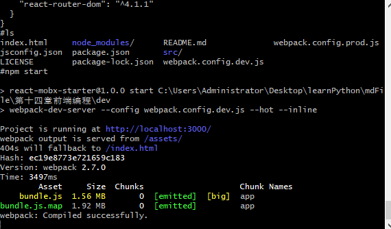
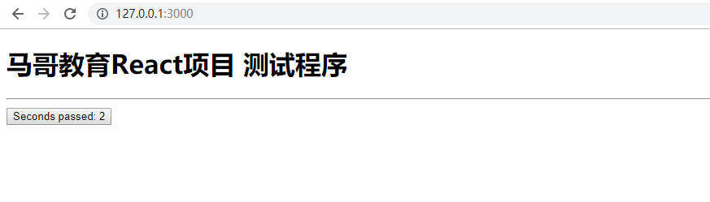

# React项目
## 项目依赖安装
将项目开发基础文件`react-mobx-starter-master.zip`解压缩, 并用这个目录作为项目根目录.  
在项目根目录中执行下面的命令, 就会自动安装按照package.json的配置安装依赖模块.  
`npm install`  
或者  
`npm i`  

安装完成后,会生成一个目录`node_modules`, 里面是安装的所有依赖的模块.  

## 项目整体说明
```sh
.
├── .babelrc
├── .gitignore
├── index.html
├── jsconfig.json
├── LICENSE
├── .npmrc
├── package.json
├── README.md
├── src
│   ├── App.js
│   ├── AppState.js
│   ├── index.html
│   └── index.js
├── node_modules
│   ├── ...
├── webpack.config.dev.js
└── webpack.config.prod.js

```

## 配置文件详解
### package.json
`npm init`产生的文件,里面记录项目星系,所有项目依赖.  

### 版本管理
```js
"script": {
    "test": "test",
    "start": "webpack-dev-server --config webpack.config.dev.js --hot --inline",
    "bulid": "webpack -p --config webpack.config.prod.js"
}
```
start指定启动webpack的dev server开发用WEB Server,主要提供2个功能: 静态文件支持,自动刷新和热替换HMR(Hot Module Replacement).  
- HMR可以再应用程序中替换,添加,删除模块,而无需重载页面,只把变化部分替换掉,不使用HMR则会自动滑行导致这也页面刷新.  
- --hot 启动HMR  
- -- inline默认模式,使用HMR的时候建议开启inline模式. 特替换是会有消息显示在控制台.  

build使用webpack侯建打包.对应`npm run build`  

### 项目依赖
devDependencies 开发室依赖,不会打包到目标文件中. 对应`npm install xxx --save-dev`. 例如使用babel的一些依赖,只是为了帮助我们转译代码,没必要发布到生产环境中去.  
dependencies 运行时依赖,回答报道项目中.对应`npm install xxx --save`  
### 开发时依赖
```sh
  "devDependencies": {
    "babel-core": "^6.24.1",
    "babel-jest": "^19.0.0",
    "babel-loader": "^6.4.1",
    "babel-plugin-transform-decorators-legacy": "^1.3.4",
    "babel-plugin-transform-runtime": "^6.23.0",
    "babel-preset-env": "^1.4.0",
    "babel-preset-react": "^6.24.1",
    "babel-preset-stage-0": "^6.24.1",
    "css-loader": "^0.28.0",
    "html-webpack-plugin": "^2.28.0",
    "jest": "^19.0.2",
    "less": "^2.7.2",
    "less-loader": "^4.0.3",
    "react-hot-loader": "^3.0.0-beta.6",
    "source-map": "^0.5.6",
    "source-map-loader": "^0.2.1",
    "style-loader": "^0.16.1",
    "uglify-js": "^2.8.22",
    "webpack": "^2.4.1",
    "webpack-dev-server": "^2.4.2"
  }

```
版本号指定:  
`版本号`: 只安装指定的版本号的版本  
`~版本号`: 例如`~1.2.3`表示安装1.2.x版本中最新的版本,不低于1.2.3 但是不能安装1.3.x  
`^版本号`: 例如`^2.3.4`表示安装2.x.x版本中最新的版本,新版本不低于2.3.4   
`latest`: 安装最新的版本(几乎不用)  

babel转译,因为开发用了很多ES6语法.从6.x开始babel拆分成很多插件,需要什么引入什么就好.  
babel-core核心.  
babel-loader webpack的loader, webpack是基于loader的.  
babel-plugin-transform-decorators-legacy 下面的撑撑用到了装饰器,这个插件就是转换装饰器用的.   

css样式相关的包括:  
css-loader,less ,less-loader, style-loader   

react-hot-loader react热加载插件,希望修改保存后,直接在页面上反馈出来,不需要手动刷新.  

source-map文件打包,js会合并或压缩,没法调试,用来看js源文件是什么.  source-map-loader也需要webpack的loader  

webpack打包工具, 2.4.1 发布于2017年4月, 当前2.7.0发表于2017年7月.   

webpack-dev-server 启动一个开发的server   

### 运行时依赖
```sh

  "dependencies": {
    "antd": "^2.9.1",
    "axios": "^0.16.1",
    "babel-polyfill": "^6.23.0",
    "babel-runtime": "^6.23.0",
    "mobx": "^3.1.9",
    "mobx-react": "^4.1.8",
    "mobx-react-devtools": "^4.2.11",
    "prop-types": "^15.5.8",
    "react": "^15.5.4",
    "react-dom": "^15.5.4",
    "react-router": "^4.1.1",
    "react-router-dom": "^4.1.1"
  }

```
antd ant design, 基于react实现,蚂蚁金服开源的react的UI库. 做中后台管理非常方便.  

axios 异步请求支持  

polyfill 解决浏览器api不支持的问题. 写好polyfill就让你的浏览器支持. 帮你抹平差异化.  

react开发的主框架  
react-dom 支持DOM  
react-router 支持路由  
react-router-dom DOM绑定路由  

mobx 状态管理库,透明化.  
mobx-react, mobx-react-devtools mobx和react结合的模块  

react和mobx是一个强强联合  

### babel配合
.babelrc babel转译的配置文件
```js
{
  "presets": [
    "react",
    "es2017",
    "es2015",
    "env",
    "stage-0"
  ],
  "plugins": ["transform-decorators-legacy", "transform-runtime"]
}
```

### webpack配置
#### webpack.config.dev.js
这是一个符合commonjs的模块.  
module.exports导出   
**devtool: 'source-map'**  
- 生成及如何生成source-map文件.  
- source-map适合生成环境使用,会生成完成Sourcemap独立文件.  
- 由于在Bundle中添加了应用注释,所以开发工具知道如何找到Sourcemap.  

**entry入口**  
- 描述入口. webpack会从入口开始,找出直接或间接的模块和库, 最后输出为bundles文件中entry如果是一个字符串,定义就是文件入口.  
- 如果是一个数组,数组中每一项都会执行, 里面包含入口文件,另一个参数可以用来配置一个服务器,我们这里配置的是热加载插件,可以自动刷新.  

**output输出**  
- 告诉webpack 输出bundles到哪里去,如何命名.  
- filename 定义输出的bundle的名称  
- path 输出目录是`__driname+'dist'`  
- publicPath 可以是绝对路径或者相对路径,一般会以/结尾. /assets/表示网站根目录下assets目录下   

**resolve解析**  
- 设置模块如何被解析  
- extensions 自动解析扩展名. '.js'的意思是,如果用户模块的时候不带扩扎名, 它尝试补全.  

**module 模块**  
- 如何处理不同的模块  
- rules 匹配请求的**规则**, 以应用不同的加载器,解析器等.  
```js
    module: {
        rules: [
            {
                test: /\.js$/,
                exclude: /node_modules/,
                use: [
                    { loader: 'react-hot-loader/webpack' },
                    { loader: 'babel-loader' }
                ]
            },
            {
                test: /\.less$/,
                use: [
                    { loader: "style-loader" },
                    { loader: "css-loader" },
                    { loader: "less-loader" }
                ]
            }
        ]
    },

```
test 匹配条件的  
exclude 排除的, /mode_modules/打包排除目录. 这一句一定要有,否则,变异就把这个目录下所有文件也拿进来了,巨大无比.  
use 使用模块的UseEntries列表中的loader.  
rules中对`.js`结尾的单不在mode_modules目录文件使用转译babel-loader和热加载loader .  

加载器:  
style-loader通过`<style>`标签吧css推荐加到DOM中.  
css-loader 加载css  
less-loader 对less的支持  

LESS  
CSS好处简单易学,但是坏处是没有模块化,服用的概念,因为它不是语言.  
LESS是一门CSS的预处理语言,扩展CSS增加了变量,Mixin,函数等开发语言的特性,从而讲了CSS的编写.  
LESS本身是一套语法规则及解析器,将写好的LESS解析成CSS, LESS可以使用在浏览器端和服务端.  

```js
@color: #4D926F;
#header{
    color: @color;
}

h2 {
    color: @color;
}
```

可以使用解析成如下的CSS  
```js
#header{
    color: #4D926F;
}
h2 {
    color: #4D926F;
}
```

LESS在服务器端使用,需要使用LESS编译器,`npm install less`,本项目目录已经安装过了.  
`node_modules/.bin/lessc test.less`
`node_modules/.bin/lessc test.less test.css`

**plugins: webpack 的插件**  
- HotModuleReplacementPlugin 开启HMR  
- DefinePlugin 全局常量配置  

**devServer, 开发用server**  

```js
devServer: {
    compress: true,
    port: 3000,
    publicPath: '/assets/',
    hot: true,
    inline: true,
    historyApiFallback: true,
    stats: {
        chunks: false
    },
    proxy: {
        '/api': {
            target: 'http://127.0.0.1:8080',
            changeOrigin: true
        }
    }
}

```
compress 启动gzip  
port 启动端口3000  
hot 启用HMR  
proxy 指定访问`/api/`开头路径都代理到`http://127.0.0.1:8080`.  

### vscode 配置
jsconfig.json是vscode的配置文件,覆盖当前配置.  
> 以上是所有配置的解释,拿到这个文件后需要修改name, version, description, 需要修改repository仓库地址, 需要修改author, license信息. 这些信息修改好了之后,就可以开始开发了.  

## 启动项目 
在项目根目录使用  
`npm start `


启动成功就可以访问了  
webpack使用babel转译, 打包, 较为耗时, 需要等一会儿  

