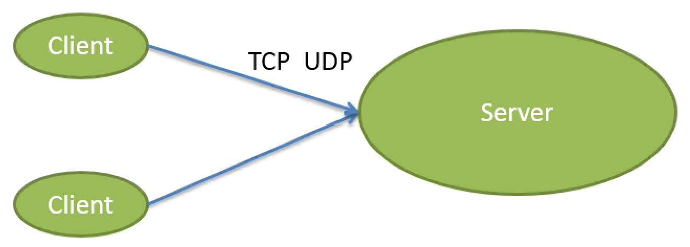
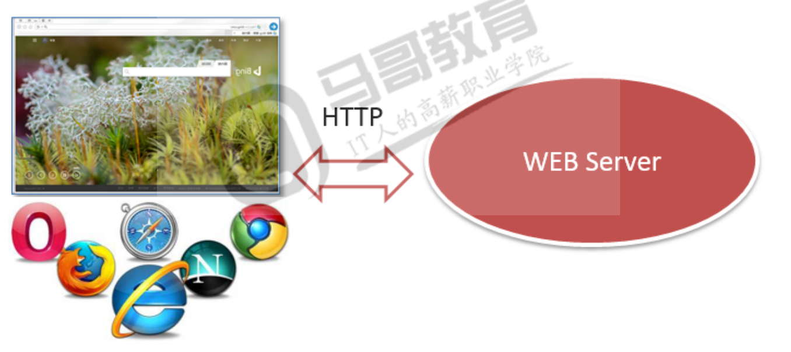

# WEB 开发

CS即客户端,服务器编程.  
客户端,服务端之间需要使用Socket,约定协议,版本(往往使用的是协议是TCP或者UPD), 指定地址和端口, 就可以通信了.   
客户端,服务端传输数据可以有一定的格式,双方必须事先约定好.  

BS编程,即Browser,Server开发.  
Browser浏览器,一种特殊的客户端,支持HTTP(s)协议,能够通过URL向服务端发起请求,等待服务端返回HTML等数据,并在浏览器内可视化展示的程序.   
Server,支持HTTP(s)协议,能够接受众多客户端发起的HTTP协议请求,经处理,将HTML等数据返回给浏览器.   
本质上来说,BS是一种特殊的cs, 即客户端必须是一种支持HTML协议且能解析并渲染HTML的软件,服务端必须是能够接受多客户端HTTP访问的服务软件.  

HTTP协议底层基于TCP协议实现.  

* BS开发分为两端开发  
    - 客户端开发,或称前端开发. HTML, CSS, JavaScript等  
    - 服务端开发,Python有WSGI, Django, Flask, Tornado等

# HTTP协议
## 安装httpd
可以安装httpd(apache)或nginx等服务端程序,通过浏览器访问,观察http协议  

## 无状态, 有连接和短连接  
无状态: 指的是服务器无法知道2尺请求之间的联系,既是是前后两次是同一个浏览器也没有任何数据能够判断初始同一个浏览器的请求. 后来可以通过cookie,session来判断.  

有链接: 是因为它http是基于TCP协议,是面向连接的,需要三次握手,和四次断开,所以是有链接的.  

短连接: Http 1.1之前,都是一个请求一个连接,二TCP的创建和销毁成本恨到,对浏览器的影响很大. 所以自Http 1.1开始,支持keep-alive, 默认也是开启的,一个连接打开后,会保持一段时间(可设置), 浏览器再次访问该服务器就是用这个TCP链接,减轻服务器压力, 提高效率.  

## 协议
HTTP协议是无状态协议.  
同一个客户端的两次请求之间没有任何关系, 从服务器角度来说,它不知道这两个请求来自同一个客户端.  

### URL组成 
URL可以说是地址, uniform resource locator统一资源定位符,每一个链接指向同一资源提供客户端访问.  
`schema://host[:port#]/path/.../index.html?id=5&name=python`  
访问静态文件资源时,通过上面的这个URL访问的是网站的某路径下的index.html文件,而这个文件对应磁盘上的真实的文件.就会从磁盘上读取这个文件, 并把这个文件的内容发回浏览器.  

#### scheme 模式, 协议  
http, ftp, https, file, mailto等等.  

#### host:port  
`www.baidu.com:80`, 80端口是默认端口可以不写. 一名会使用DNS解析,域名会解析成IP才能使用. 实际上会对解析后返回的IP个TCP端口发起访问.  

#### /path/to/resource
path, 指向资源的路径.  

#### ?key1=value1&key2=value2 
query string, 查询字符串,问好用来和路径分开,后面key=value形式, 且使用&符号分割.  

### HTTP消息
消息分为Request, Response  
Request: 浏览器向服务器发起的请求  
Response: 服务器对客户端请求的响应  

- 请求报文由Header消息报头,Body消息正文组成(可选)  
    - 请求报文第一行称为请求行  
- 响应报文由Header消息报头,Body消息正文组成(可选)  
    - 响应包头第一行称为状态行  
- 每一行使用回车和换行符作为结尾  
- 如果有Body部分, Header,Body之间留一行空行  

#### 请求报文
请求消息行: 请求方法Method 请求路径 协议版本CRLF  
```sh
GET / HTTP/1.1
Host: www.magedu.com
Connection: keep-alive
Upgrade-Insecure-Requests: 1
User-Agent: Mozilla/5.0 (Windows NT 10.0; Win64; x64) AppleWebKit/537.36 (KHTML, like Gecko) Chrome/75.0.3770.100 Safari/537.36
Accept: text/html,application/xhtml+xml,application/xml;q=0.9,image/webp,image/apng,*/*;q=0.8,application/signed-exchange;v=b3
Accept-Encoding: gzip, deflate
Accept-Language: zh-CN,zh;q=0.9
```

请求方法Method
|方法|说明|
|:--|:----|
|GET|请求获取URL对应的资源|
|POST|提交数据至服务器端|
|HEAD|和GET类似,不过不返回响应报文的正文(body部分)|

POST和GET的区别
GET主要用于做数据的拉取,虽然也可以做数据的推送,但是是以`域名+path+?+key1=value1&key2=value2`的形式提交数据的,数据存放在的请求头(request header)的首行上的,很不安全

POST主要适用于数据的提交的,他的数据是存放在`请求头(request body)下面的 存放形式为 'key1=value1&key2=value2'`

说明:  
> GET方式需要使用Request.QueryString来取得变量的值，而POST方式通过Request.Form来获取变量的值。
> GET提交的数据大小有限制（因为浏览器对URL的长度有限制），而POST方法提交的数据没有限制.
> GET方式提交数据，会带来安全问题，比如一个登录页面，通过GET方式提交数据时，用户名和密码将出现在URL上，如果页面可以被缓存或者其他人可以访问这台机器，就可以从历史记录获得该用户的账号和密码.

#### 常见传递信息的方式  
1.GET方法使用Query String  
`http://www.magedu.com/python/index.html?id=5&name=pyhton&name=linux`  
通过查询字符串在URL中传递关键参数,而URL在请求豹纹的头部的第一行.   
2.POET方法请求数据  
```sh
POST /XXX/YYY?id=magedu HTTP/1.1  
HOST: 127.0.0.1:9999
content-lenth: 26
content-type: application/x-www-form-urlencoded

age=5&weight=80&height=170
```
请求是提交的数据时在请求报文的正文Body部分  
3.URL中本身就包含着信息  
`http://www.magedu.com/python/student/001`  

#### 响应报文
响应消息行: 协议版本 状态码 消息描述CRLF  
```sh
HTTP/1.1 200 OK
Server: Tengine
Date: Sun, 14 Jul 2019 14:51:34 GMT
Content-Type: text/html; charset=UTF-8
Transfer-Encoding: chunked
Connection: keep-alive
Vary: Accept-Encoding
Vary: Accept-Encoding, Cookie
Cache-Control: max-age=3, must-revalidate
Content-Encoding: gzip
```

### status code 状态码
状态码在响应头的第一行  
- 1xx 提示信息, 表示请求已被成功接受,急需处理  
- 2xx 表示正常响应  
    - 200表示正常赶回了页面内容  

- 3xx 重定向  
    - 301 页面永久性移走, 永久重定向,返回新的URL, 浏览器会根据返回的url发起新的request请求  
    - 302 临时重定向  
    - 304 资源未修改,浏览器使用本地缓存  

- 4xx 客户端请求错误  
    - 404 Not Found, 页面找不到, 客户端的请求资源有误.  
    - 400 请求语法有误  
    - 401 请求要求身份验证  
    - 403 服务器拒绝请求  

- 5xx 服务器端错误  
    - 500 服务器内部错误  
    - 502 服务器上游错误, 例如nginx反向代理的后端服务器  


### Cookie技术
- 键值对信息  
- 是一种客户端,服务器端传递数据的技术.  
- 一般来说cookie信息是在服务器端生成, 返回给浏览器端的.  
- 浏览器端可以保持这些值,浏览器对同一域发起每一个请求时,都会把Cookie信息发给服务器端.  
- 服务器端收到浏览器端发过来的coolie,处理这些信息,可以用来判断这次请求是否和之前的请求有关联.  

曾经cookie唯一在浏览器端存储数据的手段,目前浏览器端存储数据的方案很多,cookie正在被淘汰.  

当服务器收到HTTP请求是,服务器可以在响应头里面添加一个Set-Cookie键值对.浏览器收到响应后通常会保存这些cookie,之后该服务器每一次请求中通过cookie请求头部将cookie信息发送给服务器端.  

另外,cookie的过期时间,域, 路径, 有效期, 通用站点都可以根据需要来指定.  
可以使用`Set-Cookie: NAME=VALUE; Expires=DATE; Path=PATH; Domain=DONAIN_NAME; SRCURE`

|key|value|
|:--|:----|
|Cookie过期|Cookie可以设定过期终止时间,过期后将被浏览器清除. 如果缺省,Cookie不会持久化,就蓝旗关闭Cookie消失,称为会话级Cookie|
|Cookie域|域确定有哪些鱼可以存这个Cookie.  缺省设定属性值为当前主机,例如`www.baidu.com`. 如果设置为baidu.com 表示包含子域|
|Path|确定哪些目录及子目录访问可以使用该Cookie|
|**Secure**|表示Cookie随着HTTPS加密过的请求发送给服务器端, 有些浏览器已经不允许`http://`协议使用Secure了 这个Secure不能保证Cookie是安全的的,Cookie中不要传输敏感信息|
|HttpOnly|将Cookie设置此标记,就不能被JavaScript访问,只能发给服务器端|

```
Set-Cookie: id=a3fWa; Expires=Wed; 21 Oct 2019 01:24:00 GMT; Secure; HttpOnly
告诉浏览器设置,这个Cookie的键值对,有过期时间,使用HTTPS加密传输到服务器端,且不能被浏览器中JS标本访问该cookie
```

```sh
cookie的作用域 Domain好人Path定义Cookie的作用域

Domain
domain=www.magudu.com 表示改与的RUL才能使用
domin=magedu.com 表示可以包含子域,例如www.magedu.com, python.magedu.com 等

Path
path=/ 所有/的子路径可以使用
domain=www.magedu.com; path=/webapp表示只有www.magedu.com/webapp下面的url匹配,例如
http://www.magedu.com/webapp/index.html 就可以使用
```