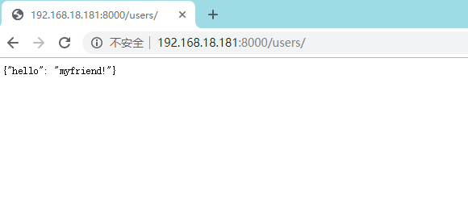
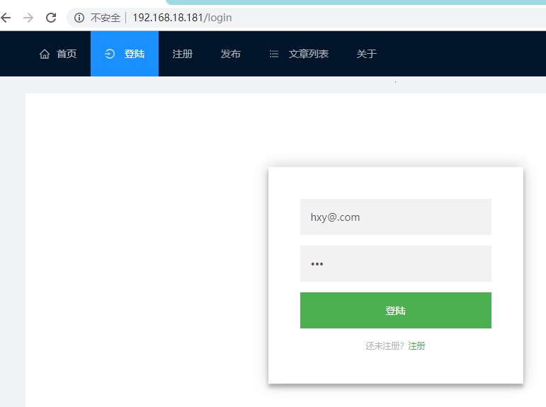
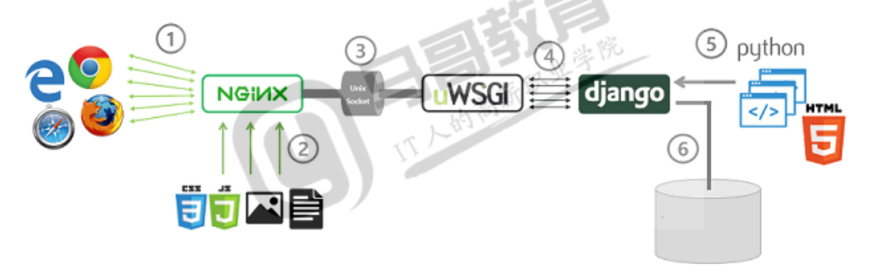

# 打包

## 一 python虚拟环境安装
由于在服务器上可能会有python版本上面的问题,我们不可能为了我们这一个版本的上线就把服务器的python升级或者降低版本,这就需要python的虚拟环境了.  

### pyenv安装
```sh
## python依赖,mysqlclient依赖

yum install git python-devel mysql-devel -y
yum install gcc make patch gdbm-devel openssl-devel sqlite-devel readline-devel zlib2-devel bzip-devel  -y

## 创建用户
useradd python
# 给用户输入密码,密码来自标准输入
echo python|passwd pthon --stdin
su - python
```

进入python用户后执行下面的操作
```sh

curl -L https://github.com/pyenv/pyenv-installer/raw/master/bin/pyenv-installer |bash

## 在bashrc文件最后面加上这三行
# vim ~/.bashrc
# echo PATH="/home/python/.pyenv/bin:$PATH"
# eval "$(pyenv init -)"
# eval "$(pyevn virtualenv-init -)"
echo -e 'echo PATH="/home/python/.pyenv/bin:$PATH"\neval "$(pyenv init -)"\neval "$(pyevn virtualenv-init -)"' >> ~/.bashrc

## 执行即使生效
source ~/.bashrc

# 安装python版本
pyenv install 3.6.6 -vvv

# # 准备pip配置文件
mkdir ~/.pip
# vim ~/.pip/pip.conf
# [global]
# index-url = https://mirrors.aliyun.com/pypi/simple/

# [install]
# trusted-host=mirrors.aliyun.com
echo -e '[global]\nindex-url = https://mirrors.aliyun.com/pypi/simple/\n\n[install]\ntrusted-host=mirrors.aliyun.com' > ~/.pip/pip.conf


## 安装虚拟环境
pyenv virtualenv 3.6.6 blog366
mkdir /home/python/projects/ -p
cd /home/python/projects/
tar xf blog-1.0.tar.gz
ln -sv blog-1.0 web
cd web
pwd
/home/python/projects/web

## 把当前目录的python环境改成3.6.6
pyenv local blog366
```

## 二 Django项目打包
###  环境打包
在项目的根目录下创建一个`setup.py`的文件
setup的配置为

```py
from distutils.core import setup
import glob

setup(name='blog',
      version='1.0',
      description='blog projest',
      author='HuXianyong',
      author_email='mghxy13@163.com',
      url='https://www.python.org/sigs/distutils-sig/',
      packages=['blog', 'post','user','utils','user.templatetags'],
      py_modules=['manage'],
      data_files=glob.glob('templates/*.html') + ['requirePags']
     )
```
1,这里面的数据库迁移文件是不会被打包进去的, 数据库我们一般是不会在这里创建的,是直接连接到数据库,所以这里我们不会打包迁移文件.
2,Django里面的自定义标签只能在Django里面跑,所以这个最好也别打包进去,我们的Django只是做动态处理的,而不是做前端页面的.
3, py_modules字段是一些相关的python模块文件,
4, 通常的打包是不会打包应用下面的子包的,需要手动的添加上去`user.templatetags`
5, 如果有的文件无法匹配,就需要添加其他模块来帮忙,如正则或者glob模块

写好配置文件之后在项目目录下执行:
```sh
# 会把pip安装的包都记录在这个文件里面
pip freeze >requirePags

# 把setup.py 文件里面要打包的东西都放在sdist文件下面,
# --formats=gztar 这是打包的格式是.tar.gz文件
python setup.py sdist --formats=gztar 

```

### 服务器上面的虚拟环境搭建
在虚拟机中可以利用requirePags文件把需要安装的包都装上
`pip install -r requirePags` 安装依赖包

```sh
## pip安装需要的python包,在我们打包Django之后在安装也行
pip install -r requirePags
pip list

(blog366) [python@localhost blog]$ pip list 
Package          Version    
---------------- -----------
bcrypt           3.1.7      
cffi             1.12.3     
Django           1.11.22    
mysqlclient      1.4.2
parso            0.5.1      
pickleshare      0.7.5      
pip              19.2.1     
pycparser        2.19       
PyJWT            1.7.1      
pytz             2019.1     
setuptools       39.0.1     
simplejson       3.16.0     
six              1.12.0     
uWSGI            2.0.18     
uwsgitop         0.11       
wcwidth          0.1.7  

## 修改Django里面的配置文件,关闭debug
sed -i -e 's/DEBGU.*/DEBUG = False/s' -e 's/ALLOWED_HOSTS.*/ALLOWED_HOSTS = ["*"]/' blog/settings.py
```
### Django的试运行
启动Django
`python manage.py runserver 0.0.0.0:8000`

使用`http://192.168.18.181:8000/users/`成功后返回数据,说明Django部署成功了.至此Django部署完成.Django带了个开发用的webserver,生产环境不用,效率太低了,需要借助其他的server.  
**注意**:  
    ALLOWED_HOSTS=["*"]这是所有ip都可以访问,生产环境下面可以指定具体访问的ip,而非所有IP.  




## 三 WSGI和uWSGI项目
### WSGI
Web Server Gateway Interface ,是Python中定义的WSGI Server与应用程序的借口定义,应用程序符合WSGI规范的Django框架负责, WSGI Server由nginx来负责  

### uWSGI项目
uWSGI是一个C语言的项目,提供一个WEB服务器,它支持WSGI协议,可以和Python的WSGI应用程序通信.  
[官方文档](https://uwsgi-docs.readthedocs.io/en/latest/)  
uWSGI可以直接启动HTTP服务,接受HTTP请求,并调用Django的应用.  
安装 uwsgi
```sh
$ pip install uwsgi
```
在Django目录下面使用uwsgi启动Django项目
`uwsgi --http :8000 --wsgi-file blog/wsgi.py --stats :8001 --stats-http`
--stats能够显示服务器状态值,  
--stats-http选项可以访问这个值  

访问首页`http://192.168.18.181:8000/users/`  
访问调用数据的页面`http://192.168.18.181:8000/posts/?page=1&size=2`  
都可以正常的访问到数据   

安装uwsgitop获取这个值,注意使用这个命令不要使用--state-http选项.  
```sh
$ pip install uwsgitop
$ uwsgitop --frequency 10 127.0.0.1:8001
```

## 三 React项目打包
rimraf递归删除文件,rm -rf 
`$ npm instal rimraf --save-dev` 或者 `$ yarn add rimraf --dev`  
在package.json中替换  
`"build": "rimraf dist && webpack -p --config webpack.config.prod.js"`

`$ npm run build`或者 `$ yarn run build`编译,成功,查看项目中的dist目录.  

```sh
$ ls dist/
app-a385ed09.js  app-a385ed09.js.map  index.html

```
我们再查可能`index.html`的时候会看到这样一句`<script type="text/javascript" src="/assets/app-a385ed09.js"></script></body>`  
这意思就是让我们把生成的app的js文件,放到nginx根目录下面的assets目录下面去.  
我们还需要在nginx html的根目录下面创建这样一个目录  
## 四 安装nginx
```sh
yum install nginx -y 
```
### nginx+django
nginx的server如下:  
```sh
    server {
        listen       80 default_server;
        listen       [::]:80 default_server;
        server_name  _;
        root         /usr/share/nginx/html;
        include /etc/nginx/default.d/*.conf;
        location / {
        }
	location ^~ /api/ {
		rewrite ^/api(/.*) $1 break;
		proxy_pass http://127.0.0.1:8000;
	}

}
```
`^~ /api/` 是左前匹配  


将编译好的前端文件放到/usr/share/nginx/html目录下面,  
创建一个文件夹assets,把app-xxx.js放到/usr/share/nginx/htmlassets下面.就完成了,试着我们的登录页试试.  
登录页[http://192.168.18.181/login](http://192.168.18.181/login)


## 五 uwsgi+nginx
目前nginx和uWSGI使用的是HTTP通信,效率低,改为使用uwsgi通信.  
使用uwsgi协议的命令写法如下:  
`$ uwsgi --socket :9000 --wsgi-file blog/wsgi.py`  

在python中配置uwsgi  
[http://nginx.org/en/docs/http/ngx_http_uwsgi_module.html](http://nginx.org/en/docs/http/ngx_http_uwsgi_module.html)  

nginx的server如下:  
```sh
    server {
        listen       80 default_server;
        listen       [::]:80 default_server;
        server_name  _;
        root         /usr/share/nginx/html;
        include /etc/nginx/default.d/*.conf;
        location / {
        }
	location ^~ /api/ {
		rewrite ^/api(/.*) $1 break;
		include	uwsgi_params;
		uwsgi_pass 127.0.0.1:9000;
	}

}
```
在之前的server下面加上一条location 配置如下
```sh
    location ^~ /api/ {
            rewrite ^/api(/.*) $1 break;
            include uwsgi_params;
            uwsgi_pass 127.0.0.1:9000;
    }
```
`^~ /api/` 是左前匹配  
`rewrite ^/api(/.*) $1 break;` 这里使用了正则匹配,()小括号里面是分组,也就是$1 这意思就是取api开头的url,去掉api做rewrite.  重新请求的path  
重启nginx服务

将编译好的前端文件放到/usr/share/nginx/html目录下面,  
创建一个文件夹assets,把app-xxx.js放到/usr/share/nginx/htmlassets下面.就完成了.  

### uwsgi配置文件
本次pyenv的虚拟目录是/home/python/projects,讲Django所有目录和文件放在这个目录下面.  
uwsgi的配置文件blog.ini也放在这个目录中.

```sh
$ pwd
/home/python/projects/blog
```
```sh
$ tree
├── blog
│   ├── __init__.py
│   ├── settings.py
│   ├── urls.py
│   └── wsgi.py
├── blog.ini
├── manage.py
├── PKG-INFO
├── post
│   ├── admin.py
│   ├── apps.py
│   ├── __init__.py
│   ├── models.py
│   ├── tests.py
│   ├── urls.py
│   └── views.py
├── setup.py
├── test_pyjwt.py
├── testredis.py
├── urla.py
├── user
│   ├── admin.py
│   ├── apps.py
│   ├── __init__.py
│   ├── models.py
│   ├── tests.py
│   ├── urls.py
│   └── views.py
├── utils
│   ├── __init__.py


```
blog.ini 配置如下
```sh
[uwsgi]
socket = 127.0.0.1:9000
chdir = /home/python/projects/blog
wsgi-file = blog/wsgi.py
```

|配置项|说明|
|:--|:---|
|socket = 127.0.0.1:9000|使用uwsgi通信协议|
|chdir = /home/python/projects/blog|Django项目根目录|
|wsgi-file = blog/wsgi.py|指定app文件,blog下面的wsgi.py|

至此前后端分离的开发,动静分离的部署的博客项目完成.  
参考:  
uwsgi[https://uwsgi-docs.readthedocs.io/en/latest/WSGIquickstart.html](https://uwsgi-docs.readthedocs.io/en/latest/WSGIquickstart.html)  
uwsgi协议[https://uwsgi-docs.readthedocs.io/en/latest/Protocol.html](https://uwsgi-docs.readthedocs.io/en/latest/Protocol.html)  

# 部署图
  
1.浏览器通过互联网http协议访问nginx  
2.静态内容(图片,js,css,文件)都是有nginx负责提供web服务  
3.ngixn配置代理,可以使http和socket通信.本次使用uwsgi协议.  
4.uwsgi服务程序提供uwsgi协议的支持.将从nginx发来的请求封装后调用wsgi的application.这个application 可能很复杂,有可能是基于Django框架协的,这个程序获得请求信息.  
5.通过Django的路由,将请求交给试图函数(类)处理,可能需要访问数据库的数据,也可能受用了模板.最终数据返回给浏览器.  
---
