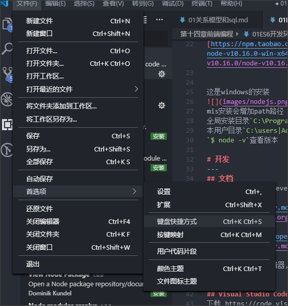

# nodejs
---
nodejs是服务器端运行JavaScript的开源,跨平台运行环境.  
nodejs是原始作者瑞安.达尔(Ryan Dahl), 与2009年发布,使用了V8引擎,并采用事件驱动,非阻塞,异步IO模型.  

2010年,npm软件包管理器诞生,通过它,可以方便的发布,分享nodejs的库和源代码.  

nodejs 4.0引入了ES6语言特性.  

我们学习JS,就让它跑在最新版的nodejs上,为了调试方便,也为了使用最新的ES2017特性.  


# 安装 
---
国内可以去阿里镜像站:  
[https://npm.taobao.org/mirrors/node](https://npm.taobao.org/mirrors/node)

Linux  
[https://npm.taobao.org/mirrors/node/v10.16.0/node-v10.16.0-linux-x64.tar.gz](https://npm.taobao.org/mirrors/node/v10.16.0/node-v10.16.0-linux-x64.tar.gz)

windows
[https://npm.taobao.org/mirrors/node/v10.16.0/node-v10.16.0-win-x64.zip](https://npm.taobao.org/mirrors/node/v10.16.0/node-v10.16.0-win-x64.zip)


这是windows的安装

mis安装会增加path路径  
全局安装目录`C:\Program Files\nodejs\`  
本用户目录`C:\users|Administrator\AppDate\Roaming\npm`  
`$ node -v`查看版本  

# 开发 
--- 
## 文档
所搜MDN, MOzilla Developer Network, 提供非常完善HTML, CSS,JS等技术资料.
[https://developer.mozilla.org/zh-CN/docs/Web/JavaScript](https://developer.mozilla.org/zh-CN/docs/Web/JavaScript)  

指南[https://developer.mozilla.org/zh-CN/docs/Web/JavaScript/Guide](https://developer.mozilla.org/zh-CN/docs/Web/JavaScript/Guide)  

使用任何一种文本编辑器,都可以开发JS,此次使用微软的Visual Studio Code开发.  

## Visual Studio Code
下载 https://code.visualstudio.com/Download  
支持windows,mac,linux平台.  

新版本vs code Windows版本分为System 和User两个版本,当前用户使用安装User版即可.  


有代码自动完成功能,还可以安装Node exe插件,将写的js跑在nodejs上.  

node exec插件快件建: **F8运行js脚本,F9停滞**  
前端开发中,JS脚本一般来说是为了控制浏览器网页的,这里使用了VSCode,只是为了开发调试方便  

## 解决快捷键冲突
F8和某些软件冲突,无法使用,例如某些词典软件.  
可以通过调试VSCode的快捷键设置,当然可以修改其他软件的快键键.  



## 注释
和C,Java一样  
`// 单行注释`  
`/* 多行注释 */`  多行注释,也可以用在语句中  
```js
str = 'hello' + /* commit */ 'world'
console.log(str)
```

## 常量和变量
### 标识符
标识符必须是字符,下划线,美元符号和数字,但必须是字母,下划线,美元符号开头,依然是不能数字开头就行.  

标识符**区分大小写**.  

### 声明
var 声明一个变量(大范围使用)  
let 声明一个块作用域中的局部变量  
const 声明一个常量(不允许修改)   
JS中的变量声明和初始化时可以分开的  

先调用再声明变量,那么调用的结果就是undefined,而不是报错

```js
var a //只是声明, a为了undefined
let b
console.log(1,a,b)
// const c //可以吗? 不能.因为这是常亮
const c= 100 //常亮必须声明是赋值,之后不能在修改
console.log(c)

// c = 200 //常亮不能修改
```

```js
var y //只是声明,y值为undefined,作用域在函数中 
var x = 5 //规范的声明并初始化,声明全局或局部变量 
z = 6 //不规范的初始化,不推荐,在严格模式下会产生异常,在赋值之前不能引用,因为它没有声明. 一旦这样赋值就是全局作用域.  

```

```js

function hello() {
    var a //只是声明,a为undefined, 作用域在函数中
    a =100
}

console.log(a) //未声明变量a,异常

//a = 200 //不能声明提升
// let a=200 //不能声明提升
// var a = 200 ;hello(); //var声明提升hoisting
```

var会把变量提升到当前全局或函数作用域  

常亮和变量的选择  
如果明确知道一个标识符定以后不能修改,应该尽量声明成const常亮,减少被修改的风险,减少Bug.  


## 数据类型

|序号|名称|说明|
|:--|:---|
|1|number|数值型,包括整形和浮点型|
|2|boolean|布尔型,true和false|
|3|string|字符串|
|4|null|中有一个null|
|5|undefined|变量声明未赋值的;对象未定义的属性|
|6|symbol|ES6新引入类型|
|7|object类型|是以上类型的复合类型,是容器,空容器为(true|
ES是动态语言,弱类型语言  
虽然先声明了变量,但是变量可以重新赋值任何类型  

```js
//类型转化

// 弱类型
console.log('=====string=====')
console.log(a = 3 + 'hxy', typeof(a))
console.log(a = null +'hxy',typeof(a))
console.log(a = undefined +'hxy',typeof(a))
console.log(a = true+ 'hxy',typeof(a))

// 数字
console.log('=====number=====')
console.log(a = 3+ 8,typeof(a))
console.log(a = null + 8,typeof(a)) // undefined没法转换成一个对应的数字
console.log(a = true + 8,typeof(a))
console.log(a = false + 8,typeof(a))

// boolean
console.log('=====bool=====')
console.log(a = null + true,typeof(a))
console.log(a = null + false,typeof(a))
console.log(a = undefined + true,typeof(a)) //undefined没办法转换成一个对应的数字
console.log(a = undefined + false,typeof(a)) //NaN
console.log(a = null & true,typeof(a))
console.log(a = undefined & true,typeof(a))

// 短路
console.log(a = null && true,typeof(a)) // 逻辑运算符,null 直接就是false短路
console.log(a = null && false,typeof(a)) //逻辑运算符,false短路返回false
console.log(a = false && 'hxy',typeof(a)) //boolean
console.log(a = true && 'hxy',typeof(a)) //字符串
console.log(a = true && '',typeof(a)) //字符串

//null 
console.log('=====null=====')
console.log(a = null +undefined,typeof(a))
```
输出结果为:  
```js
=====string=====
3hxy string
nullhxy string
undefinedhxy string
truehxy string
=====number=====
11 'number'
8 'number'
9 'number'
8 'number'
=====bool=====
1 'number'
0 'number'
NaN 'number'
NaN 'number'
0 'number'
0 'number'
null 'object'
null 'object'
false 'boolean'
hxy string
 string
=====null=====
NaN 'number'
```
弱类型,不需要强类型转换,回应是类型转换.  
NaN,即Not a Number,转化数字失败. 它和任何值都不等,和自己也不等. 只能使用Number is NaN(NaN)   

总结:  
遇到字符串,加好就是连接字符串,所有非字符串隐式转化为字符串.  
如果没有字符串,加号把其他所有类型都当做数字处理, 非数字类型隐式转换为数字. undefined特殊,因为它没有定义,所以转换数字失败得到一个特殊值NaN.  
如果运算符是逻辑运算符,将短路,返回就是短路时的类型,没有隐式转换.  
除非你十分明确,否则不要依赖隐式转换.写代码的时候,往往为了程序的健壮,请显示转换.  

注意: 以上的原则不要死机,忘了就实验测试, 或者显示的类型转换.  

## 字符串
将一个值使用`'`单引号或者`"`双引号应用起来就是字符串.  
**ES6提供了反引号**定义一个字符串,可以支持多行,还支持插值.  

字符串和变量引用  
```js
let a = 'abc'
let b = "123"
let c = `line1
    line2
line3`
// 支持多行

console.log(c)

// 字符串插值,要求在反引号字符串中.python3.6支持

let name = 'tom',age = 19
console.log(`hi , my name is ${name} . my age is ${age}`)
```

输出结果为:  
```js
line1
    line2
line3
hi , my name is tom . my age is 19
```

### 转义字符
|名称|说明|
|:--|:----|
|\0|Null字节,空字符|
|\b|退格符|
|\f|换页符|
|\n|换行符|
|\r|回车符|
|\t|Tab(制表符)|
|\v|垂直制表符|
|\'|单引号|
|\"|双引号|
|\ |反斜杠字符(\ )|
|\XXX|从0到377最多三位八进制数XXX表示Latin-1字符. 例如, \251是版权符号的八进制序列|
|\xXX|由00和FF的两位十六进制数字XX比搜地方人Latin-1字符. 例如,\xA9是版权符号的十六进制序列|
|\uXXXX|由四位十六进制数XXXX表示的Unicode字符,例如,\u00A9是版权符号的Unicode序列.  |
|\u{XXXXX}|Unicode代码点(code point)转义字符.例如. \u{2F804}相当于unicode转义字符\uD87E\uDC04的缩写|

### 字符串操作方法

字符串操作方法很多,但和Python类似  
```js
let school = 'magedu'

console.log(school.charAt(2)) //g
console.log(school[2]) //g
console.log(school.toUpperCase())
console.log(school.concat('.com')) //与后面的字符串连接
console.log(school.slice(2)) // 切片,支持负索引
console.log(school.slice(3,5))
console.log(school.slice(-2,-1))
console.log(school.slice(-1))

let url = 'www.hxy.com'
console.log(url.split('.'))
console.log(url.substr(7,2)) //返回子串从何处开始,取多长
console.log(url.substring(7,10)) //返回子串,从何处开始,到什么为止

let s = 'hxy.com'
console.log(s.indexOf('y')) //3
console.log(s.indexOf('y',4)) //7
console.log(s.replace('.com','.cn'))

s = '\thxy com \r\n'
console.log(s.trim()) // 去除两端的空白字符,trimLeft,triRight是非标函数,少用

```

输出结果为:  
```js
g
g
MAGEDU
magedu.com
gedu
ed
d
u
[ 'www', 'hxy', 'com' ]
.c
.co
2
-1
hxy.cn
hxy com
```

## 数值型number
在JS中,数据均为双精度浮点型范围只能在-(2^53-1)和2^53-1之间,整形也不例外  
数字类型还有三种符号值: `+ Infinity(正无穷), -Infinity(负无穷)和 NaN(not a number 非数字)`  

二进制0b0010,0B110.  
八进制0755,注意0855,将被认作是静止,因为8不在八进制中, ES6中最好使用0o前缀表示八进制  
十六进制0xAA, 0Xff  
指数表示1E3(1000), 2e-2(0.02)  

[5.进制问题.js](js代码/基础语法/5.进制问题.js)
```js
let a = 012; //八进制
console.log(a);

let b = 112;
console.log(b);

let c = 0412; //八进制
console.log(c);

let d = 0812; //虽然是八进制,但是八进制不能出现八,只能当做十进制,所以为了方便区分,在前面加上0x,0o
console.log(d);

let e = 0o112; //八进制
console.log(e);

let f = 0x995; //十六进制
console.log(f);
```
输出结果为:  

```js
10
112
266
812
74
2453
```


常量属性  
```js
var biggestNum = Number.MAX_VALUE;
var smallestNum = Number.MIN_VALUE;
var infiniteNum = Number.POSITIVE_INFINITY;
var negInfiniteNum = Number.NEGATIVE_INFINITY;
var notANum = Number.NaN;
```

数字的方法  
|方法|描述|
|:--|:---|
|Number.parseFloat()|把字符串参数解析成浮点数, 和全局方法parseFloat()作用一直|
|Number.parseInt()|把字符串解析成特定基数的整形数字,和全局方法parseInt()作用一致|
|Number.isFinite()|判断传递的值是否为有限数字|
|Number.isInteger()|判断传递的值是否为整数|
|Number.isNaN()|判断传递的值是否为NaN|

内置数学对象Math  
Math提供了绝对值,对数指数运算, 三角函数运算,最大值,最小值,随机数,开放等运算函数,提供了PI值.  

[传递数判断](js代码/基础语法/6.传递数判断.js)
```js
console.log(Math.PI)
console.log(Math.abs(-1))
console.log(Math.log2(16))
console.log(Math.sqrt(2))
console.log(Math.random()) // 取值范围是0到1之间的随机数(0,1)
```
输出结果为:  
```js
3.141592653589793
1
4
1.4142135623730951
0.21415483590362872
```
## 运算符
### 算术运算符

`+ - * / %` 等运算符和Python一样   

[自增和自减](js代码/基础语法/7.数值运算.js)
```js
console.log(1/2) //0.5自然除
console.log(1/0) //无异常,返回无穷
console.log(5 % 3)

console.log(parseInt(1/2)) //0
console.log(parseInt(3/2)) //1

console.log(Math.floor(3.2)) //1
console.log(Math.ceil(3/2)) //2
console.log(Math.round(3/2)) //2
console.log(Math.round(1/2)) //1
```
输出结果为:  
```js
0.5
Infinity
2
0
1
3
2
2
1
```
`++ 和--`  
单目运算符,代表变量自增,自减  
`i++`先用i,用完之后i再自增加1  
`++i`先自增,在使用i  

[自增和自减](js代码/基础语法/8.自增和自减.js)
```js
let i = 0
let a = i++
console.log(a,i)
console.log(a,i++)
a = ++i 
console.log(a,++i)
```
输出结果为:  
```js
0 1
0 1
3 4
```
练习  
```js
i = 0;
let a = ++i+i+++i+++i; // a= ++i + i++ + i++ + i  1 + 1 + 2 + 3
console.log(a)
```
此题来自C, C++, java的面试题  
1. 单目运算符优先级高于双目运算符  
2. 加号+是双目运算符, 两边的表达式必须先计算好   


### 比较运算符 
```
> , < , >= , <= 没有什么区别
!=, ==
!=== ,  ===

== 宽松相等,进项类型转换
=== 严格相等,不禁想类型转换
```
[比较运算符](js代码/基础语法/10.比较运算符.js)
```js
console.log(100 > '200') //false
console.log(300 > '200') // true
console.log(300 > '2000') // false
console.log(3000 > '2a') // false
console.log(3000 > 'a2') // false
console.log('300' > '200') // true

// 比较宽松
console.log(300 == '300') // true
console.log('300' == '300') // true

//严格比较 ===
console.log(300 === '300') // false
console.log('200' === '200') // true
```

输出结果为:  
```js
false
true
false
false
false
true
true
true
false
true
```
从上面的比较中,我们先以为前几行是隐式转换字符串的,但是后来发现转换为数字,当3000>'2a'比较师范难了.  
 
使用宽松比较的时候,尽可能确保比较的类型相同,否则会引起隐式转换,而且转换的规则很复杂不好把控.  
如果不知道类型是否一致,但是就是要求一定要相等,那么请使用 `===`和`!==`  

### 逻辑运算符
`&&, ||, |`与, 或, 非  
这些运算符和其他搞基语言一样,支持短路  

### 运算符
`& | ^ ~ << >>` 位与, 位或, 异或, 取反, 左移, 右移 和python一样.  

### 三元运算符
```js
条件表达式?针织:假值
等价于简单的 if ... else 结构
if (条件表达式) {
    真值
}
else {
    假值
}
```
`console.log(('3> 30)? ' 真':'假')`

### 逗号运算符
js运行多个表达式写在一起  

[逗号运算符](js代码/基础语法/11.逗号运算符.js)
```js
let a = 4+5, b = true, c=a > 20? 't':'f'
console.log(a) //9
console.log(c) //f

function test(){
    return 3, a+b ,  c = a++
}

console.log(test()) //结果是什么?
console.log(c) //结果是什么?
```

输出结果为:

```js
9
f
9
9
```
### 其他
|名称|说明|
|:--|:---|
|instanceof|判断是否属于指定类型|
|typeof|返回类型字符串|
|delete|delete操作符,删除一个对象(an object)或一个对象的属性(an object's property)或者一个数组中某一个键值(an element at a specified Index in an array)|
|in |如果指定的属性在对象内,则返回true|

[实例和类型](js代码/基础语法/9.实例和类型.js)
```js
console.log('a' instanceof String) //false
console.log(1 instanceof Number) //false

a = new String('b')
console.log(a instanceof String) //false
console.log(new  Number(1) instanceof Number) //false
console.log(a instanceof Object) //false

console.log(typeof('a'))
console.log(typeof 'a')
console.log(typeof a )
```
输出结果为:  
```js
false
false
true
true
true
string
string
object
```
instanceof 要求必须明确使用类型定义变量,就是对象必须是new关键字声明创建的,它可以用于继承关系的判断.  
typeof就是返回对象的类型字符串.  
delete删除对象,属性,数组元素  
[删除delete](js代码/基础语法/12.删除delete.js)
```js
x = 42; 
var y = 43;
let z = 60;
myobj = new Number();

myobj.h = 4; //create property h
console.log(delete x);              //returns true (can delete if declated implicitly)
console.log(delete y);              //return false (cannot delete if declared with var)
console.log(delete z);              //return false 
console.log(delete Math.PI);        //return false (cannot delete predefined  propertied)
console.log(delete myobj.h);        //return true (can delete user-defined propertied)
console.log(delete myobj);          //return true (can delete if declared implicitly)
console.log('~~~~~~~~~~~~~~~~~~~~~~~~~~~');

var  trees = new Array('redwood', 'bay', 'cedar', 'oak', 'maple');
for (var i=0;i<trees.length;i++){
    console.log(trees[i])
}
console.log('=========================')
delete trees[3]; // 数组中元素被删除,但空着的位置是undefined
for(var i=0;i<trees.length;i++){
    console.log(trees[i])
}
```
删除结果为:  

```js
true
false
false
false
true
true
~~~~~~~~~~~~~~~~~~~~~~~~~~~
redwood
bay
cedar
oak
maple
=========================
redwood
bay
cedar
undefined
maple
```
in 判断属性是否在对象内
[in判断属性](js代码/基础语法/13.in判断属性.js)
```js
var  trees = new Array('redwood', 'bay', 'cedar', 'oak', 'maple');
console.log(0 in trees);            //returns true,0 在数组对象的index中
console.log(3 in trees);            //returns true ,3在数组对象的index中
console.log(6 in trees);            //returns false ,6不在数组对象index中
console.log("bay"in trees);         //returns false ,bay不是属性,是值
console.log("length" in trees);     //returns true, length是对象的属性
console.log('~~~~~~~~~~~~~~~~~~~~~~~~~~~~~')

delete  trees[3];
console.log(3 in trees);
for(var i=0;i<trees.length;i++){
    console.log(trees[i]);
}
console.log('~~~~~~~~~~~~~~~~~~~~~~~~~~~~~')

// Custom objects
let mycar = {
    color:'red',
    year:1988
};

console.log('color' in mycar); //returns true
console.log('model' in mycar); //returns false
console.log('year' in mycar); //true
```

输出结果为:
```js
true
true
false
false
true
~~~~~~~~~~~~~~~~~~~~~~~~~~~~~
false
redwood
bay
cedar
undefined
maple
~~~~~~~~~~~~~~~~~~~~~~~~~~~~~
true
false
true
```
这里的in出来的是索引key,  
如果容器类型是{k:v} in出来的是k  
如果容器类型是{1,2,3,5} in出来的是0 1 2 3  

### 运算符优先级
运算符由高到低,顺序如下  

|运算符|	描述|
|:--|:----|
|. [] ()	|字段访问、数组下标、函数调用以及表达式分组|
|++ -- - ~ ! delete new typeof void	|一元运算符、返回数据类型、对象创建、未定义值|
|* / %	|乘法、除法、取模|
|+ - +	|加法、减法、字符串连接|
|<< >> >>>	|移位|
|< <= > >= instanceof	|小于、小于等于、大于、大于等于、instanceof|
|== != === !==	|等于、不等于、严格相等、非严格相等|
|&	|按位与|
|^	|按位异或|
||	|按位或|
|&&	|逻辑与|
|||	|逻辑或|
|?:	|条件|
|= oP=	|赋值、运算赋值|
|,|	多重求值|


逗号运算符优先级最低,比赋值语句还低.  
记不住就是用括号.  

### 表达式
基本表达式,和Python差不多  

解析是也和Python的相似,但在ES6中非标准不推荐使用
生成器推荐使用生成函数ES6开始支持.  
[表达式](js代码/基础语法/14.表达式.js)
```js
function * inc(){
    let i = 0;
    let j = 7;
    while (true){
        yield i++;
        if (!j--) return 100;
    }
}

let gen = inc()
for (let i=0;i<10;i++){
    console.log(gen.next());
}
```
输出结果为:  
```js
{ value: 0, done: false }
{ value: 1, done: false }
{ value: 2, done: false }
{ value: 3, done: false }
{ value: 4, done: false }
{ value: 5, done: false }
{ value: 6, done: false }
{ value: 7, done: false }
{ value: 100, done: true }
{ value: undefined, done: true }
```

每次调用next() 方法返回一个对象,这个对象包含两个属性: value和done,value属性表示本次yield表达式方式的返回值, done属性为布尔类型. done是false表示后续还有yield语句执行, 如果执行完成或者return后, done为true.  