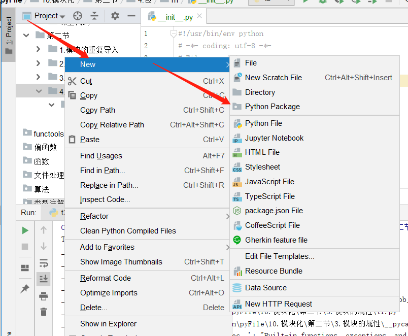

# 模块化  
---
一般来说,编程语言中,库,包,模块是同一种概念,是代码的组织方式.  
Python中只有一种模块对象类型,但是为了模块化组织模块的便利,提供了'包'的概念.  

模块module,指的是Python的源代码文件.  
包package,指的是模块组织在一起,的包名和包名同名的目录及其相关文件.  

## 导入语句  
|语句|含义|
|:--|:----|
|import 模块,[模块1,模块2...]|完全导入|
|import...as...|模块别名|

---
import语句  
1.找到指定的模块,加载和初始化它,生成模块对象.找不到就抛出异常.  
2.在import所在的作用域的局部命名空间中,增加名称和上一步创建的对象向关联.  

单独运行下面的例子,体会区别:

```py
import functools #导入模块

print(dir())
print(functools)
print(functools.wraps)
```
运行结果为:
```py
['__annotations__', '__builtins__', '__cached__', '__doc__', '__file__', '__loader__', '__name__', '__package__', '__spec__', 'functools']
<module 'functools' from 'C:\\software\\python3\\lib\\functools.py'>
<function wraps at 0x00F33D68>
```
----

```py
import os.path

print(dir())
print(os)
print(os.path)
```
运行结果为:
```py
['__annotations__', '__builtins__', '__cached__', '__doc__', '__file__', '__loader__', '__name__', '__package__', '__spec__', 'os']
<module 'os' from 'C:\\software\\python3\\lib\\os.py'>
<module 'ntpath' from 'C:\\software\\python3\\lib\\ntpath.py'>
```
这里的windows所以是ntpath  

---

```py
import os.path as osp

print(dir())
print(osp)
```
运行结果为:
```py
['__annotations__', '__builtins__', '__cached__', '__doc__', '__file__', '__loader__', '__name__', '__package__', '__spec__', 'osp']
<module 'ntpath' from 'C:\\software\\python3\\lib\\ntpath.py'>
```
这里的名词空间使用的是osp,而不再是os了  

---

```py
def testimport():
    import os.path
    print(dir())

testimport()
print(globals().keys())
```
运行结果为:
```py
['os']
dict_keys(['__name__', '__doc__', '__package__', '__loader__', '__spec__', '__annotations__', '__builtins__', '__file__', '__cached__', 'testimport'])

```
总结:  
    导入顶级模块,其名称会加入到本地名词空间中,绑定到期模块对象.  
    导入非顶级模块,只将其顶级模块名称加入到本地名词空间中.导入模块必须使用完全限定名称来访问.  
    如果使用了as,as后的名称直接绑定到导入的模块对象,并将其名称加入到本地名词空间中.  

---
## from语句  
|语句|含义|
|:--|:---|
|from  ... import ...| 部分导入|
|from ... import ... as ... | 别名|
from 语句

---

```py

from pathlib import Path,PosixPath #在当前名词空间导入该模块指定的成员
print(1,dir())

from pathlib import * #在当前名词空间导入该模块所有公共成员(非下划线开头成员,)或指定成员
print(2,dir())

from functools import wraps as wr,partial #别名
print(3,dir())
```
运行结果为:
```py
1 ['Path', 'PosixPath', '__annotations__', '__builtins__', '__cached__', '__doc__', '__file__', '__loader__', '__name__', '__package__', '__spec__']
2 ['Path', 'PosixPath', 'PurePath', 'PurePosixPath', 'PureWindowsPath', 'WindowsPath', '__annotations__', '__builtins__', '__cached__', '__doc__', '__file__', '__loader__', '__name__', '__package__', '__spec__']
3 ['Path', 'PosixPath', 'PurePath', 'PurePosixPath', 'PureWindowsPath', 'WindowsPath', '__annotations__', '__builtins__', '__cached__', '__doc__', '__file__', '__loader__', '__name__', '__package__', '__spec__', 'partial', 'wr']


```
---


```py
from os.path import exists #加载.初始化os,os.path模块,exists加入本地命名空间并绑定

if exists('dir'):
    print('found')
else:
    print("not found")

print(dir())
print(exists)

import os
#4种方式获得同一个对象exists
print(os.path.exists)
print(exists)
print(os.path.__dict__['exists']) #字符串
print(getattr(os.path,'exists')) #字符串

```
运行结果为:
```py
not found
['__annotations__', '__builtins__', '__cached__', '__doc__', '__file__', '__loader__', '__name__', '__package__', '__spec__', 'exists']
<function exists at 0x02EF36F0>
<function exists at 0x02EF36F0>
<function exists at 0x02EF36F0>
<function exists at 0x02EF36F0>
<function exists at 0x02EF36F0>
```
* 总结:  
    - 找到from子句中指定的模块,加载并初始化它(并不是导入)  
    - 对于import字句的名称  
        - 1.先查from字句导入的模块是否具有该名称的**属性**  
        - 2.如果不是,则尝试导入该名称的子模块  
        - 3.还没有找到,则抛出ImportError异常.  
        - 4.这个名称保存到本地命名空间,如果有as字句,则使用as字句后的名称  

---
代码表现  
```py
from pathlib import Path #导入Path模块

print(1,Path,id(Path))

import pathlib as p1 #导入模块使用别名
print(2,dir())
print(3,p1)
print(4,p1.Path,id(p1.Path))
#可以查看出导入的名词空间Path和p1.Path是同一个对象
```
运行结果为:  
```py
1 <class 'pathlib.Path'> 23426096
2 ['Path', '__annotations__', '__builtins__', '__cached__', '__doc__', '__file__', '__loader__', '__name__', '__package__', '__spec__', 'p1']
3 <module 'pathlib' from 'C:\\software\\python3\\lib\\pathlib.py'>
4 <class 'pathlib.Path'> 23426096
```

---
## 自定义模块  

---
自定义模块: .py文件就是一个模块  
t1.py    
```py
print('This is t1 module')

class A:
    def showmodule(self):
        print(1,self.__module__,self)
        print(2,self.__dict__)
        print(3,self.__class__.__dict__)
        print(4,self.__class__.__name__)

a = A()
a.showmodule()
print()
print(__file__)
print('='*60)
```
t2.py  
```py
#t2.py file
print('This is t2 module')
import t1
print()
print(__file__)
print('='*60)
a = t1.A()
a.showmodule()


```
t3.py
```py
#t3.py file
print('This is t3 module')
from t1 import A as cls

print()
print(__file__)
print('='*60)
a = cls()
a.showmodule()
```
执行t1的运行结果为:
```py
This is t1 module
1 __main__ <__main__.A object at 0x01D8FE90>
2 {}
3 {'__module__': '__main__', 'showmodule': <function A.showmodule at 0x01DC36F0>, '__dict__': <attribute '__dict__' of 'A' objects>, '__weakref__': <attribute '__weakref__' of 'A' objects>, '__doc__': None}
4 A

C:/Users/abc/Desktop/learnPython/pyFile/10.模块化/第一节/模块化代码/8.自定义模块/t1.py
============================================================
```
总结:
    执行这里的module是__main__
    执行t1的时候就把整个t1的文件执行,并输出结果,

---

执行t2.py的结果:  
```py
This is t2 module
This is t1 module
1 t1 <t1.A object at 0x0381EF90>
2 {}
3 {'__module__': 't1', 'showmodule': <function A.showmodule at 0x038A3738>, '__dict__': <attribute '__dict__' of 'A' objects>, '__weakref__': <attribute '__weakref__' of 'A' objects>, '__doc__': None}
4 A

C:\Users\abc\Desktop\learnPython\pyFile\10.模块化\第一节\模块化代码\8.自定义模块\t1.py
============================================================

C:/Users/abc/Desktop/learnPython/pyFile/10.模块化/第一节/模块化代码/8.自定义模块/t2.py
============================================================
1 t1 <t1.A object at 0x0380FE90>
2 {}
3 {'__module__': 't1', 'showmodule': <function A.showmodule at 0x038A3738>, '__dict__': <attribute '__dict__' of 'A' objects>, '__weakref__': <attribute '__weakref__' of 'A' objects>, '__doc__': None}
4 A

```
总结:
    执行这里的module是t1 非是自己执行的时候__module__就是模块自己的文件名  
    这里调用t1的时候t1和t2一起加载执行并输出结果  

---

执行t3.py的结果:  
```py
This is t3 module
This is t1 module
1 t1 <t1.A object at 0x030DEF90>
2 {}
3 {'__module__': 't1', 'showmodule': <function A.showmodule at 0x03163738>, '__dict__': <attribute '__dict__' of 'A' objects>, '__weakref__': <attribute '__weakref__' of 'A' objects>, '__doc__': None}
4 A

C:\Users\abc\Desktop\learnPython\pyFile\10.模块化\第一节\模块化代码\8.自定义模块\t1.py
============================================================

C:/Users/abc/Desktop/learnPython/pyFile/10.模块化/第一节/模块化代码/8.自定义模块/t3.py
============================================================
1 t1 <t1.A object at 0x030CFE90>
2 {}
3 {'__module__': 't1', 'showmodule': <function A.showmodule at 0x03163738>, '__dict__': <attribute '__dict__' of 'A' objects>, '__weakref__': <attribute '__weakref__' of 'A' objects>, '__doc__': None}
4 A

```
总结:
    执行这里的module是t1,非是自己执行的时候__module__就是模块自己的文件名  
    这里调用t1的时候t1和t3一起加载执行并输出结果  

---

## 自定义模块命名规范  

---
    1.模块名就是文件名  
    2.模块名必须符合标识符法人要求,费事数字开头的字母,数字和下划线的组合.test-module.py这样的文件名不能作为模块名,也不要使用中文.  
    3.不要使用系统模块名来避免冲突,除非你明确知道这个模块名的用途.  
    4.通常模块名全为小写,下划线来分割  

---

## 模块搜索顺序  
使用**sys.path**查看搜索顺序  
```py
import sys

print(*sys.path,sep='\n')
#这两个输出的结果是一样的,只是上面的结果是结构输出的
# for  p in sys.path:
#     print(p)
```
运行结果为:
```py
C:\Users\abc\Desktop\learnPython\pyFile\10.模块化\第一节\模块化代码
C:\Users\abc\Desktop\learnPython\pyFile
C:\software\PyCharm 2019.1.1\helpers\pycharm_display
C:\software\python3\python37.zip
C:\software\python3\DLLs
C:\software\python3\lib
C:\software\python3
C:\software\python3\lib\site-packages
C:\software\PyCharm 2019.1.1\helpers\pycharm_matplotlib_backend
```
总结:
    显示结果为,python模块路径搜索顺序.  
    当加载一个模块的时候,需要从这些搜索路径中从前到后的依次查找,并不搜索目录的子目录.  
    当搜索到了就加在模块,搜索不到就抛异常,  

    路径也可以成为字典,zip文件,egg文件.  
    .egg文件,由setuptools库创建的包,第三方库常用的格式,添加完了元数据(版本号,依赖项等)信息=的zip文件,

* 路径顺序为:  
    - 1.程序主目录,程序运行主程序脚本所在的目录.  
    - 2.PythonPath目录,环境变量PythonPath设置的目录也是搜索模块的路径.  
    - 3.标准库目录,Python自带库模块所在路径.  

sys.path也已被修改,增加新的目录.  

----
## 模块的重复导入  
---
模块的重复导入不会多次加载,只会加载第一次  

代码如下:
```py
print('This is t1 module')

class A:
    def showmodule(self):
        print(1,self.__module__,self)
        print(2,self.__dict__)
        print(3,self.__class__.__dict__)
        print(4,self.__class__.__name__)
a = A()
a.showmodule()

```
t2代码
```py
import t1
import sys

print('local module')
import t1
import t1
import t1
import t1
print(sys.modules.keys())

```

t2的运行结果为:
```py
This is t1 module
1 t1 <t1.A object at 0x02DBEFD0>
2 {}
3 {'__module__': 't1', 'showmodule': <function A.showmodule at 0x02E43738>, '__dict__': <attribute '__dict__' of 'A' objects>, '__weakref__': <attribute '__weakref__' of 'A' objects>, '__doc__': None}
4 A
local module
dict_keys(['sys', 'builtins', '_frozen_importlib', '_imp', '_thread', '_warnings', '_weakref', 'zipimport', '_frozen_importlib_external', '_io', 'marshal', 'nt', 'winreg', 'encodings', 'codecs', '_codecs', 'encodings.aliases', 'encodings.utf_8', '_signal', '__main__', 'encodings.latin_1', 'io', 'abc', '_abc', 'site', 'os', 'stat', '_stat', 'ntpath', 'genericpath', 'os.path', '_collections_abc', '_sitebuiltins', 'sitecustomize', 't1'])


```
从输出的结果来看,不会长生重复导入的现象.  
所有加载的模块都会记录在**sys.modules**中,sys.modules是存储已经加载过的所有木块的字典.  
打印sys.modules就可以到看os.path,os都已经记载了  

## 模块运行  
`__name__`,每个模块都会自定义一个`__name__`特殊变量来保存当前模块的名称,如果不指定,则默认为源代码文件名,如果是包则有限定名.  

解释器初始化的时候,会初始化sys.modules字典(保存已加载的模块),加载builtins(全局变量,常量)模块,`__main__`,sys模块,以及初始化模块搜索路径sys.path等.  

Python是脚本语言,任何一个脚本都可以执行,也可以作为模块被导入.  
当从标准输入(命令行方式敲代码),脚本($python test,py) 或者交互时读取的时候,会将模块的`__name__`设置成`__main__`,模块的等成代码就在`__main__`这个作用域中执行. 顶层代码:模块中缩进最外层的代码.  
如果是import 导入的,其`__name__`默认就是模块名.  

test1.py file
```py
if __name__ == '__main__':
    #判断是否是依程序方式运行的代码$Python test1.py
    print('in __main__') #程序方式运行代码
else:
    print('in imported module') #模块导入方式运行代码
```
test2.py
```py
import test1
```

直接运行test1结果为:

```py
in __main__

```
运行test2运行结果为:
```py
in imported module
```
程序的运行方式就是它自己本身取运行的程序,非它本身取运行的都算作是它当做模块去被别的模块去被调用  

---
**`if __name__ == '__main__'`: 的用途**  
1.本模块的功能测试  
对于非主模块,测试本模块的函数,类
2.避免主模块变更的副作用  
顶层代码,没有封装,主模块使用时没有问题,但是,一旦有了新的主模块,老的主模块成了被导入模块,由于原来代码没有封装,一并执行了.  

---
## 模块的属性  
|属性|含义|
|:--|:----|
|`__file__`|字符串,源文件路径|
|`__cache__`|字符串,编译后的字节码文件路径|
|`__spec__`|显示模块的规范|
|`__name__`|模块名|
|`__package__`|当模块是包,同`__name__`;否则,可以设置为顶级模块的空字符串|
```py
import t1

for k,v in t1.__dict__.items():
    print(k,str(v)[:80])
print('-'*100)
print(dir(t1))
# print(getattr(t1,'__builtins__'))
print('-'*100)
for name in dir(t1):
    print(name,str(getattr(t1,name))[:80])
```
运行结果为:
```py
This is t1
__name__ t1
__doc__ None
__package__ 
__loader__ <_frozen_importlib_external.SourceFileLoader object at 0x0340E9D0>
__spec__ ModuleSpec(name='t1', loader=<_frozen_importlib_external.SourceFileLoader object
__file__ C:\Users\abc\Desktop\learnPython\pyFile\10.模块化\第二节\3.模块的属性\t1.py
__cached__ C:\Users\abc\Desktop\learnPython\pyFile\10.模块化\第二节\3.模块的属性\__pycache__\t1.cpytho
__builtins__ {'__name__': 'builtins', '__doc__': "Built-in functions, exceptions, and other o
----------------------------------------------------------------------------------------------------
['__builtins__', '__cached__', '__doc__', '__file__', '__loader__', '__name__', '__package__', '__spec__']
----------------------------------------------------------------------------------------------------
__builtins__ {'__name__': 'builtins', '__doc__': "Built-in functions, exceptions, and other o
__cached__ C:\Users\abc\Desktop\learnPython\pyFile\10.模块化\第二节\3.模块的属性\__pycache__\t1.cpytho
__doc__ None
__file__ C:\Users\abc\Desktop\learnPython\pyFile\10.模块化\第二节\3.模块的属性\t1.py
__loader__ <_frozen_importlib_external.SourceFileLoader object at 0x0340E9D0>
__name__ t1
__package__ 
__spec__ ModuleSpec(name='t1', loader=<_frozen_importlib_external.SourceFileLoader object
```
---
## 包  
---
包,特殊的模块  
Python模块支持目录吗?  

实验  
在项目中新建一个目录,使用下面的代码  
```py
import m
print(m)
print(type(m))
print(dir(m)) #没有__file__
```
运行结果为:
```py
<module 'm' from 'C:\\Users\\abc\\Desktop\\learnPython\\pyFile\\10.模块化\\第二节\\4.包\\m\\__init__.py'>
<class 'module'>
['__builtins__', '__cached__', '__doc__', '__file__', '__loader__', '__name__', '__package__', '__path__', '__spec__']

```
竟然可以导入目录m,目录也是文件,所以可以导入,不过问题是,目录模块怎么写入代码?  
为了解决这个问题,Python要求在目录下建立一个特殊文件,`__init__.py`,在其中写入代码  

在pycharm中,创建Dirdctory和创建Python package不同,前者是创建普通的目录,后者是创建了一个带有`__init__.py`文件的目录即是包.  
Python中,目录可以作为模块,这就是包,不过代码需要卸载该目录下的`__init__.py`中.  
`__init__.py`称为此目录的初始化文件.  

虽然我们在这里导入的是m但是init.py也导入进去了.  
有了 init.py之后m也就相当于m.py了

---

```py

```
运行结果为:
```py

```


---

```py

```
运行结果为:
```py

```


---

```py

```
运行结果为:
```py

```


---

```py

```
运行结果为:
```py

```


---

```py

```
运行结果为:
```py

```


---

```py

```
运行结果为:
```py

```


---

```py

```
运行结果为:
```py

```


---

```py

```
运行结果为:
```py

```


---

```py

```
运行结果为:
```py

```


---

```py

```
运行结果为:
```py

```


---

```py

```
运行结果为:
```py

```


---

```py

```
运行结果为:
```py

```


---

```py

```
运行结果为:
```py

```


---

```py

```
运行结果为:
```py

```


---

```py

```
运行结果为:
```py

```


